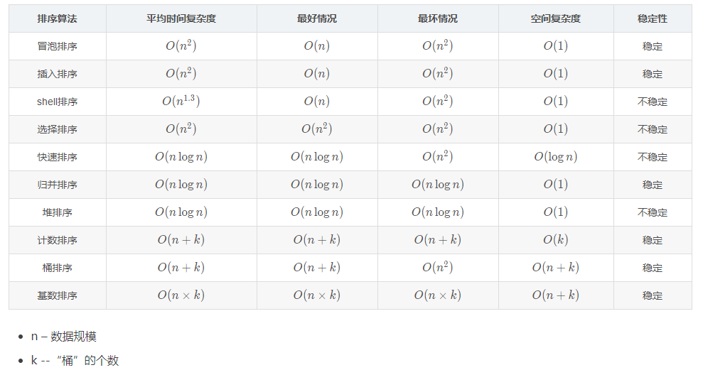

# 排序算法



- [冒泡排序](#冒泡排序)
- [选择排序](#选择排序)
- [插入排序](#插入排序)
- [希尔排序](#希尔排序)
- [快速排序](#快速排序)
- [归并排序](#归并排序)
- [堆排序](#堆排序)
- [烧饼排序](#烧饼排序)
- [基于链表的快速、归并、插入排序](#基于链表的快速归并插入排序)

# 排序算法的一些常见考点
1.稳定的排序
+ 插入排序
  - 时间复杂度：最差、平均都是O(n^2)，最好是O(n)
  - 空间复杂度：1
+ 归并排序
  - 时间复杂度：最差、平均、最好都是O(nlogn)
  - 空间复杂度：O(n)
2.不稳定的排序
+ 快速排序
  - 时间复杂度：平均O(nlogn)，最差O(n^2)--已排序或已经倒序的数组
  - 空间复杂度：O(logn)
+ 选择排序
  - 时间复杂度：最差、平均都是O(n^2)
  - 空间复杂度:1
+ 堆排序
  - 时间复杂度：最差、平均、最好都是O(nlogn)
  - 空间复杂度：1
  
# 冒泡排序
```
平均时间复杂度：O(n^2)
空间复杂度：O(1)
```

1.思路
+ 比较相邻的元素。如果第一个比第二个大，就交换它们两个；
+ 对每一对相邻元素作同样的工作，从开始第一对到结尾的最后一对，这样在最后的元素应该会是最大的数；
+ 针对所有的元素重复以上的步骤，除了最后一个；
+ 重复步骤1~3，直到排序完成。

2.模板
```C++
void bubbleSort(vector<int>& vec){
    int len = vec.size();
    for(int i=0;i<len-1;i++){//这里小于len-1是因为要顾及后面判断存在vec[i+1]的情况，防止越界。
        bool isSwap = false;//加入isSwap标志，如果某次比较没有发生交换，即说明了已经有序，后面就无须进行遍历了
        //每次冒泡的时候可以少比较数组末尾已经排序好的。因为每一轮冒泡一定会把最大的数放到末尾。
        for(int j=0;j<len-i-1;j++){
            if(vec[j+1]<vec[j]){
                int temp = vec[j];
                vec[j] = vec[j+1];
                vec[j+1] = temp;
            }
        }
        if(!isSwap) return;//这个功能可选
    }
}
```
# 选择排序
```
平均时间复杂度：O(n^2)
空间复杂度：O(1)
```

1.思路
+ 首先在未排序序列中找到最小（大）元素，存放到排序序列的起始位置
+ 再从剩余未排序元素中继续寻找最小（大）元素，然后放到已排序序列的末尾。
+ 重复第二步，直到所有元素均排序完毕。

2.模板
```C++
void SelectionSort(vector<int>& vec){
    int len = vec.size();
    for(int i=0;i<len-1;i++){// 总共要经过 len-1 轮比较
        int min = i;
        for(int j=i;j<len;j++){
            if(vec[j]<vec[min]){
                min = j;// 记录目前能找到的最小值元素的下标
            }
        }
        // 将找到的最小值和i位置所在的值进行交换
        if(min != i){
            int temp = vec[i];
            vec[i] = vec[min];
            vec[min] = temp;
        }
    }
}
```
# 插入排序
```
平均时间复杂度：O(n^2)
空间复杂度：O(1)
```

1.思路
+ 从第一个元素开始，该元素可以认为已经被排序；
+ 取出下一个元素，在已经排序的元素序列中从后向前扫描；
+ 如果该元素（已排序）大于新元素，将该元素移到下一位置；
+ 重复步骤3，直到找到已排序的元素小于或者等于新元素的位置；
+ 将新元素插入到该位置后；
+ 重复步骤2~5。

2.模板
```C++
void InsertSort(vector<int>& vec){
    int len = vec.size();
    for(int i=1;i<len;i++){
        for(int j=i;j>0;j--){// 从已经排序的序列最右边的开始比较，找到比其小的数
            if(vec[j]<vec[j-1]){
                int temp = vec[j];
                vec[j] = vec[j-1];
                vec[j-1] = temp;
            }
        }
    }
}

```
# 希尔排序

```
平均时间复杂度：O(n^1.3)
空间复杂度：O(1)
```
1.思路

+ 思想来源：插入排序的优化。在插入排序里，如果靠后的数字较小，它来到前面就得交换多次。「希尔排序」改进了这种做法。带间隔地使用插入排序，直到最后「间隔」为 1 的时候，就是标准的「插入排序」，此时数组里的元素已经「几乎有序」了；
+ 希尔排序的「间隔序列」其实是一个超参数，具体不用了解。

2.模板
```C++
void ShellSort(vector<int>& vec){
    int len = vec.size();
    int index = len/2;
    while(index >= 1){
        for(int i=index;i<len;i++){
            for(int j=i-index;j>=0;j-=index){
                if(vec[j]>vec[j+index]){
                    int temp = vec[j];
                    vec[j] = vec[j+index];
                    vec[j+index] = temp;
                }
            }
        }
        index /= 2;
    }
}
```
# 快速排序

```
平均时间复杂度：O(nlogn)
空间复杂度：O(logn)
```

1.思路

+ 从数列中挑出一个元素，称为 “基准”（pivot）;
+ 重新排序数列，所有元素比基准值小的摆放在基准前面，所有元素比基准值大的摆在基准的后面（相同的数可以到任一边）。在这个分区退出之后，该基准就处于数列的中间位置。这个称为分区（partition）操作；
+ 递归地（recursive）把小于基准值元素的子数列和大于基准值元素的子数列排序；
+ 递归的最底部情形，是数列的大小是零或一，也就是永远都已经被排序好了。虽然一直递归下去，但是这个算法总会退出，因为在每次的迭代（iteration）中，它至少会把一个元素摆到它最后的位置去。

2.模板
```C++
int Paritition(vector<int>& vec, int low, int high){
    int pivot = vec[low];
    while(low<high){
        while(low<high&&vec[high]>=pivot){
            --high;
        }
        vec[low] = vec[high];
        while(low<high&&vec[low]<=pivot){
            ++low;
        }
        vec[high] = vec[low];
    }
    vec[low] = pivot;
    return low;
}
void QuickSort(vector<int>& vec, int low, int high){
    if(low<high){
        int pivot = Paritition(vec,low,high);
        QuickSort(vec,low,pivot-1);
        QuickSort(vec,pivot+1,high);
    }
}
```
3.非递归方法的实现
```C++
#include<iostream>
#include<vector>
#include<stack>
#include<time.h>
using namespace std;

// 与递归快速排序中的partition函数相同，寻找切分点，同时调整元素位置
int Partiton(vector<int> &array, int low, int high){
    // 三数取中，避免取得最大值或者最小值
    int mid = low + (high- low)/2;
    if(array[low] > array[high])
        swap(array[low], array[high]);
    if(array[mid] > array[high])
        swap(array[mid], array[high]);
    if(array[mid] > array[low])
        swap(array[mid], array[low]);
    int pivot = array[low];

    // 执行交换
    while(low < high){
        while(low < high && array[high] >= pivot)
            high--;
        swap(array[low], array[high]);
        while(low < high && array[low] <= pivot)
            low++;
        swap(array[low], array[high]);
    }
    return low;
}

// 非递归快速排序
void QuickSort(vector<int> &array){
    if(array.size() <= 1) return ;

    stack<int> st; // 用栈保存每一个待排序子串的首尾元素下标
    int mid = Partiton(array, 0, array.size()-1);
    if(mid > 1){
        st.push(0);
        st.push(mid-1);
    }
    if(mid < array.size()-2){
        st.push(mid + 1);
        st.push(array.size()-1);
    }

    while(!st.empty()){
        int right = st.top();
        st.pop();
        int left = st.top();
        st.pop();
        mid = Partiton(array, left, right);
        if(left < mid-1){
            st.push(left);
            st.push(mid-1);
        }
        if(right > mid+1){
            st.push(mid+1);
            st.push(right);
        }
    }
}

// 生成随机数组，长度为num， 其中每个元素满足 min<= u <= max
vector<int> RAND(int min, int max, unsigned int num){
    vector<int> res;
    if(min > max) return res;

    srand(time(NULL));
    for(unsigned int i = 0; i < num; i++){
        int u = min + rand()%(max-min+1);
        res.push_back(u);
    }
    return res;
}

// 判断数组是否单调非减 ，若是，返回true
bool isOrder(vector<int> array){
    if(array.size() <= 1) return true;
    for(int i = 1; i < array.size(); i++){
        if(array[i] < array[i-1])
            return false;
    }
    return true;
}

// 打印数组array
void printArray(vector<int> array){
    for(auto &it : array)
        cout<<it<<" ";
    cout<<endl;
}

int main(int argc, char const *argv[])
{
    vector<int> array = RAND(0, 10, 20);
    printArray(array);
    QuickSort(array);
    if(isOrder(array)) cout<<"isSorted?: YES"<<endl;
    else cout<<"isSorted?: NO"<<endl;
    printArray(array);
    return 0;
}
```
4.优化版快速排序
```C++
#include<iostream>
#include<vector>
#include <stdlib.h>
#include <time.h>
#include <ctime>
using namespace std;

int Partition(vector<int> &array, int low, int high){
    // 优化1：使用三数区中法，有效避免pivotkey取得最大最小值
    int mid = low + (high - low) / 2;
    if(array[low] > array[high])
        swap(array[low], array[high]);
    if(array[mid] > array[high])
        swap(array[mid], array[high]);
    if(array[mid] > array[low])
        swap(array[mid], array[low]);

    int pivotkey = array[low];
    while(low < high){
        while(low < high && array[high] >= pivotkey)
            high--;
        array[low] = array[high]; // 优化2：采用指定位置赋值，减少不必要的交换
        while(low < high && array[low] <= pivotkey)
            low++;
        array[high] = array[low];
    }
    array[low] = pivotkey;
    return low;
}

void InsertSort2(vector<int> &array, int low, int high){
    for(int i = low+1; i <= high; i++){
        if(array[i] < array[i-1]){
            int temp = array[i];
            int j = i;
            while(j > low && temp < array[j-1]){
                array[j] = array[j-1];
                j--;
            }
            array[j] = temp;
        }
    }
}

void QSort(vector<int> &array, int low, int high){
    int pivot;
    if((high-low) > 13){
        pivot = Partition(array, low, high);
        QSort(array, low, pivot-1);
        QSort(array, pivot+1, high);
    }
    // 优化3：当元素部分有序时，切换到插入排序
    else
        InsertSort2(array, low, high);
}

bool isOrder(vector<int> &array){
    for(int i = 1; i < array.size(); i++){
        if(array[i] < array[i-1])
            return false;
    }
    return true;
}

void QuickSort(vector<int> &array){
    QSort(array, 0, array.size()-1);
}

// 生成n个介于min，max之间的整型数
vector<int> RAND(int max, int min, int n) {
    vector<int> res;
    //srand(time(NULL)); // 注释该行之后，每次生成的随机数都一样
    for(int i = 0; i < n; ++i) {
        int u = (double)rand() / (RAND_MAX + 1) * (max - min) + min;
        res.push_back(u);
    }
    return res;
}

int main(int argc, char const *argv[]) {
    vector<int> a = RAND(1, 10000, 20000000);

    clock_t start = clock();
    QuickSort(a);
    clock_t end   = clock();
    cout << "Time goes: " << (double)(end - start) / CLOCKS_PER_SEC << "sec" << endl;

    bool sorted = isOrder(a);
    cout<<sorted<<endl;
    return 0;
}

```

# 归并排序

```
平均时间复杂度：O(nlogn)
空间复杂度：O(n)
```

1.思路

+ 归并排序（Merge sort）是建立在归并操作上的一种有效的排序算法。该算法是采用分治法（Divide and Conquer）的一个非常典型的应用。作为一种典型的分而治之思想的算法应用，归并排序的实现由两种方法：
  - 自上而下的递归（所有递归的方法都可以用迭代重写，所以就有了第 2 种方法）；
  - 自下而上的迭代； 
+ 算法步骤
  - 申请空间，使其大小为两个已经排序序列之和，该空间用来存放合并后的序列；
  - 设定两个指针，最初位置分别为两个已经排序序列的起始位置；
  - 比较两个指针所指向的元素，选择相对小的元素放入到合并空间，并移动指针到下一位置；
  - 重复步骤 3 直到某一指针达到序列尾；
  - 将另一序列剩下的所有元素直接复制到合并序列尾。
2.模板
```C++
void Merge(vector<int>& nums, vector<int>& tmp, int l, int r) {
    if (l >= r) {
        return;
    }//相当于归并排序时已经拆分到了单个元素，这时直接返回0.

    int mid = (l + r) / 2;
    Merge(nums, tmp, l, mid) ;
    Merge(nums, tmp, mid + 1, r);//在归并两个有序数组前，首先将这两个数组的逆序对数目进行归并。
    int i = l, j = mid + 1, pos = l;//归并排序的下标处理
    while (i <= mid && j <= r) {//开始对两个有序数组进行归并排序
        if (nums[i] <= nums[j]) {
            tmp[pos] = nums[i];//tmp[]存放归并两个序列后的结果
            ++i;
        }
        else {
            tmp[pos] = nums[j];
            ++j;
        }
        ++pos;
    }
    for (int k = i; k <= mid; ++k) {//如果第2个子区间元素耗尽，第1个子区间还有元素，则全部拷贝入tmp
        tmp[pos++] = nums[k];
    }
    for (int k = j; k <= r; ++k) {//第1个耗尽，第2个子区间还有元素
        tmp[pos++] = nums[k];
    }
    copy(tmp.begin() + l, tmp.begin() + r + 1, nums.begin() + l);//将每一次归并排序结果拷贝到nums中。
    return;
}

vector<int> MergeSort(vector<int>& nums) {
    int n = nums.size();
    vector<int> tmp(n);
    Merge(nums, tmp, 0, n - 1);
    return nums;

}
```
3.非递归版归并排序
```C++
#include <iostream>
#include <vector>
#include <iterator>
using namespace std;
 
int min(int x, int y){
    return (x < y) ? x : y;
}
//和原始的归并排序一样 
vector<int> Merge(vector<int> &data, int begin, int mid, int end){    
    int n1 = mid - begin + 1;
    int n2 = end - mid;
    int left[n1], right[n2];
    for(int i = 0; i < n1; i++){
        left[i] = data[begin+i];
    }
    for(int i = 0; i < n2; i++){
        right[i] = data[mid + i + 1];
    }
    int i = 0, j = 0, k = begin;
    while(i < n1 && j < n2){
        if(left[i] <= right[j]){
            data[k++] = left[i++];
        }else{
            data[k++] = right[j++];
        }
    }
    while(i < n1){
        data[k++] = left[i++];
    }
    while(j < n2){
        data[k++] = right[j++];
    }
    return data;
}
//因为是非递归，所以先在数组里面两个两个元素的归并，之后再四个四个归并，...最后归并完成。
vector<int> MergeSort(vector<int> data){
    vector<int> res;
    if(data.empty()){
        return res;
    }
    unsigned int i = 1;
    while(i < data.size()){
        for(unsigned int begin = 0; begin < data.size(); begin += 2*i){
            int mid = begin + i - 1;
            int end = min(begin + 2 * i -1, data.size()-1);
            res = Merge(data, begin, mid, end);
        }
        i = 2 * i;
    }
    return res;
}
 
void printVec(vector<int> &vec){
    if(vec.empty()){
        return ;
    }
    for(vector<int>::iterator it = vec.begin(); it != vec.end(); it++){
        cout<< *it << " ";
    }
    cout << endl;
}
 
int main()
{
    int arr[] = {12, 11, 13, 5, 6, 7};
    vector<int> vec(arr, arr + 6);
    vector<int> res;
 
    cout << "the origonal array:" << endl;
    printVec(vec);
 
    res = MergeSort(vec);
    cout << "the merge sort array:" << endl;
    printVec(res);
 
    return 0;
}
```

# 堆排序

```
平均时间复杂度：O(nlogn)
空间复杂度：O(nlogn)
```
1.分析
+ [这篇介绍比较详细](https://blog.csdn.net/u010452388/article/details/81283998)
+ [后面的实现基于这篇](https://www.runoob.com/w3cnote/heap-sort.html)

2.实现
```C++
#include <iostream>
#include <algorithm>
using namespace std;

void max_heapify(int arr[], int start, int end) {
    // 建立父節點指標和子節點指標
    int dad = start;
    int son = dad * 2 + 1;
    while (son <= end) { // 若子節點指標在範圍內才做比較
        if (son + 1 <= end && arr[son] < arr[son + 1]) // 先比較兩個子節點大小，選擇最大的
            son++;
        if (arr[dad] > arr[son]) // 如果父節點大於子節點代表調整完畢，直接跳出函數
            return;
        else { // 否則交換父子內容再繼續子節點和孫節點比較
            swap(arr[dad], arr[son]);
            dad = son;
            son = dad * 2 + 1;
        }
    }
}

void heap_sort(int arr[], int len) {
    // 初始化，i從最後一個父節點開始調整
    for (int i = len / 2 - 1; i >= 0; i--)
        max_heapify(arr, i, len - 1);
    // 先將第一個元素和已经排好的元素前一位做交換，再從新調整(刚调整的元素之前的元素)，直到排序完畢
    for (int i = len - 1; i > 0; i--) {
        swap(arr[0], arr[i]);
        max_heapify(arr, 0, i - 1);
    }
}

int main() {
    int arr[] = { 3, 5, 3, 0, 8, 6, 1, 5, 8, 6, 2, 4, 9, 4, 7, 0, 1, 8, 9, 7, 3, 1, 2, 5, 9, 7, 4, 0, 2, 6 };
    int len = (int) sizeof(arr) / sizeof(*arr);
    heap_sort(arr, len);
    for (int i = 0; i < len; i++)
        cout << arr[i] << ' ';
    cout << endl;
    return 0;
}
```
## 烧饼排序

1.方法

- 找到 n 个饼中最大的那个。
- 把这个最大的饼移到最底下。
- 递归调用 pancakeSort(A, n - 1)。
  - base case：n == 1 时，排序 1 个饼时不需要翻转。
  
2.如何设法将某块烧饼翻到最后？比如第 3 块饼是最大的，我们想把它换到最后，也就是换到第 n 块。可以这样操作：
- 用锅铲将前 3 块饼翻转一下，这样最大的饼就翻到了最上面。
- 用锅铲将前 n 块饼全部翻转，这样最大的饼就翻到了第 n 块，也就是最后一块。

3.实现
```C++
class Solution {
public:
    vector<int> pancakeSort(vector<int>& A) {
        sort(A, A.size());
        return res;
    }
private:
    vector<int> res;//用来记录每次从第几块烧饼开始翻转，实际排序时也可以不要
    void sort(vector<int>& arr, int n) {
        // base case
        if (n == 1)
            return;
        // 寻找最大饼的索引
        int max = 0, index = 0;
        for(int i = 0;i < n;i++)
            if (arr[i] > max) {
                max = arr[i];
                index = i;
            }
        // 第一次翻转，将最大饼翻到最上面
        reverse(arr.begin(), arr.begin() + index + 1);
        res.emplace_back(index + 1);
        // 第二次翻转，将最大饼翻到最下面
        reverse(arr.begin(), arr.begin() + n);
        res.emplace_back(n);
        // 递归调用
        sort(arr, n - 1);
    }
};
```
## 基于链表的快速归并插入排序
```C++
#include <iostream>
#include <stack>
using namespace std;
struct ListNode
{
    int val;
    ListNode *next;
    ListNode(const int&val0):val(val0),next(nullptr){};
    void print()
    {
        ListNode* cur = this;//常指针不危险
        while(cur->next)
        {
            cout<<cur->val<<"->";
            cur = cur->next;
        }
        cout<<cur->val<<endl;
    }
};
void delete_ListNode(ListNode*a)
{
    stack<ListNode*>s;
    while(a)
    {
        s.push(a);
        a=a->next;}
    while(s.empty()==false)
    {
        ListNode* cur = s.top();
        s.pop();
        delete cur;
    }
    return;
}
//链表快排似乎是稳定的
ListNode* qSort_ListNode(ListNode* head)
{
    //C++只能有一个返回值呀,所以把部分排序拆开了
    //三路快排
    if(head==nullptr || head->next==nullptr)return head;
    //前中后头结点
    ListNode *L = new ListNode(-1);
    ListNode *cur_L = L;
    ListNode *M = head;
    ListNode *cur_M = M;
    ListNode *R = new ListNode(-1);
    ListNode *cur_R = R;
    //凡是递归里new出来的都要在递归里删掉
    ListNode *cur = head->next;
    while(cur)
    {
        if(cur->val < head->val)
        {
            cur_L->next = cur;
            cur_L = cur_L->next;
            cur = cur->next;
            continue;
        }
        if(cur->val == head->val)
        {
            cur_M->next = cur;
            cur_M = cur_M->next;
            cur = cur->next;
            continue;
        }
        if(cur->val > head->val)
        {
            cur_R->next = cur;
            cur_R = cur_R->next;
            cur = cur->next;
            continue;
        }
    }
    //添加结尾标志符号
    cur_L->next = nullptr;
    cur_R->next = nullptr;
    //数据被分成了三段，分别是左 中 右
    //中间与右边接起来
    cur_M->next = qSort_ListNode(R->next);
    //析构工具人
    delete(R);
    R=nullptr;
    cur_L = qSort_ListNode(L->next);
    delete L;
    L = cur_L;
    if(L == nullptr)return M;
    //res代表最左边，不空，要遍历到结尾，导致链表的快排比归并慢一点。当然最根本的原因就是链表快排丧失了随机初始化的base选择和原地swap，而且稳定的快排并不比归并好多少，所以链表的快排并不如归并排序
    while(cur_L->next)cur_L = cur_L->next;
    //接起来
    cur_L->next = M;
    return L;
}
 
//两段链表merge连起来
ListNode* merge_ListNode(ListNode* left,ListNode* right)
{
    ListNode* head = new ListNode(-1);
    ListNode* cur= head;
    while(left && right)
    {
        if(left->val<=right->val)//<=稳定排序
        {
            cur->next = left;
            left = left->next;
            cur = cur->next;
            continue;
        }else
        {
            cur->next = right;
            right = right->next;
            cur = cur->next;
            continue;
        }
    }
    if(left)cur->next = left;
    if(right)cur->next = right;
    cur = head->next;
    delete head;
    return cur;
}
ListNode* mergeSort_ListNode(ListNode* head)
{
    if(head==nullptr || head->next==nullptr)// C++会更倾向于nullptr==head的写法，因为如果不小心==写成=,会报错，nullptr不允许赋值，容易排查出来
    {
        return head;
    }
    ListNode *fast = head,*slow = head;
    while(fast->next && fast->next->next)
    {
        fast = fast->next->next;
        slow = slow->next;//slow停在中间或中间靠左的位置
    }
    //截成两半
    fast = slow->next;
    slow->next = nullptr;
    head = mergeSort_ListNode(head);
    fast = mergeSort_ListNode(fast);
    return merge_ListNode(head,fast);
}
//插入
ListNode* insert(ListNode* head,ListNode* insert_ListNode)
{
    if(head==nullptr)return insert_ListNode;
    if(head->val > insert_ListNode->val)
    {
        insert_ListNode->next = head;
        return insert_ListNode;
    }
    ListNode *cur = head;
    while(cur->next && cur->next->val <= insert_ListNode->val)cur = cur->next;
    insert_ListNode->next = cur->next;
    cur->next = insert_ListNode;
    return head;
}
//插入排序
ListNode *insertSort_ListNode(ListNode *head)
{
    if(head==nullptr)return head;
    ListNode *L = new ListNode(-1);
    ListNode *cur = head;
    while(cur)
    {
        head = head->next;
        cur ->next = nullptr;
        L->next = insert(L->next,cur);
        cur = head;
    }
    cur = L->next;
    delete(L);
    return cur;
}
int main()
{
    //List A;
    //A.print();
    ListNode*B = new ListNode(1);
    B->next =  new ListNode(5);
    B->next->next = new ListNode(2);
    B->next->next->next = new ListNode(4);
    B->next->next->next->next = new ListNode(3);
    B->print();
    //B = qSort_ListNode(B);
    B = mergeSort_ListNode(B);
    //B = insertSort_ListNode(B);
    B->print();
    delete_ListNode(B);
    return 0;
}
```
