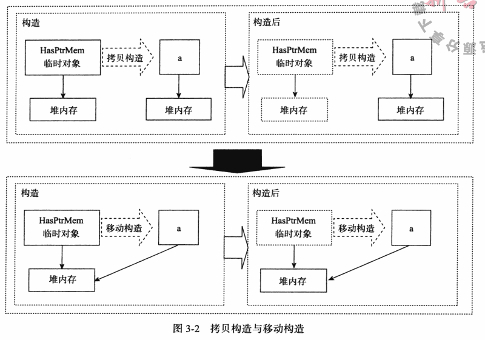
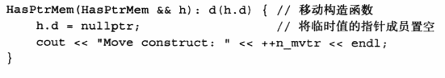
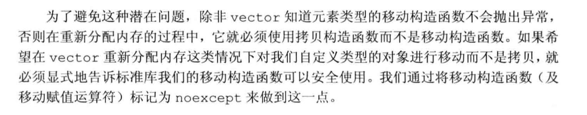
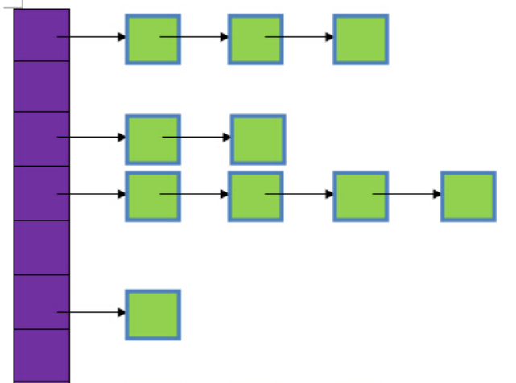

##### 1.关于c++内存对齐

内存对齐原因：

(1). 平台原因(移植原因)：不是所有的硬件平台都能访问任意地址上的任意数据的；某些硬件平台只能在某些地址处取某些特定类型的数据，否则抛出硬件异常。

(2). 性能原因：数据结构(尤其是栈)应该尽可能地在自然边界上对齐。原因在于，为了访问未对齐的内存，处理器需要作两次内存访问；而对齐的内存访问仅需要一次访问

```cpp
#include <cassert>


int main(int argc, char* argv[])
{
    //此处指定对齐大小为1
    //对于a，实际对齐大小为min(sizeof(int),1)=min(4,1)=1
    //对于b，实际对齐大小为min(sizeof(char),1)=min(1,1)=1
    //编译器会确保TEST_A首地址即a的地首址是1字节对齐的，此时a对齐
    //对于b，由于b要求首地址1字节对齐，这显然对于任何地址都合适，所以a,b都是对齐的
    //对于TEST_A数组，第一个TEST_A是对齐的（假设其地址为0），则第二个TEST_A的首地址为(0+5=5)，对于第二个TEST_A的两个变量a，b均对齐
    //OK,对齐合理。因此整个结构体的大小为5
#pragma pack(1)
    struct TEST_A
    {
        int a;
        char b;
    };
#pragma  pack()
    assert(sizeof(TEST_A) == 5);

    //此处指定对齐大小为2
    //对于a，实际对齐大小为min(sizeof(int),2)=min(4,2)=2
    //对于b，实际对齐大小为min(sizeof(char),2)=min(1,2)=1
    //编译器会确保TEST_A首地址即a的地首址是2字节对齐的，此时a对齐
    //对于b，由于b要求首地址1字节对齐，这显然对于任何地址都合适，所以a,b都是对齐的
    //对于TEST_B数组，第一个TEST_B是对齐的（假设其地址为0），则第二个TEST_B的首地址为(0+5=5)，对于第二个TEST_B的变量a，显然地址5是不对齐于2字节的
    //因此，需要在TEST_B的变量b后面填充1字节，此时连续相连的TEST_B数组才会对齐
    //OK,对齐合理。因此整个结构体的大小为5+1=6
#pragma pack(2)
    struct TEST_B
    {
        int a;
        char b;
    };
#pragma  pack()
    assert(sizeof(TEST_B) == 6);

    //此处指定对齐大小为4
    //对于a，实际对齐大小为min(sizeof(int),2)=min(4,4)=4
    //对于b，实际对齐大小为min(sizeof(char),2)=min(1,4)=1
    //编译器会确保TEST_A首地址即a的地首址是4字节对齐的，此时a对齐
    //对于b，由于b要求首地址1字节对齐，这显然对于任何地址都合适，所以a,b都是对齐的
    //对于TEST_C数组，第一个TEST_C是对齐的（假设其地址为0），则第二个TEST_C的首地址为(0+5=5)，对于第二个TEST_C的变量a，显然地址5是不对齐于4字节的
    //因此，需要在TEST_C的变量b后面填充3字节，此时连续相连的TEST_C数组才会对齐
    //OK,对齐合理。因此整个结构体的大小为5+3=8
#pragma pack(4)
    struct TEST_C
    {
        int a;
        char b;
    };
#pragma  pack()
    assert(sizeof(TEST_C) == 8);

    //此处指定对齐大小为8
    //对于a，实际对齐大小为min(sizeof(int),8)=min(4,8)=4
    //对于b，实际对齐大小为min(sizeof(char),8)=min(1,8)=1
    //编译器会确保TEST_A首地址即a的地首址是4字节对齐的，此时a对齐
    //对于b，由于b要求首地址1字节对齐，这显然对于任何地址都合适，所以a,b都是对齐的
    //对于TEST_D数组，第一个TEST_D是对齐的（假设其地址为0），则第二个TEST_D的首地址为(0+5=5)，对于第二个TEST_D的变量a，显然地址5是不对齐于4字节的
    //因此，需要在TEST_D的变量b后面填充3字节，此时连续相连的TEST_D数组才会对齐
    //OK,对齐合理。因此整个结构体的大小为5+3=8
#pragma pack(8)
    struct TEST_D
    {
        int a;
        char b;
    };
#pragma  pack()
    assert(sizeof(TEST_D) == 8);


    //此处指定对齐大小为8
    //对于a，实际对齐大小为min(sizeof(int),8)=min(4,8)=4
    //对于b，实际对齐大小为min(sizeof(char),8)=min(1,8)=1
    //对于c，这是一个数组，数组的对齐大小与其单元一致，因而align(c)=align(double)=min(sizeof(double),8)=min(8,8)=8
    //对于d，实际对齐大小为min(sizeof(char),8)=min(1,8)=1
    //编译器会确保TEST_A首地址即a的地首址是4字节对齐的，此时a对齐
    //对于b，由于b要求首地址1字节对齐，这显然对于任何地址都合适，所以a,b都是对齐的
    //对于c，由于c要求首地址8字节对齐，因此前面的a+b=5，还要在c后面补上3个字节才能对齐
    //对于d，显而易见，任何地址均对齐，此时结构体大小为4+1+3+10*8+1=89
    //对于TEST_E数组，第一个TEST_E是对齐的（假设其地址为0），则第二个TEST_E的首地址为(0+89=89)，对于第二个TEST_E的变量a，显然地址89是不对齐于4字节的
    //因此，需要在TEST_E的变量d后面填充7字节，此时连续相连的TEST_E数组才会对齐 
    //(注意：此处不仅要确保下一个TEST_E的a,b变量对齐，还要确保c也对齐，所以这里不是填充3字节，而是填充7字节）
    //OK,对齐合理。因此整个结构体的大小为(4)+(1+3)+(10*8)+(1+7)=96
#pragma pack(8)
    struct TEST_E
    {
        int a;
        char b;
        double c[10];
        char d;
    };
#pragma  pack()
    assert(sizeof(TEST_E) == 96);

    return 0;
}
```

##### 2.c++ inline函数

```
使用函数能够避免将相同代码重写多次的麻烦，还能减少可执行程序的体积，但也会带来程序运行时间上的开销。

函数调用在执行时，首先要在栈中为形参和局部变量分配存储空间，然后还要将实参的值复制给形参，接下来还要将函数的返回地址（该地址指明了函数执行结束后，程序应该回到哪里继续执行）放入栈中，最后才跳转到函数内部执行。这个过程是要耗费时间的。

另外，函数执行 return 语句返回时，需要从栈中回收形参和局部变量占用的存储空间，然后从栈中取出返回地址，再跳转到该地址继续执行，这个过程也要耗费时间。

总之，使用函数调用语句和直接把函数中的代码重新抄写一遍相比，节省了人力，但是带来了程序运行时间上的额外开销。

一般情况下，这个开销可以忽略不计。但是，如果一个函数内部没有几条语句，执行时间本来就非常短，那么这个函数调用产生的额外开销和函数本身执行的时间相比，就显得不能忽略了。假如这样的函数在一个循环中被上千万次地执行，函数调用导致的时间开销可能就会使得程序运行明显变慢。

作为特别注重程序执行效率，适合编写底层系统软件的高级程序设计语言，C++ 用 inline 关键字较好地解决了函数调用开销的问题。

在 C++ 中，可以在定义函数时，在返回值类型前面加上 inline 关键字。如：
inline int Max (int a, int b)
{
    if(a >b)
        return a;
    return b;
}
增加了 inline 关键字的函数称为“内联函数”。内联函数和普通函数的区别在于：当编译器处理调用内联函数的语句时，不会将该语句编译成函数调用的指令，而是直接将整个函数体的代码插人调用语句处，就像整个函数体在调用处被重写了一遍一样。

有了内联函数，就能像调用一个函数那样方便地重复使用一段代码，而不需要付出执行函数调用的额外开销。很显然，使用内联函数会使最终可执行程序的体积增加。以时间换取空间，或增加空间消耗来节省时间，这是计算机学科中常用的方法。

内联函数中的代码应该只是很简单、执行很快的几条语句。如果一个函数较为复杂，它执行的时间可能上万倍于函数调用的额外开销，那么将其作为内联函数处理的结果是付出让代码体积增加不少的代价，却只使速度提高了万分之一，这显然是不划算的。

有时函数看上去很简单，例如只有一个包含一两条语句的循环，但该循环的执行次数可能很多，要消耗大量时间，那么这种情况也不适合将其实现为内联函数。

另外，需要注意的是，调用内联函数的语句前必须已经出现内联函数的定义（即整个数体），而不能只出现内联函数的声明。
```

##### 3.C++多态

静态多态，函数重载，编译期间完成，编译器根据实参类型来选择调用合适的函数

动态多态：在程序运行时根据基类的指针或引用指向的对象来确定自己具体该调用哪一个类的虚函数

虚函数指针  虚函数表

vptr的分步初始化：在构造子类对象时，执行父类构造函数时，子类的vptr指针指向父类的虚函数表，当父类构造函数执行完毕后，子类的vptr会指向子类的虚函数表。

##### 4.菱形继承

虚基类指针 虚表

##### 5.内存检测原理

```
Memcheck 能够检测出内存问题，关键在于其建立了两个全局表，如下所述。
( 1 ) Valid-Value 表：对于进程的整个地址空间中的每一个字节（ Byte ），都有与之对应的8 bit ；对于CPU 的每个寄存器， 也有一个与之对应的bit 向量。这些bit 负责记录该字节或者寄存器值是否具有有效的、已初始化的值。
( 2 ) Valid-Address 表：对于进程整个地址空间中的每一个字节（ Byte ），还有与之对应的1 bit ， 负责记录该地址是否能够被读写。
检测原理： 当要读写内存中某个字节时， 首先检查这个字节对应的A bit。如果该A bit显示该位置是无效位置， Memcheck 则报告读写错误。
内核（ core ） 类似于一个虚拟的CPU 环境，这样当内存中的某个字节被加载到真实的CPU 中时，该字节对应的V bit 也被加载到虚拟的CPU 环境中。一旦寄存器中的值，被用来产生内存地址， 或者该值能够影响程序输出，则Memcheck 会检查对应的V bit ，如果该值尚未初始化，则会报告使用未初始化内存错误。
```

windows:_CrtDumpMemoryLeaks();

##### 6.i++和++i哪个效率更高

对于内建数据类型，没有差异

对于自定义数据类型，++i更高，因为++i可以返回引用，而i++必须返回对象的值，导致复制开销

##### 7.关于atexit函数

可以在程序正常退出时运行，函数运行的顺序与注册顺序相反。

##### 8.auto,nullptr,for-each,declytype

nullptr是为了解决NULL的二义性而引进的一种新的类型，由于NULL实际代表的是0

##### 9.C++11多线程编程

1.std::thread和pthread的区别

2.原子操作：std::atomic

3.线程同步：std::mutex, std::lock_guard, std::condition_variable

##### 10.std::function, std::bind

使用

占位符

##### 11.智能指针

```
C++程序设计中使用堆内存是非常频繁的操作，堆内存的申请和释放都由程序员自己管理。程序员自己管理堆内存可以提高了程序的效率，但是整体来说堆内存的管理是麻烦的，C++11中引入了智能指针的概念，方便管理堆内存。使用普通指针，容易造成堆内存泄露（忘记释放），二次释放，程序发生异常时内存泄露等问题等，使用智能指针能更好的管理堆内存。
	1.从较浅的层面看，智能指针是利用了一种叫做RAII（资源获取即初始化）的技术对普通的指针进行封装，这使得智能指针实质是一个对象，行为表现的却像一个指针。
	2.智能指针的作用是防止忘记调用delete释放内存和程序异常的进入catch块忘记释放内存。另外指针的释放时机也是非常有考究的，多次释放同一个指针会造成程序崩溃，这些都可以通过智能指针来解决。
	3.智能指针还有一个作用是把值语义转换成引用语义
```

```cpp
shared_ptr:
	多个指针指向相同的对象。shared_ptr使用引用计数，每一个shared_ptr的拷贝都指向相同的内存。每使用他一次，内部的引用计数加1，每析构一次，内部的引用计数减1，减为0时，自动删除所指向的堆内存。shared_ptr内部的引用计数是线程安全的，但是对象的读取需要加锁。
	1.初始化。智能指针是个模板类，可以指定类型，传入指针通过构造函数初始化。也可以使用make_shared函数初始化。不能将指针直接赋值给一个智能指针，一个是类，一个是指针。例如std::shared_ptr<int> p4 = new int(1);的写法是错误的
	2.拷贝和赋值。拷贝使得对象的引用计数增加1，赋值使得原对象引用计数减1，当计数为0时，自动释放内存。后来指向的对象引用计数加1，指向后来的对象。
	3.get函数获取原始指针
	4.注意不要用一个原始指针初始化多个shared_ptr，否则会造成二次释放同一内存
	5.注意避免循环引用，shared_ptr的一个最大的陷阱是循环引用，循环，循环引用会导致堆内存无法正确释放，导致内存泄漏。
//shared计数放在这个结构体里面，实际上结构体里还应该有另一个weak计数。下文介绍weak_ptr时会解释。
struct SharedPtrControlBlock{
　　int shared_count;
};
//大概长这个样子（化简版）
template<class T>
class shared_ptr{
　　T* ptr;
　　SharedPtrControlBlock* count;
};

void runGame(){
　　std::shared_ptr<Monster> monster1(new Monster());　　　//计数加到1

　　do{std::shared_ptr<Monster> monster2 = monster1;　　　　//计数加到2
　　}while(0);　　　　　　　　　　
　　//该栈退出后，计数减为1，monster1指向的堆对象仍存在

　　std::shared_ptr<Monster> monster3 = monster1;　　　　　　//计数加到2
}
//该栈退出后，shared_ptr都释放了，计数减为0，它们指向的堆对象也能跟着释放.
```

```cpp
unique_ptr:
　　unique_ptr“唯一”拥有其所指对象，同一时刻只能有一个unique_ptr指向给定对象（通过禁止拷贝语义、只有移动语义来实现）。相比与原始指针unique_ptr用于其RAII的特性，使得在出现异常的情况下，动态资源能得到释放。unique_ptr指针本身的生命周期：从unique_ptr指针创建时开始，直到离开作用域。离开作用域时，若其指向对象，则将其所指对象销毁(默认使用delete操作符，用户可指定其他操作)。unique_ptr指针与其所指对象的关系：在智能指针生命周期内，可以改变智能指针所指对象，如创建智能指针时通过构造函数指定、通过reset方法重新指定、通过release方法释放所有权、通过移动语义转移所有权。
void runGame(){
　　std::unique_ptr<Monster> monster1(new Monster());//monster1 指向 一个怪物
　　std::unique_ptr<Monster> monster2 = monster1;//Error!编译期出错，不允许复制指针指向同一个资源。
　　std::unique_ptr<Monster> monster3 = std::move(monster1);//转移所有权给monster3.
　　monster1->doSomething();//Oops!monster1指向nullptr，运行期崩溃
}
```

```cpp
weak_ptr:
　　weak_ptr是为了配合shared_ptr而引入的一种智能指针，因为它不具有普通指针的行为，没有重载operator*和->,它的最大作用在于协助shared_ptr工作，像旁观者那样观测资源的使用情况。weak_ptr可以从一个shared_ptr或者另一个weak_ptr对象构造，获得资源的观测权。但weak_ptr没有共享资源，它的构造不会引起指针引用计数的增加。使用weak_ptr的成员函数use_count()可以观测资源的引用计数，另一个成员函数expired()的功能等价于use_count()==0,但更快，表示被观测的资源(也就是shared_ptr的管理的资源)已经不复存在。weak_ptr可以使用一个非常重要的成员函数lock()从被观测的shared_ptr获得一个可用的shared_ptr对象， 从而操作资源。但当expired()==true的时候，lock()函数将返回一个存储空指针的shared_ptr。
内部大概实现:

计数区域(SharedPtrControlBlock)结构体引进新的int变量weak_count，来作为弱引用计数。
每个weak_ptr都占指针的两倍空间，一个装着原始指针，一个装着计数区域的指针（和shared_ptr一样的成员）。
weak_ptr可以由一个shared_ptr或者另一个weak_ptr构造。
weak_ptr的构造和析构不会引起shared_count的增加或减少，只会引起weak_count的增加或减少。

被管理资源的释放只取决于shared计数，当shared计数为0，才会释放被管理资源，
也就是说weak_ptr不控制资源的生命周期。

但是计数区域的释放却取决于shared计数和weak计数，当两者均为0时，才会释放计数区域。

//shared引用计数和weak引用计数
//之前的计数区域实际最终应该长这个样子
struct SharedPtrControlBlock{
　　int shared_count;
　　int weak_count;
};
//大概长这个样子（化简版）
template<class T>
class weak_ptr{
　　T* ptr;
　　SharedPtrControlBlock* count;
};
 
针对空悬指针问题：

空悬指针问题是指：无法知道指针指向的堆内存是否已经释放。

得益于引入的weak_count,weak_ptr指针可以使计数区域的生命周期受weak_ptr控制，

从而能使weak_ptr获取 被管理资源的shared计数，从而判断被管理对象是否已被释放。（可以实时动态地知道指向的对象是否被释放,从而有效解决空悬指针问题）

它的成员函数expired()就是判断指向的对象是否存活。

针对循环引用问题：

class Monster{
　　//尽管父子可以互相访问，但是彼此都是独立的个体，无论是谁都不应该拥有另一个人的所有权。
　　std::weak_ptr<Monster> m_father;　　　　//所以都把shared_ptr换成了weak_ptr
　　std::weak_ptr<Monster> m_son;　　　　　　//同上
public:
　　void setFather(std::shared_ptr<Monster>& father); //实现细节懒得写了
　　void setSon(std::shared_ptr<Monster>& son);　　　　//懒
　　~Monster(){std::cout << "A monster die!";}　　　　 //析构时发出死亡的悲鸣
};
复制代码
然后执行下面的函数

void runGame(){
　　std::shared_ptr<Monster> father(new Monster());
　　std::shared_ptr<Monster> son(new Monster());
　　father->setSon(son);
　　son->setFather(father);
}
那么我们再来模拟一遍，函数退出时栈的shared_ptr对象陆续释放后的情形：
一开始：
father指向的堆对象 shared计数为1,weak计数为1
son指向的堆对象 shared计数为1,weak计数为1

son智能指针退出栈：
son指向的堆对象 shared计数减为0,weak计数为1,释放son的堆对象,发出第一个死亡的悲鸣
father指向的堆对象 shared计数为1,weak计数减为0;

father智能指针退出栈:
father指向的堆对象 shared计数减为0,weak计数为0;释放father的堆对象和father的计数区域,发出第二个死亡的悲鸣。
son指向的堆对象 shared计数为0,weak计数减为0;释放son的计数区域。

函数结束，释放行为正确。

（可以说，当生命控制权没有彼此互相掌握时，才能正确解决循环引用问题，而弱引用的使用可以使生命控制权互相掌握的情况消失）

此外：
weak_ptr没有重载 * 和 -> ，所以并不能直接使用资源。但可以使用lock()获得一个可用的shared_ptr对象，
如果对象已经死了，lock()会失败，返回一个空的shared_ptr。

void runGame(){
　　std::shared_ptr<Monster> monster1(new Monster());
　　std::weak_ptr<Monster> r_monster1 = monster1;
　　r_monster1->doSomething();//Error! 编译器出错！weak_ptr没有重载* 和 -> ，无法直接当指针用
　　std::shared_ptr<Monster> s_monster1 = r_monster1.lock();//OK!可以通过weak_ptr的lock方法获得shared_ptr。
}
```

##### 12.可变模板参数

```cpp
可变参数模板：
C++11的可变参数模板，对参数进行了高度泛化，可以表示任意数目、任意类型的参数，其语法为：在class或typename后面带上省略号”。

例如：

Template<class ... T>
void func(T ... args)
{
cout<<”num is”<<sizeof ...(args)<<endl;
}
func();//args不含任何参数

func(1);//args包含一个int类型的实参

func(1,2.0)//args包含一个int一个double类型的实参

其中T叫做模板参数包，args叫做函数参数包

省略号作用如下：

1）声明一个包含0到任意个模板参数的参数包

2）在模板定义得右边，可以将参数包展成一个个独立的参数

C++11可以使用递归函数的方式展开参数包，获得可变参数的每个值。通过递归函数展开参数包，需要提供一个参数包展开的函数和一个递归终止函数。例如：
#include <iostream>

using namespace std;
void print()
{

    cout << "empty" << endl;

}

// 展开函数
template <class T, class... args>
void print(T head, args... Args)
{
    cout << head << ",";
    print(Args...);
}
int main()
{
    print(1, 2, 3, 4);
    return 0;
}
参数包Args ...在展开的过程中递归调用自己，没调用一次参数包中的参数就会少一个，直到所有参数都展开为止。当没有参数时就会调用非模板函数printf终止递归过程。
```

##### 12.右值引用， std::move, 完美转发

1.浅拷贝存在的问题：

容易导致野指针

2.深拷贝同样存在问题：

```
//已经有一个有深拷贝构造函数的类A
A get(A a)
{
    return a;
}
```

这个时候拷贝构造函数就会调用多次，造成时空的浪费

如果对象所指的堆区非常大的话，会造成很大的浪费

然而临时对象的产生和销毁以及拷贝对程序员来说基本是透明的，不会影响程序的正确性。

那么如何避免这个问题呢？



3.移动构造函数



可以看到，移动构造函数接受一个”右值引用“参数

那么，移动构造函数何时会被触发呢，一旦我们用到的是临时变量，那么移动构造语义就可以得到执行。



4.左值、右值与右值引用

左值：

右值：纯右值，将亡值

右值引用：T && a = ReturnRvalue();

右值引用想比于T b = ReturnRvalue();就会少一次对象的析构和一次对象的构造。

5.std::move 强制转化为右值

将左值强制转换为右值引用，继而我们可以通过右值引用使用该值，以用于移动语义。

```cpp
#include <iostream>
#include <vector>

using namespace std;

class A
{
public:
    A()
    {
    }
    A(const A& rhs)
    {
        cout << "拷贝构造" << endl;
    }
    A(A&& rhs)
    {
        a = rhs.a;
        rhs.a = nullptr;
        cout << "移动构造" << endl;
    }


private:
    char* a;
};

int main()
{
    vector<A> hh;
    hh.reserve(3);
    A x;

    hh.push_back(x);

    hh.push_back(std::move(x));
}
```

运行结果：

拷贝构造

移动构造

emplace_back（）也可以避免拷贝，原地构造。仅对临时对象有用。

6.完美转发 std::forward

当我们将一个右值引用传入函数时，他在实参中有了命名，所以继续往下传或者调用其他函数时，根据C++ 标准的定义，这个参数变成了一个左值。那么他永远不会调用接下来函数的右值版本，这可能在一些情况下造成拷贝。为了解决这个问题 C++ 11引入了完美转发，根据右值判断的推倒，调用forward 传出的值，若原来是一个右值，那么他转出来就是一个右值，否则为一个左值。 

这样的处理就完美的转发了原有参数的左右值属性，不会造成一些不必要的拷贝。

##### 13.lambda表达式

信号与槽

##### 14.static_assert

编译时assert

##### 15.四种cast

```
C++中四种类型转换是：static_cast, dynamic_cast, const_cast, reinterpret_cast
1、const_cast
用于将const变量转为非const
2、static_cast
用于各种隐式转换，比如非const转const，void*转指针等, static_cast能用于多态向上转化，如果向下转能成功但是不安全，结果未知；
3、dynamic_cast
用于动态类型转换。只能用于含有虚函数的类，用于类层次间的向上和向下转化。只能转指针或引用。向下转化时，如果是非法的对于指针返回NULL，对于引用抛异常。要深入了解内部转换的原理。
向上转换：指的是子类向基类的转换
向下转换：指的是基类向子类的转换
它通过判断在执行到该语句的时候变量的运行时类型和要转换的类型是否相同来判断是否能够进行向下转换。
4、reinterpret_cast
几乎什么都可以转，比如将int转指针，可能会出问题，尽量少用；
5、为什么不使用C的强制转换？
C的强制转换表面上看起来功能强大什么都能转，但是转化不够明确，不能进行错误检查，容易出错。
```

##### 16.malloc的原理，brk系统调用干什么的，mmap呢

```
	Malloc函数用于动态分配内存。为了减少内存碎片和系统调用的开销，malloc其采用内存池的方式，先申请大块内存作为堆区，然后将堆区分为多个内存块，以块作为内存管理的基本单位。当用户申请内存时，直接从堆区分配一块合适的空闲块。Malloc采用隐式链表结构将堆区分成连续的、大小不一的块，包含已分配块和未分配块；同时malloc采用显示链表结构来管理所有的空闲块，即使用一个双向链表将空闲块连接起来，每一个空闲块记录了一个连续的、未分配的地址。
	当进行内存分配时，Malloc会通过隐式链表遍历所有的空闲块，选择满足要求的块进行分配；当进行内存合并时，malloc采用边界标记法，根据每个块的前后块是否已经分配来决定是否进行块合并。
	调用 free 函数时，它将用户释放的内存块连接到空闲链表上
	到最后，空闲链会被切成很多的小内存片段，如果这时用户申请一个大的内存片段， 那么空闲链表上可能没有可以满足用户要求的片段了。于是，malloc（）函数请求延时，并开始在空闲链表上检查各内存片段，对它们进行内存整理，将相邻的小空闲块合并成较大的内存块
	Malloc在申请内存时，一般会通过brk或者mmap系统调用进行申请。其中当申请内存小于128K时，会使用系统函数brk在堆区中分配；而当申请内存大于128K时，会使用系统函数mmap在映射区分配。
	从操作系统角度来看，进程分配内存有两种方式，分别由两个系统调用完成：brk和mmap（不考虑共享内存）。
	1、brk是将数据段(.data)的最高地址指针_edata往高地址推；
	2、mmap是在进程的虚拟地址空间中（堆和栈中间，称为文件映射区域的地方）找一块空闲的虚拟内存。
     这两种方式分配的都是虚拟内存，没有分配物理内存。在第一次访问已分配的虚拟地址空间的时候，发生缺页中断，操作系统负责分配物理内存，然后建立虚拟内存和物理内存之间的映射关系。
	在标准C库中，提供了malloc/free函数分配释放内存，这两个函数底层是由brk，mmap，munmap这些系统调用实现的。
```

##### 17.为什么c++空类占一个字节

```
所谓类的实例化就是在内存中分配一块地址．（空类同样可以被实例化），每个实例在内存中都有一个独一无二的地址，为了达到这个目的，编译器往往会给一个空类隐含的加一个字节，这样空类在实例化后在内存得到了独一无二的地址．因为如果空类不隐含加一个字节的话，则空类无所谓实例化了（因为类的实例化就是在内存中分配一块地址。 
```

##### 18.为啥栈更快

至于堆和栈哪个更快，从两方面来考虑：
      1.分配和释放，堆在分配和释放时都要调用函数（MALLOC,FREE)，比如分配时会到堆空间去寻找足够大小的空间（因为多次分配释放后会造成空洞），这些都会花费一定的时间，具体可以看看MALLOC和FREE的源代码，他们做了很多额外的工作，而栈却不需要这些。

​     2.访问时间，访问堆的一个具体单元，需要两次访问内存，第一次得取得指针，第二次才是真正得数据，而栈只需访问一次。另外，堆的内容被操作系统交换到外存的概率比栈大，栈一般是不会被交换出去的。 

##### 19.内存泄漏及解决

1.C++内存泄漏是什么？

```
内存泄漏(memory leak)是指由于疏忽或错误造成了程序未能释放掉不再使用的内存的情况。内存泄漏并非指内存在物理上的消失，而是应用程序分配某段内存后，由于设计错误，失去了对该段内存的控制，因而造成了内存的浪费。
内存泄漏的分类：
1. 堆内存泄漏 （Heap leak）。对内存指的是程序运行中根据需要分配通过malloc,realloc new等从堆中分配的一块内存，再是完成后必须通过调用对应的 free或者delete 删掉。如果程序的设计的错误导致这部分内存没有被释放，那么此后这块内存将不会被使用，就会产生Heap Leak.
2. 系统资源泄露（Resource Leak）。主要指程序使用系统分配的资源比如 Bitmap,handle ,SOCKET等没有使用相应的函数释放掉，导致系统资源的浪费，严重可导致系统效能降低，系统运行不稳定。
3. 没有将基类的析构函数定义为虚函数。当基类指针指向子类对象时，如果基类的析构函数不是virtual，那么子类的析构函数将不会被调用，子类的资源没有正确是释放，因此造成内存泄露。
```

2.造成的后果

性能不良，内存会耗尽
4.内存泄漏排查

BoundsChecker,定位运行时发生的各种错误
调试运行DEBUG版程序，运用以下技术：CRT(C run-time libraries)、运行时函数调用堆栈、内存泄漏时提示的内存分配序号(集成开发环境OUTPUT窗口)，综合分析内存泄漏的原因，排除内存泄漏。
linux工具之检测内存泄漏-valgrind,功能强大，不仅仅是内存泄漏检测工具。
5.怎么有效解决内存泄漏问题？

智能指针。因为智能指针可以自动删除分配的内存。智能指针和普通指针类似，只是不需要手动释放指针，而是通过智能指针自己管理内存的释放。

##### 20.哪些函数不能是虚函数（构造函数，静态函数，inline函数）？为什么？

```cpp
C++哪些函数不能声明为虚函数
什么样的函数不能声明为虚函数？1）不能被继承的函数。2）不能被重写的函数。
1）普通函数
普通函数不属于成员函数，是不能被继承的。普通函数只能被重载，不能被重写，因此声明为虚函数没有意义。因为编译器会在编译时绑定函数。

而多态体现在运行时绑定。通常通过基类指针指向子类对象实现多态。
2）友元函数
友元函数不属于类的成员函数，不能被继承。对于没有继承特性的函数没有虚函数的说法。
3）构造函数
首先说下什么是构造函数，构造函数是用来初始化对象的。假如子类可以继承基类构造函数，那么子类对象的构造将使用基类的构造函数，而基类构造函数并不知道子类的有什么成员，显然是不符合语义的。从另外一个角度来讲，多态是通过基类指针指向子类对象来实现多态的，在对象构造之前并没有对象产生，因此无法使用多态特性，这是矛盾的。因此构造函数不允许继承。
4）内联成员函数
我们需要知道内联函数就是为了在代码中直接展开，减少函数调用花费的代价。也就是说内联函数是在编译时展开的。而虚函数是为了实现多态，是在运行时绑定的。因此显然内联函数和多态的特性相违背。
5）静态成员函数
首先静态成员函数理论是可继承的。但是静态成员函数是编译时确定的，无法动态绑定，不支持多态，因此不能被重写，也就不能被声明为虚函数。
```

##### 21.malloc调用失败会发生什么？new失败呢？

malloc调用失败会返回null，new会抛出异常

malloc失败原因：

1.内存不足

2.就要查从不能分配的那个malloc函数开始往回找最近的那个能分配的malloc，出问题的代码应该就在这部分，很可能的原因就是指针越界，对未知的内存进行了操作，导致了malloc不能继续分配内存。

##### 22.模板声明与定义要放在同一文件中？

“通常情况下，你会在.h文件中声明函数和类，而将它们的定义放置在一个单独的.cpp文件中。但是在使用模板时，这种习惯性做法将变得不再有用，因为当实例化一个模板时，编译器必须看到模板确切的定义，而不仅仅是它的声明。因此，最好的办法就是将模板的声明和定义都放置在同一个.h文件中。这就是为什么所有的STL头文件都包含模板定义的原因。”[1]

"标准要求编译器在实例化模板时必须在上下文中可以查看到其定义实体；而反过来，在看到实例化模板之前，编译器对模板的定义体是不处理的——原因很简单，编译器怎么会预先知道 typename 实参是什么呢？因此模板的实例化与定义体必须放到同一翻译单元中。"[1]


"《C++编程思想》第15章(第300页)说明了原因：
模板定义很特殊。由template<…> 处理的任何东西都意味着编译器在当时不为它分配存储空间，它一直处于等待状态直到被一个模板实例告知。在编译器和连接器的某一处，有一机制能去掉指定模板的多重定义。所以为了容易使用，几乎总是在头文件中放置全部的模板声明和定义。"


"对C++编译器而言，当调用函数的时候，编译器只需要看到函数的声明。当定义类类型的对象时，编译器只需要知道类的定义，而不需要知道类的实现代码。因此，因该将类的定义和函数声明放在头文件中，而普通函数和类成员函数的定义放在源文件中。
       但在处理模板函数和类模板时，问题发生了变化。要进行实例化模板函数和类模板，要求编译器在实例化模板时必须在上下文中可以查看到其定义实体；而反过来，在看到实例化模板之前，编译器对模板的定义体是不处理的——原因很简单，编译器怎么会预先知道 typename 实参是什么呢？因此模板的实例化与定义体必须放到同一翻译单元中。"

##### 23.struct与union的区别

1.在存储多个成员信息时，编译器会自动给struct第个成员分配存储空间，struct 可以存储多个成员信息，而Union每个成员会用同一个存储空间，只能存储最后一个成员的信息。

2.都是由多个不同的数据类型成员组成，但在任何同一时刻，Union只存放了一个被先选中的成员，而结构体的所有成员都存在。

3.对于Union的不同成员赋值，将会对其他成员重写，原来成员的值就不存在了，而对于struct 的不同成员赋值 是互不影响的。

##### 24.三种调用方式

```
编译器一般使用堆栈来实现函数调用。当一个函数被调用时，（进程内核对象为其在进程的地址空间的堆栈部分）分配一定的栈内存给函数使用，函数堆栈用于：
1.在进入函数前，保存“返回地址”和环境变量。返回地址是指该函数结束后，从进入该函数之前的哪个地址继续执行下去。
2.在进入函数之后，保存局部变量等。
在Win32下有一下4中调用：
1._cdecl：它是c/c++默认的调用方式。实参是以参数列表从右至左入栈，函数栈有调用方释放。主要用在哪些带有可变参数的函数上。
2._stdcall：它是WIN API的调用约定，需要显示指定。实参是以参数列表从右至左入栈，函数栈由被调用方自己释放。但若函数含有可变参数，那么即使显示指定了_stdcall，编译器也会自动把其改为_cdecl。
3._thiscall：它是类的非静态成员函数默认的调用约定，不能用在含有可变参数的函数上。实参是以参数列表从右至左入栈，函数栈由被调用方自己释放。（但是类的非静态成员函数内部都含有一个this指针，该指针不是存在函数堆栈上，而是直接存放在寄存器上）。
4._fastcall：快速调用。它的实参不是放在函数堆栈上，而是直接存在寄存器上，所以不存在入栈出栈、函数堆栈释放。
```

##### 25.#include""和#include<>的区别

常识。。。

可以说下#include<iostream.h>和#include<iostream>的区别

事实上是不一样的，iostream和iostream.h是两个不同的文件。实际上，在你的编译器include 文件夹里面可以看到，两个文件打开后，里面的代码是不一样的。后缀为.h 的头文件在C＋＋标准已经明确提出不再支持了，早些的C 语言为了实现将标准库功能定义在全局空间里，声明放在在带h 后缀的头文件里。C＋＋标准为了和C 语言区别开，也为了正确使用命名空间，规定头文件不再使用后缀.h 。因此，当使用< iostream.h ＞时，相当于在C 中调用库函数，使用的是全局命名空间，也就是早期的C＋＋实现方法。换句话说， iostream 是iostream.h 的升级版，大部分的头文件都有一个不带.h 扩展名的文件与之相对应


但是<string>并非<string.h>的升级

对于c程序库,可以#include<stdio>也可以#include<cstdio>

##### 26.volatile关键字

```
	在本次线程内，当读取一个变量时，为了提高读取速度，编译器进行优化时有时会先把变量读取到一个寄存器中。当变量值在本线程内改变时，会及时改写寄存器中的值，当这个值在别的线程被改写时，寄存器中的值不会发生改变，从而造成问题。
	volatile可以避免优化，强制内存读取的顺序。
```

##### 27.重载overload，重写override，重定义overwrite

```
1.overload，将语义相同但是参数列表不同的几个函数用一个名字表示，返回值类型可以不同。
2.overide，派生类覆盖基类的虚函数，实现接口的重用，返回值类型必须相同。
3.overwrite，派生类屏蔽了其同名的基类函数，返回值类型可以不同。

```

##### 28.gcc和g++的区别

```
1.gcc和g++都可以编译c代码和c++代码。但是.c，gcc把它当做c程序，g++把它当做c++程序。.cpp，两者都会认为是c程序。
2.编译阶段，g++会调用gcc，对于c++代码，两者是等价的，但是因为gcc命令不能自动和c++程序使用的库链接，所以通常用g++来完成链接。
3.可以用gcc链接，形式如下：
gcc main.cpp -lstdc++
```

##### 29.拷贝构造函数的调用时机

```cpp
	生成一个实例化对象会调用一次普通构造函数，而用一个对象去实例化一个新的对象所调用的就是拷贝构造函数。
三种时机：
	1.用类的一个对象取初始化另一个对象
	2.当函数的参数是类的对象时，就是值传递的时候，如果是引用传递则不会调用
	3.当函数的返回值是类的对象或者引用的时候
#include <iostream>
#include <string>

using namespace std;

class A
{
public:
    A(int i)
    {
        data = i;
    }
    A(const A& a)
    {
        data = a.data;
        cout << "拷贝构造函数被调用了" << endl;
    }

private:
    int data;
};

void func1(A a)
{
    cout << "func1" << endl;
}

void func2(A& a)
{
    cout << "func2" << endl;
}

int main()
{
    A a(3);
    cout << "我是分割线-----" << endl;
    A b(a);
    cout << "我是分割线-----" << endl;
    func1(a);
    cout << "我是分割线-----" << endl;
    func2(a);
    return 0;
}

运行结果：
我是分割线-----
拷贝构造函数被调用了
我是分割线-----
拷贝构造函数被调用了
func1
我是分割线-----
func2
```

##### 30.static

static关键字主要起隐藏作用

static修饰内置类型变量为静态变量：

```
static修饰的内置类型变量分为静态全局变量和静态局部变量，静态变量内存分配在 .data段，生成的符号为local类型的符号，在链接阶段进行符号解析时不做处理。静态变量只初始化一次，未初始化的静态变量会默认初始化为0。静态全局变量只在本文件可见，外部文件无法访问。而静态局部变量只在定义的作用域内可见，但他们的生存周期都是整个程序运行时期。
```

```cpp
#include<iostream>

using namespace std;

static int a = 1;
static int b;

int main()
{
    static int c = 2;
    static int d;
    while(true)
    {
        static int e = 3;
        break;
    }
    cout << a << endl;
    cout << b << endl;
    cout << c << endl;
    cout << d << endl;
    //cout << e << endl;
    return 0;
}
```

输出为：

1
0
2
0

static修饰函数：

```
static修饰的函数为静态函数，静态函数主要是起到函数的隐藏作用，static修饰的函数只允许在当前文件中使用，在其他文件中无法找到该函数的地址，比如在一个工程中创建两个.cpp（.c）文件，main1、main2，在main1中定义一个static int add()函数并对该函数进行实现，而在main2中使用add函数是就编译会报错误，这就是由于static修饰该函数只允许在main1文件中使用造成的。
```

static修饰类数据成员：

```cpp
#include<iostream>

using namespace std;

class A
{
public:
    static const int a = 2;
};


int main()
{
    cout << A::a << endl;
    return 0;
}
```

如果是non-const成员，就不能在类内初始化：

```cpp
#include<iostream>

using namespace std;

class xx
{
public:
    static int a;
};

int xx::a = 1;

int main()
{
    //int xx::a = 1;
    cout << xx::a << endl;
    return 0;
}
```

实现数据共享：

```cpp
#include<iostream>

using namespace std;

class xx
{
public:
    static int a;
    int b = 0;
};

int xx::a = 0;

int main()
{
    xx x;
    x.a = 1;
    cout << x.a << endl;
    xx y;
    y.a = 2;
    cout << x.a << endl;
    cout << y.a << endl;
    return 0;
}
```

static修饰成员函数

```
static修饰的成员方法为静态成员方法，静态成员方法可以在类内或类外定义，但必须在类内声明；static成员方法没有this指针，所以不能直接引用非static数据成员或调用类的非static成员方法，只能调用类的static成员数据和static成员方法；static成员不是任何对象的组成，不依赖对象的调用所以static成员方法不能被声明为const，因为const只限定该类的对象；static成员方法不能同时被声明为虚函数
```

##### 31.c++内存分区

```
    1)堆：由程序员手动分配和释放，完全不同于数据结构中的堆，分配方式类似链表。由malloc或者new来分配，free和delete来释放。若程序员不释放，程序结束时由系统释放
    2)栈：由编译器自动分配和释放的，存放函数的参数值、局部变量的值等。操作方式类似数据结构中的栈
    3)全局（静态）存储区：存放全局变量和静态变量。包括DATA段(全局初始化区)与BSS段（全局未初始化区）。程序结束后由系统释放。
    BSS段：程序执行之前会自动清0。所以，未初始化的全局变量与静态变量在程序执行前已经成0了。
    4)文字常量区：常量字符串存放在这里
    5)代码区：
```

##### 32.实现一个memcpy函数

...

##### 33.线程安全的单例（带gc）

```cpp
#include <iostream>
using namespace std;
 
class Singleton
{
public:
	static Singleton *GetInstance()
	{
		return m_Instance;
	}
 
	int GetTest()
	{
		return m_Test;
	}
 
private:
	Singleton() { m_Test = 10; }
	static Singleton *m_Instance;
	int m_Test;
 
	//用内部类销毁单例
	class GC
	{
	public:
		~GC()
		{
			// We can destory all the resouce here, eg:db connector, file handle and so on
			if (m_Instance != NULL)
			{
				cout << "Here is the test" << endl;
				delete m_Instance;
				m_Instance = NULL;
			}
		}
	};
 
	static GC gc;
};
 
Singleton *Singleton::m_Instance = new Singleton();
Singleton::GC Singleton::gc;  //全局对象，程序结束时会掉用它的析构函数
 
int main(int argc, char *argv[])
{
	Singleton *singletonObj = Singleton::GetInstance();
	cout << singletonObj->GetTest() << endl;
 
	system("pause");
	return 0;
}
```

如果是另一种模式的话，要通过lock来保证线程安全

linux系统可以通过pthread_once保证线程安全

muduo的Singleton

```cpp
// Use of this source code is governed by a BSD-style license
// that can be found in the License file.
//
// Author: Shuo Chen (chenshuo at chenshuo dot com)

#ifndef MUDUO_BASE_SINGLETON_H
#define MUDUO_BASE_SINGLETON_H

#include "muduo/base/noncopyable.h"

#include <assert.h>
#include <pthread.h>
#include <stdlib.h> // atexit
/*
线程安全的单例模式类模板
*/

namespace muduo
{

    namespace detail
    {
        // This doesn't detect inherited member functions!
        // http://stackoverflow.com/questions/1966362/sfinae-to-check-for-inherited-member-functions
        template<typename T>
        struct has_no_destroy
        {
            template <typename C> static char test(decltype(&C::no_destroy));
            template <typename C> static int32_t test(...);
            const static bool value = sizeof(test<T>(0)) == 1;
        };
    }  // namespace detail

    template<typename T>
    class Singleton : noncopyable
    {
    public:
        Singleton() = delete;
        ~Singleton() = delete;

        static T& instance()  //创建单例对象并返回
        {
            pthread_once(&ponce_, &Singleton::init);  //保证init函数仅被调用一次，且调用是线程安全的
            assert(value_ != NULL);
            return *value_;
        }

    private:
        static void init()
        {
            value_ = new T();
            if (!detail::has_no_destroy<T>::value)
            {
                ::atexit(destroy);  //在程序结束是调用destroy
            }
        }

        static void destroy()
        {
            typedef char T_must_be_complete_type[sizeof(T) == 0 ? -1 : 1];
            //T_must_be_complete_type必须是完整类型，完整类型才可以被delete
            T_must_be_complete_type dummy; (void)dummy;

            delete value_;
            value_ = NULL;
        }

    private:
        static pthread_once_t ponce_;
        static T*             value_;
    };

    template<typename T>
    pthread_once_t Singleton<T>::ponce_ = PTHREAD_ONCE_INIT;

    template<typename T>
    T* Singleton<T>::value_ = NULL;

}  // namespace muduo

#endif  // MUDUO_BASE_SINGLETON_H
```

##### 35.hash冲突

1、开放定址

开放地址法有个非常关键的特征，就是所有输入的元素全部存放在哈希表里，也就是说，位桶的实现是不需要任何的链表来实现的，换句话说，也就是这个哈希表的装载因子不会超过1。它的实现是在插入一个元素的时候，先通过哈希函数进行判断，若是发生哈希冲突，就以当前地址为基准，根据再寻址的方法（探查序列），去寻找下一个地址，若发生冲突再去寻找，直至找到一个为空的地址为止。所以这种方法又称为再散列法。

有几种常用的探查序列的方法：

①线性探查

dii=1，2，3，…，m-1；这种方法的特点是：冲突发生时，顺序查看表中下一单元，直到找出一个空单元或查遍全表。

②二次探查

di=12，-12，22，-22，…，k2，-k2    ( k<=m/2 )；这种方法的特点是：冲突发生时，在表的左右进行跳跃式探测，比较灵活。

③ 伪随机探测

di=伪随机数序列；具体实现时，应建立一个伪随机数发生器，（如i=(i+p) % m），生成一个位随机序列，并给定一个随机数做起点，每次去加上这个伪随机数++就可以了。

2、链地址

每个位桶实现的时候，采用链表或者树的数据结构来去存取发生哈希冲突的输入域的关键字，也就是被哈希函数映射到同一个位桶上的关键字。



紫色部分即代表哈希表，也称为哈希数组，数组的每个元素都是一个单链表的头节点，链表是用来解决冲突的，如果不同的key映射到了数组的同一位置处，就将其放入单链表中，即链接在桶后。

3、公共溢出区

建立一个公共溢出区域，把hash冲突的元素都放在该溢出区里。查找时，如果发现hash表中对应桶里存在其他元素，还需要在公共溢出区里再次进行查找。

4、再hash

再散列法其实很简单，就是再使用哈希函数去散列一个输入的时候，输出是同一个位置就再次散列，直至不发生冲突位置。

缺点：每次冲突都要重新散列，计算时间增加。
