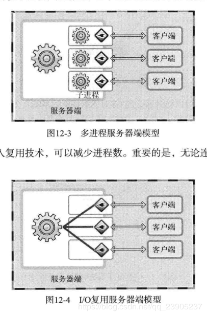

##### 1.进程和线程,为什么要有线程

​	进程的频繁切换，带来巨大时空开销

​	为了解决这个限制，后来提出将进程的两个属性分开，由操作系统分开处理，即对于作为调度和分派的基本单位，但不同时作为拥有资源的单位；而对于拥有资源的基本单位，又不对其进行频繁的切换。正是在这种思想的指导下，形成了线程的概念。

​	在多线程操作系统中中，通常是在一个进程中包括多个线程，每个线程都是独立调度和分派的基本单位。资源由进程来拥有，线程不拥有资源。同一个进程之间的线程切换不会导致进程的切换，只有不同进程间的线程切换才会导致进程切换。而且线程的切换则仅需保存和设置少量寄存器内容，不会同进程切换需求创建和销毁进程控制块等，所以非常迅速，所以其十分适合高并发环境。

​	进程间通信麻烦

​	使多cpu系统更加高效，操作系统会保证当线程数不大于cpu数目时，不同的线程运行于不同的cpu上。

​	改善程序结构，逻辑分开，便于理解和修改

##### 2.进程间通信

```
进程间通信的方式：
进程间通信主要包括管道、系统IPC（包括消息队列、信号量、信号、共享内存等）、以及套接字socket。
1.管道：
管道主要包括无名管道和命名管道:管道可用于具有亲缘关系的父子进程间的通信，有名管道除了具有管道所具有的功能外，它还允许无亲缘关系进程间的通信
1.1 普通管道PIPE：
1)它是半双工的（即数据只能在一个方向上流动），具有固定的读端和写端
2)它只能用于具有亲缘关系的进程之间的通信（也是父子进程或者兄弟进程之间）
3)它可以看成是一种特殊的文件，对于它的读写也可以使用普通的read、write等函数。但是它不是普通的文件，并不属于其他任何文件系统，并且只存在于内存中。
1.2 命名管道FIFO：
1)FIFO可以在无关的进程之间交换数据
2)FIFO有路径名与之相关联，它以一种特殊设备文件形式存在于文件系统中。
2. 系统IPC：
2.1 消息队列
消息队列，是消息的链接表，存放在内核中。一个消息队列由一个标识符（即队列ID）来标记。 (消息队列克服了信号传递信息少，管道只能承载无格式字节流以及缓冲区大小受限等特点)具有写权限得进程可以按照一定得规则向消息队列中添加新信息；对消息队列有读权限得进程则可以从消息队列中读取信息；
特点：
1)消息队列是面向记录的，其中的消息具有特定的格式以及特定的优先级。
2)消息队列独立于发送与接收进程。进程终止时，消息队列及其内容并不会被删除。
3)消息队列可以实现消息的随机查询,消息不一定要以先进先出的次序读取,也可以按消息的类型读取。
2.2 信号量semaphore
信号量（semaphore）与已经介绍过的 IPC 结构不同，它是一个计数器，可以用来控制多个进程对共享资源的访问。信号量用于实现进程间的互斥与同步，而不是用于存储进程间通信数据。
特点：
1)信号量用于进程间同步，若要在进程间传递数据需要结合共享内存。
2)信号量基于操作系统的 PV 操作，程序对信号量的操作都是原子操作。
3)每次对信号量的 PV 操作不仅限于对信号量值加 1 或减 1，而且可以加减任意正整数。
4)支持信号量组。
2.3 信号signal
信号是一种比较复杂的通信方式，用于通知接收进程某个事件已经发生。
2.4 共享内存（Shared Memory）
它使得多个进程可以访问同一块内存空间，不同进程可以及时看到对方进程中对共享内存中数据得更新。这种方式需要依靠某种同步操作，如互斥锁和信号量等
特点：
1)共享内存是最快的一种IPC，因为进程是直接对内存进行存取
2)因为多个进程可以同时操作，所以需要进行同步
3)信号量+共享内存通常结合在一起使用，信号量用来同步对共享内存的访问
3.套接字SOCKET：
socket也是一种进程间通信机制，与其他通信机制不同的是，它可用于不同主机之间的进程通信。
```

##### 3.线程间通信

```
临界区：通过多线程的串行化来访问公共资源或一段代码，速度快，适合控制数据访问；
互斥量Synchronized/Lock：采用互斥对象机制，只有拥有互斥对象的线程才有访问公共资源的权限。因为互斥对象只有一个，所以可以保证公共资源不会被多个线程同时访问
信号量Semphare：为控制具有有限数量的用户资源而设计的，它允许多个线程在同一时刻去访问同一个资源，但一般需要限制同一时刻访问此资源的最大线程数目。
事件(信号)，Wait/Notify：通过通知操作的方式来保持多线程同步，还可以方便的实现多线程优先级的比较操作
```

##### 4.多线程同步

同步是指在一定的时间内只允许某一个线程访问某个资源。

互斥锁、条件变量、读写锁、信号量

RAII（Resource Acquisition Is Initialization）,也称为“资源获取就是初始化”

std::mutex  std::lock_guard  std::condition_variable

信号量：sem_wait：用原子操作的方式将信号量的值-1  sem_post

std::atomic  原子操作

##### 5.你理解的I/O复用




可以将上述问题理解为：某教师中，有10个学生,同时这10个学生对应与10个老师，这样是比较浪费老师的，所以采用下列模式，10个学生和1个老师，老师上课时，学生提问前必须举手，老师确认举手学生的提问后再回答问题。

##### 6.select,poll,epoll

(1)select==>时间复杂度O(n)

它仅仅知道了，有I/O事件发生了，却并不知道是哪那几个流（可能有一个，多个，甚至全部），我们只能无差别轮询所有流，找出能读出数据，或者写入数据的流，对他们进行操作。所以**select具有O(n)的无差别轮询复杂度**，同时处理的流越多，无差别轮询时间就越长。

(2)poll==>时间复杂度O(n)

poll本质上和select没有区别，它将用户传入的数组拷贝到内核空间，然后查询每个fd对应的设备状态， **但是它没有最大连接数的限制**，原因是它是基于链表来存储的.

(3)epoll==>时间复杂度O(1)

**epoll可以理解为event poll**，不同于忙轮询和无差别轮询，epoll会把哪个流发生了怎样的I/O事件通知我们。所以我们说epoll实际上是**事件驱动（每个事件关联上fd）**的，此时我们对这些流的操作都是有意义的。**（复杂度降低到了O(1)）**

select，poll，epoll都是IO多路复用的机制。I/O多路复用就通过一种机制，可以监视多个描述符，一旦某个描述符就绪（一般是读就绪或者写就绪），能够通知程序进行相应的读写操作。**但select，poll，epoll本质上都是同步I/O，因为他们都需要在读写事件就绪后自己负责进行读写，也就是说这个读写过程是阻塞的**，而异步I/O则无需自己负责进行读写，异步I/O的实现会负责把数据从内核拷贝到用户空间。  

epoll跟select都能提供多路I/O复用的解决方案。在现在的Linux内核里有都能够支持，其中epoll是Linux所特有，而select则应该是POSIX所规定，一般操作系统均有实现

**select：**

select本质上是通过设置或者检查存放fd标志位的数据结构来进行下一步处理。这样所带来的缺点是：

1、 单个进程可监视的fd数量被限制，即能监听端口的大小有限。

​      一般来说这个数目和系统内存关系很大，具体数目可以cat /proc/sys/fs/file-max察看。32位机默认是1024个。64位机默认是2048.

2、 对socket进行扫描时是线性扫描，即采用轮询的方法，效率较低：

​       当套接字比较多的时候，每次select()都要通过遍历FD_SETSIZE个Socket来完成调度,不管哪个Socket是活跃的,都遍历一遍。这会浪费很多CPU时间。如果能给套接字注册某个回调函数，当他们活跃时，自动完成相关操作，那就避免了轮询，这正是epoll与kqueue做的。

3、需要维护一个用来存放大量fd的数据结构，这样会使得用户空间和内核空间在传递该结构时复制开销大

**poll：**

poll本质上和select没有区别，它将用户传入的数组拷贝到内核空间，然后查询每个fd对应的设备状态，如果设备就绪则在设备等待队列中加入一项并继续遍历，如果遍历完所有fd后没有发现就绪设备，则挂起当前进程，直到设备就绪或者主动超时，被唤醒后它又要再次遍历fd。这个过程经历了多次无谓的遍历。

**它没有最大连接数的限制**，原因是它是基于链表来存储的，但是同样有一个缺点：

1、大量的fd的数组被整体复制于用户态和内核地址空间之间，而不管这样的复制是不是有意义。                   

2、poll还有一个特点是“水平触发”，如果报告了fd后，没有被处理，那么下次poll时会再次报告该fd。

**epoll:**

epoll有EPOLLLT和EPOLLET两种触发模式，LT是默认的模式，ET是“高速”模式。LT模式下，只要这个fd还有数据可读，每次 epoll_wait都会返回它的事件，提醒用户程序去操作，而在ET（边缘触发）模式中，它只会提示一次，直到下次再有数据流入之前都不会再提示了，无 论fd中是否还有数据可读。所以在ET模式下，read一个fd的时候一定要把它的buffer读光，也就是说一直读到read的返回值小于请求值，或者 遇到EAGAIN错误。还有一个特点是，epoll使用“事件”的就绪通知方式，通过epoll_ctl注册fd，一旦该fd就绪，内核就会采用类似callback的回调机制来激活该fd，epoll_wait便可以收到通知。

**epoll为什么要有EPOLLET触发模式？**

如果采用EPOLLLT模式的话，系统中一旦有大量你不需要读写的就绪文件描述符，它们每次调用epoll_wait都会返回，这样会大大降低处理程序检索自己关心的就绪文件描述符的效率.。而采用EPOLLET这种边沿触发模式的话，当被监控的文件描述符上有可读写事件发生时，epoll_wait()会通知处理程序去读写。如果这次没有把数据全部读写完(如读写缓冲区太小)，那么下次调用epoll_wait()时，它不会通知你，也就是它只会通知你一次，直到该文件描述符上出现第二次可读写事件才会通知你！！！**这种模式比水平触发效率高，系统不会充斥大量你不关心的就绪文件描述符**

**epoll的优点：**

1、**没有最大并发连接的限制，能打开的FD的上限远大于1024（1G的内存上能监听约10万个端口）**；
**2、效率提升，不是轮询的方式，不会随着FD数目的增加效率下降。只有活跃可用的FD才会调用callback函数；**
**即Epoll最大的优点就在于它只管你“活跃”的连接，而跟连接总数无关，因此在实际的网络环境中，Epoll的效率就会远远高于select和poll。**

3、 内存拷贝，利用mmap()文件映射内存加速与内核空间的消息传递；即epoll使用mmap减少复制开销。
**select、poll、epoll 区别总结：**

1、支持一个进程所能打开的最大连接数

select

单个进程所能打开的最大连接数有FD_SETSIZE宏定义，其大小是32个整数的大小（在32位的机器上，大小就是32*32，同理64位机器上FD_SETSIZE为32*64），当然我们可以对进行修改，然后重新编译内核，但是性能可能会受到影响，这需要进一步的测试。

poll

poll本质上和select没有区别，但是它没有最大连接数的限制，原因是它是基于链表来存储的

epoll

虽然连接数有上限，但是很大，1G内存的机器上可以打开10万左右的连接，2G内存的机器可以打开20万左右的连接

2、FD剧增后带来的IO效率问题

select

因为每次调用时都会对连接进行线性遍历，所以随着FD的增加会造成遍历速度慢的“线性下降性能问题”。

poll

同上

epoll

因为epoll内核中实现是根据每个fd上的callback函数来实现的，只有活跃的socket才会主动调用callback，所以在活跃socket较少的情况下，使用epoll没有前面两者的线性下降的性能问题，但是所有socket都很活跃的情况下，可能会有性能问题。

3、 消息传递方式

select

内核需要将消息传递到用户空间，都需要内核拷贝动作

poll

同上

epoll

epoll通过内核和用户空间共享一块内存来实现的。

**总结：**

**综上，在选择select，p****oll，epoll时要根据具体的使用场合以及这三种方式的自身特点。**

**1、表面上看epoll的性能最好，但是在连接数少并且连接都十分活跃的情况下，select和poll的性能可能比epoll好，毕竟epoll的通知机制需要很多函数回调。**

**2、select低效是因为每次它都需要轮询。但低效也是相对的，视情况而定，也可通过良好的设计改善**

 

**1、select实现**

**select的调用过程如下所示：**


（1）使用copy_from_user从用户空间拷贝fd_set到内核空间

（2）注册回调函数__pollwait

（3）遍历所有fd，调用其对应的poll方法（对于socket，这个poll方法是sock_poll，sock_poll根据情况会调用到tcp_poll,udp_poll或者datagram_poll）

（4）以tcp_poll为例，其核心实现就是__pollwait，也就是上面注册的回调函数。

（5）__pollwait的主要工作就是把current（当前进程）挂到设备的等待队列中，不同的设备有不同的等待队列，对于tcp_poll来说，其等待队列是sk->sk_sleep（注意把进程挂到等待队列中并不代表进程已经睡眠了）。在设备收到一条消息（网络设备）或填写完文件数据（磁盘设备）后，会唤醒设备等待队列上睡眠的进程，这时current便被唤醒了。

（6）poll方法返回时会返回一个描述读写操作是否就绪的mask掩码，根据这个mask掩码给fd_set赋值。

（7）如果遍历完所有的fd，还没有返回一个可读写的mask掩码，则会调用schedule_timeout是调用select的进程（也就是current）进入睡眠。当设备驱动发生自身资源可读写后，会唤醒其等待队列上睡眠的进程。如果超过一定的超时时间（schedule_timeout指定），还是没人唤醒，则调用select的进程会重新被唤醒获得CPU，进而重新遍历fd，判断有没有就绪的fd。

（8）把fd_set从内核空间拷贝到用户空间。

**总结：**

**select的几大缺点：**

**（1）每次调用select，都需要把fd集合从用户态拷贝到内核态，这个开销在fd很多时会很大**

**（2）同时每次调用select都需要在内核遍历传递进来的所有fd，这个开销在fd很多时也很大**

**（3）select支持的文件描述符数量太小了，默认是1024**

**2 poll实现**

　　poll的实现和select非常相似，只是描述fd集合的方式不同，poll使用pollfd结构而不是select的fd_set结构，其他的都差不多,管理多个描述符也是进行轮询，根据描述符的状态进行处理，**但是poll没有最大文件描述符数量的限制**。poll和select同样存在一个缺点就是，包含大量文件描述符的数组被整体复制于用户态和内核的地址空间之间，而不论这些文件描述符是否就绪，它的开销随着文件描述符数量的增加而线性增大。

**3、epoll**

　　epoll既然是对select和poll的改进，就应该能避免上述的三个缺点。那epoll都是怎么解决的呢？在此之前，我们先看一下epoll和select和poll的调用接口上的不同，select和poll都只提供了一个函数——select或者poll函数。而epoll提供了三个函数，epoll_create,epoll_ctl和epoll_wait，epoll_create是创建一个epoll句柄；epoll_ctl是注册要监听的事件类型；epoll_wait则是等待事件的产生。

　　对于第一个缺点，epoll的解决方案在epoll_ctl函数中。每次注册新的事件到epoll句柄中时（在epoll_ctl中指定EPOLL_CTL_ADD），会把所有的fd拷贝进内核，而不是在epoll_wait的时候重复拷贝。epoll保证了每个fd在整个过程中只会拷贝一次。

　　对于第二个缺点，epoll的解决方案不像select或poll一样每次都把current轮流加入fd对应的设备等待队列中，而只在epoll_ctl时把current挂一遍（这一遍必不可少）并为每个fd指定一个回调函数，当设备就绪，唤醒等待队列上的等待者时，就会调用这个回调函数，而这个回调函数会把就绪的fd加入一个就绪链表）。epoll_wait的工作实际上就是在这个就绪链表中查看有没有就绪的fd（利用schedule_timeout()实现睡一会，判断一会的效果，和select实现中的第7步是类似的）。

　　对于第三个缺点，epoll没有这个限制，它所支持的FD上限是最大可以打开文件的数目，这个数字一般远大于2048,举个例子,在1GB内存的机器上大约是10万左右，具体数目可以cat /proc/sys/fs/file-max察看,一般来说这个数目和系统内存关系很大。

**总结：**

（1）select，poll实现需要自己不断轮询所有fd集合，直到设备就绪，期间可能要睡眠和唤醒多次交替。而epoll其实也需要调用epoll_wait不断轮询就绪链表，期间也可能多次睡眠和唤醒交替，但是它是设备就绪时，调用回调函数，把就绪fd放入就绪链表中，并唤醒在epoll_wait中进入睡眠的进程。虽然都要睡眠和交替，但是select和poll在“醒着”的时候要遍历整个fd集合，而epoll在“醒着”的时候只要判断一下就绪链表是否为空就行了，这节省了大量的CPU时间。这就是回调机制带来的性能提升。

（2）select，poll每次调用都要把fd集合从用户态往内核态拷贝一次，并且要把current往设备等待队列中挂一次，而epoll只要一次拷贝，而且把current往等待队列上挂也只挂一次（在epoll_wait的开始，注意这里的等待队列并不是设备等待队列，只是一个epoll内部定义的等待队列）。这也能节省不少的开销。

##### 6.epoll实现

Linux epoll机制是通过红黑树和双向链表实现的。 首先通过epoll_create()系统调用在内核中创建一个eventpoll类型的句柄，其中包括红黑树根节点和双向链表头节点。然后通过epoll_ctl()系统调用，向epoll对象的红黑树结构中添加、删除、修改感兴趣的事件，返回0标识成功，返回-1表示失败。最后通过epoll_wait()系统调用判断双向链表是否为空，如果为空则阻塞。当文件描述符状态改变，fd上的回调函数被调用，该函数将fd加入到双向链表中，此时epoll_wait函数被唤醒，返回就绪好的事件。

##### 7.ET,LT

...

##### 8.I/O模型，同步，异步，阻塞，非阻塞

```
socket在创建的时候是默认阻塞的，我们参数SOCK_NONBLOCK或者fcntl将其设置为非阻塞。阻塞和非阻塞的概念能应用于所有文件描述符，而不仅仅是socket。

阻塞I/O就是挂起在那里，直到等待的事件发送为止。比如，客户端通过connect向服务器发起连接时，connect将首先发送同步报文给服务器，然后等待服务器返回确认报文段。如果服务器的确认报文段没有立即到达客户端，则connect调用将被挂起，直到客户端收到确认报文段并唤醒connect调用。在socket的基础API中，可能被阻塞的包括：accep,send,recv,conncet

非阻塞I/O，总是立即返回，不管事件是否已经发生。如果事件没有立即发生，则返回-1。此时我们需要根据errno来区分出错和事件没有发生。对accept、send、recv而言，事件未发生时被设置为EAGAIN（再来一次）或者EWOULDBLOCK（期望阻塞）;对connect而言，errno被设置为EINPROGRESS（在处理中）

I/O复用：https://blog.csdn.net/qq_23905237/article/details/87919306

SIGIO信号：

从理论上说，阻塞I/O、I/O复用和信号驱动I/O都是同步I/O模型。因为这三种I/O模型中，I/O的读写操作，都是在I/O事件发生之后，由应用程序来完成的。对于异步I/O而言，用户可以直接对I/O执行读写操作，这些操作告诉内核用户读写缓冲区的位置，以及I/O操作完成之后内核通知应用程序的方式。异步I/O的读写操作总是立即返回，而不论I/O是否是阻塞的，因为真正的读写操作已经由内核接管。同步I/O向应用程序通知的是I/O就绪事件，而异步I/O向应用程序通知的是I/O完成事件。//linux环境下aio.h头文件中定义的函数提供了对异步I/O的支持。

POSIX(可移植操作系统接口)把同步IO操作定义为导致进程阻塞直到IO完成的操作，反之则是异步IO。

接水例子：阻塞I/O：A同学用杯子装水，打开水龙头装满水然后离开。这一过程就可以看成是使用了阻塞IO模型，因为如果水龙头没有水，他也要等到有水并装满杯子才能离开去做别的事情。很显然，这种IO模型是同步的。；非阻塞I/O: B同学也用杯子装水，打开水龙头后发现没有水，它离开了，过一会他又拿着杯子来看看……在中间离开的这些时间里，B同学离开了装水现场(回到用户进程空间)，可以做他自己的事情。这就是非阻塞IO模型。但是它只有是检查无数据的时候是非阻塞的，在数据到达的时候依然要等待复制数据到用户空间(等着水将水杯装满)，因此它还是同步IO。；I/O复用：C同学来装水，发现有一排水龙头，舍管阿姨告诉他这些水龙头都还没有水，等有水了告诉他。于是等啊等(select调用中)，过了一会阿姨告诉他有水了，但不知道是哪个水龙头有水，自己看吧。于是C同学一个个打开，往杯子里装水(recv)。这里再顺便说说鼎鼎大名的epoll(高性能的代名词啊)，epoll也属于IO复用模型，主要区别在于舍管阿姨会告诉C同学哪几个水龙头有水了，不需要一个个打开看(当然还有其它区别)。；SIGIO：D同学让舍管阿姨等有水的时候通知他(注册信号函数)，没多久D同学得知有水了，跑去装水。是不是很像异步IO？很遗憾，它还是同步IO(省不了装水的时间啊)。；异步I/O:E同学让舍管阿姨将杯子装满水后通知他。整个过程E同学都可以做别的事情(没有recv)，这才是真正的异步IO。
```

##### 9.copy on write

...

##### 10.linux程序虚拟地址空间

```
为了防止不同进程同一时刻在物理内存中运行而对物理内存的争夺和践踏，采用了虚拟内存。
虚拟内存技术使得不同进程在运行过程中，它所看到的是自己独自占有了当前系统的4G内存。所有进程共享同一物理内存，每个进程只把自己目前需要的虚拟内存空间映射并存储到物理内存上。 事实上，在每个进程创建加载时，内核只是为进程“创建”了虚拟内存的布局，具体就是初始化进程控制表中内存相关的链表，实际上并不立即就把虚拟内存对应位置的程序数据和代码（比如.text .data段）拷贝到物理内存中，只是建立好虚拟内存和磁盘文件之间的映射就好（叫做存储器映射），等到运行到对应的程序时，才会通过缺页异常，来拷贝数据。还有进程运行过程中，要动态分配内存，比如malloc时，也只是分配了虚拟内存，即为这块虚拟内存对应的页表项做相应设置，当进程真正访问到此数据时，才引发缺页异常。
请求分页系统、请求分段系统和请求段页式系统都是针对虚拟内存的，通过请求实现内存与外存的信息置换。
虚拟内存的好处：
1.扩大地址空间；
2.内存保护：每个进程运行在各自的虚拟内存地址空间，互相不能干扰对方。虚存还对特定的内存地址提供写保护，可以防止代码或数据被恶意篡改。
3.公平内存分配。采用了虚存之后，每个进程都相当于有同样大小的虚存空间。
4.当进程通信时，可采用虚存共享的方式实现。
5.当不同的进程使用同样的代码时，比如库文件中的代码，物理内存中可以只存储一份这样的代码，不同的进程只需要把自己的虚拟内存映射过去就可以了，节省内存
6.虚拟内存很适合在多道程序设计系统中使用，许多程序的片段同时保存在内存中。当一个程序等待它的一部分读入内存时，可以把CPU交给另一个进程使用。在内存中可以保留多个进程，系统并发度提高
7.在程序需要分配连续的内存空间的时候，只需要在虚拟内存空间分配连续空间，而不需要实际物理内存的连续空间，可以利用碎片
虚拟内存的代价：
1.虚存的管理需要建立很多数据结构，这些数据结构要占用额外的内存
2.虚拟地址到物理地址的转换，增加了指令的执行时间。
3.页面的换入换出需要磁盘I/O，这是很耗时的
4.如果一页中只有一部分数据，会浪费内存。
```


##### 11.缺页中断

```
malloc()和mmap()等内存分配函数，在分配时只是建立了进程虚拟地址空间，并没有分配虚拟内存对应的物理内存。当进程访问这些没有建立映射关系的虚拟内存时，处理器自动触发一个缺页异常。
缺页中断：在请求分页系统中，可以通过查询页表中的状态位来确定所要访问的页面是否存在于内存中。每当所要访问的页面不在内存是，会产生一次缺页中断，此时操作系统会根据页表中的外存地址在外存中找到所缺的一页，将其调入内存。
缺页本身是一种中断，与一般的中断一样，需要经过4个处理步骤：
1、保护CPU现场
2、分析中断原因
3、转入缺页中断处理程序进行处理
4、恢复CPU现场，继续执行
但是缺页中断是由于所要访问的页面不存在于内存时，由硬件所产生的一种特殊的中断，因此，与一般的中断存在区别：
1、在指令执行期间产生和处理缺页中断信号
2、一条指令在执行期间，可能产生多次缺页中断
3、缺页中断返回是，执行产生中断的一条指令，而一般的中断返回是，执行下一条指令。
```

##### 12.fork和vfork的区别

```
fork:创建一个和当前进程映像一样的进程可以通过fork( )系统调用：
#include <sys/types.h>
#include <unistd.h>
pid_t fork(void);
成功调用fork( )会创建一个新的进程，它几乎与调用fork( )的进程一模一样，这两个进程都会继续运行。在子进程中，成功的fork( )调用会返回0。在父进程中fork( )返回子进程的pid。如果出现错误，fork( )返回一个负值。
最常见的fork( )用法是创建一个新的进程，然后使用exec( )载入二进制映像，替换当前进程的映像。这种情况下，派生（fork）了新的进程，而这个子进程会执行一个新的二进制可执行文件的映像。这种“派生加执行”的方式是很常见的。
在早期的Unix系统中，创建进程比较原始。当调用fork时，内核会把所有的内部数据结构复制一份，复制进程的页表项，然后把父进程的地址空间中的内容逐页的复制到子进程的地址空间中。但从内核角度来说，逐页的复制方式是十分耗时的。现代的Unix系统采取了更多的优化，例如Linux，采用了写时复制的方法，而不是对父进程空间进程整体复制。
vfork的基础知识：
在实现写时复制之前，Unix的设计者们就一直很关注在fork后立刻执行exec所造成的地址空间的浪费。BSD的开发者们在3.0的BSD系统中引入了vfork( )系统调用。
#include <sys/types.h>
#include <unistd.h>
pid_t vfork(void);
除了子进程必须要立刻执行一次对exec的系统调用，或者调用_exit( )退出，对vfork( )的成功调用所产生的结果和fork( )是一样的。vfork( )会挂起父进程直到子进程终止或者运行了一个新的可执行文件的映像。通过这样的方式，vfork( )避免了地址空间的按页复制。在这个过程中，父进程和子进程共享相同的地址空间和页表项。实际上vfork( )只完成了一件事：复制内部的内核数据结构。因此，子进程也就不能修改地址空间中的任何内存。
vfork( )是一个历史遗留产物，Linux本不应该实现它。需要注意的是，即使增加了写时复制，vfork( )也要比fork( )快，因为它没有进行页表项的复制。然而，写时复制的出现减少了对于替换fork( )争论。实际上，直到2.2.0内核，vfork( )只是一个封装过的fork( )。因为对vfork( )的需求要小于fork( )，所以vfork( )的这种实现方式是可行的。
补充知识点：写时复制
Linux采用了写时复制的方法，以减少fork时对父进程空间进程整体复制带来的开销。
写时复制是一种采取了惰性优化方法来避免复制时的系统开销。它的前提很简单：如果有多个进程要读取它们自己的那部门资源的副本，那么复制是不必要的。每个进程只要保存一个指向这个资源的指针就可以了。只要没有进程要去修改自己的“副本”，就存在着这样的幻觉：每个进程好像独占那个资源。从而就避免了复制带来的负担。如果一个进程要修改自己的那份资源“副本”，那么就会复制那份资源，并把复制的那份提供给进程。不过其中的复制对进程来说是透明的。这个进程就可以修改复制后的资源了，同时其他的进程仍然共享那份没有修改过的资源。所以这就是名称的由来：在写入时进行复制。
写时复制的主要好处在于：如果进程从来就不需要修改资源，则不需要进行复制。惰性算法的好处就在于它们尽量推迟代价高昂的操作，直到必要的时刻才会去执行。
在使用虚拟内存的情况下，写时复制（Copy-On-Write）是以页为基础进行的。所以，只要进程不修改它全部的地址空间，那么就不必复制整个地址空间。在fork( )调用结束后，父进程和子进程都相信它们有一个自己的地址空间，但实际上它们共享父进程的原始页，接下来这些页又可以被其他的父进程或子进程共享。
写时复制在内核中的实现非常简单。与内核页相关的数据结构可以被标记为只读和写时复制。如果有进程试图修改一个页，就会产生一个缺页中断。内核处理缺页中断的方式就是对该页进行一次透明复制。这时会清除页面的COW属性，表示着它不再被共享。
现代的计算机系统结构中都在内存管理单元（MMU）提供了硬件级别的写时复制支持，所以实现是很容易的。
在调用fork( )时，写时复制是有很大优势的。因为大量的fork之后都会跟着执行exec，那么复制整个父进程地址空间中的内容到子进程的地址空间完全是在浪费时间：如果子进程立刻执行一个新的二进制可执行文件的映像，它先前的地址空间就会被交换出去。写时复制可以对这种情况进行优化。
fork和vfork的区别：
1. fork( )的子进程拷贝父进程的数据段和代码段；vfork( )的子进程与父进程共享数据段
2. fork( )的父子进程的执行次序不确定；vfork( )保证子进程先运行，在调用exec或exit之前与父进程数据是共享的，在它调用exec或exit之后父进程才可能被调度运行。
3. vfork( )保证子进程先运行，在它调用exec或exit之后父进程才可能被调度运行。如果在调用这两个函数之前子进程依赖于父进程的进一步动作，则会导致死锁。
4.当需要改变共享数据段中变量的值，则拷贝父进程。
```

##### 13.页表寻址

```
页式内存管理，内存分成固定长度的一个个页片。操作系统为每一个进程维护了一个从虚拟地址到物理地址的映射关系的数据结构，叫页表，页表的内容就是该进程的虚拟地址到物理地址的一个映射。页表中的每一项都记录了这个页的基地址。通过页表，由逻辑地址的高位部分先找到逻辑地址对应的页基地址，再由页基地址偏移一定长度就得到最后的物理地址，偏移的长度由逻辑地址的低位部分决定。一般情况下，这个过程都可以由硬件完成，所以效率还是比较高的。页式内存管理的优点就是比较灵活，内存管理以较小的页为单位，方便内存换入换出和扩充地址空间。

Linux最初的两级页表机制：
两级分页机制将32位的虚拟空间分成三段，低十二位表示页内偏移，高20分成两段分别表示两级页表的偏移。
* PGD(Page Global Directory): 最高10位，全局页目录表索引
* PTE(Page Table Entry)：中间10位，页表入口索引
当在进行地址转换时，结合在CR3寄存器中存放的页目录(page directory, PGD)的这一页的物理地址，再加上从虚拟地址中抽出高10位叫做页目录表项(内核也称这为pgd)的部分作为偏移, 即定位到可以描述该地址的pgd；从该pgd中可以获取可以描述该地址的页表的物理地址，再加上从虚拟地址中抽取中间10位作为偏移, 即定位到可以描述该地址的pte；在这个pte中即可获取该地址对应的页的物理地址, 加上从虚拟地址中抽取的最后12位，即形成该页的页内偏移, 即可最终完成从虚拟地址到物理地址的转换。从上述过程中，可以看出，对虚拟地址的分级解析过程，实际上就是不断深入页表层次，逐渐定位到最终地址的过程，所以这一过程被叫做page talbe walk。

Linux的三级页表机制：
当X86引入物理地址扩展(Pisycal Addrress Extension, PAE)后，可以支持大于4G的物理内存(36位），但虚拟地址依然是32位，原先的页表项不适用，它实际多4 bytes被扩充到8 bytes，这意味着，每一页现在能存放的pte数目从1024变成512了(4k/8)。相应地，页表层级发生了变化，Linus新增加了一个层级，叫做页中间目录(page middle directory, PMD), 变成：

字段            描述                        位数

cr3            指向一个PDPT            crs寄存器存储

PGD        指向PDPT中4个项中的一个    位31~30

PMD        指向页目录中512项中的一个    位29~21

PTE            指向页表中512项中的一个    位20~12

page offset    4KB页中的偏移            位11~0

现在就同时存在2级页表和3级页表，在代码管理上肯定不方便。巧妙的是，Linux采取了一种抽象方法：所有架构全部使用3级页表: 即PGD -> PMD -> PTE。那只使用2级页表(如非PAE的X86)怎么办？
办法是针对使用2级页表的架构，把PMD抽象掉，即虚设一个PMD表项。这样在page table walk过程中，PGD本直接指向PTE的，现在不了，指向一个虚拟的PMD，然后再由PMD指向PTE。这种抽象保持了代码结构的统一。

Linux的四级页表机制：
硬件在发展，3级页表很快又捉襟见肘了，原因是64位CPU出现了, 比如X86_64， 它的硬件是实实在在支持4级页表的。它支持48位的虚拟地址空间1。如下：

字段            描述                        位数

PML4        指向一个PDPT            位47~39

PGD        指向PDPT中4个项中的一个    位38~30

PMD        指向页目录中512项中的一个    位29~21

PTE            指向页表中512项中的一个    位20~12

page offset    4KB页中的偏移            位11~0


Linux内核针为使用原来的3级列表(PGD->PMD->PTE)，做了折衷。即采用一个唯一的，共享的顶级层次，叫PML4。这个PML4没有编码在地址中，这样就能套用原来的3级列表方案了。不过代价就是，由于只有唯一的PML4, 寻址空间被局限在(239=)512G, 而本来PML4段有9位, 可以支持512个PML4表项的。现在为了使用3级列表方案，只能限制使用一个， 512G的空间很快就又不够用了，解决方案呼之欲出。

在2004年10月，当时的X86_64架构代码的维护者Andi Kleen提交了一个叫做4level page tables for Linux的PATCH系列，为Linux内核带来了4级页表的支持。在他的解决方案中，不出意料地，按照X86_64规范，新增了一个PML4的层级, 在这种解决方案中，X86_64拥一个有512条目的PML4, 512条目的PGD, 512条目的PMD, 512条目的PTE。对于仍使用3级目录的架构来说，它们依然拥有一个虚拟的PML4,相关的代码会在编译时被优化掉。 这样，就把Linux内核的3级列表扩充为4级列表。这系列PATCH工作得不错，不久被纳入Andrew Morton的-mm树接受测试。不出意外的话，它将在v2.6.11版本中释出。但是，另一个知名开发者Nick Piggin提出了一些看法，他认为Andi的Patch很不错，不过他认为最好还是把PGD作为第一级目录，把新增加的层次放在中间，并给出了他自己的Patch:alternate 4-level page tables patches。Andi更想保持自己的PATCH, 他认为Nick不过是玩了改名的游戏，而且他的PATCH经过测试很稳定，快被合并到主线了，不宜再折腾。不过Linus却表达了对Nick Piggin的支持，理由是Nick的做法conceptually least intrusive。毕竟作为Linux的扛把子，稳定对于Linus来说意义重大。最终，不意外地，最后Nick Piggin的PATCH在v2.6.11版本中被合并入主线。在这种方案中，4级页表分别是：PGD -> PUD -> PMD -> PTE。
```

##### 14.互斥锁和读写锁的区别

```
1、互斥锁和读写锁区别：
互斥锁：mutex，用于保证在任何时刻，都只能有一个线程访问该对象。当获取锁操作失败时，线程会进入睡眠，等待锁释放时被唤醒。
读写锁：rwlock，分为读锁和写锁。处于读操作时，可以允许多个线程同时获得读操作。但是同一时刻只能有一个线程可以获得写锁。其它获取写锁失败的线程都会进入睡眠状态，直到写锁释放时被唤醒。 注意：写锁会阻塞其它读写锁。当有一个线程获得写锁在写时，读锁也不能被其它线程获取；写者优先于读者（一旦有写者，则后续读者必须等待，唤醒时优先考虑写者）。适用于读取数据的频率远远大于写数据的频率的场合。
互斥锁和读写锁的区别：
1）读写锁区分读者和写者，而互斥锁不区分
2）互斥锁同一时间只允许一个线程访问该对象，无论读写；读写锁同一时间内只允许一个写者，但是允许多个读者同时读对象。
2、Linux的4种锁机制：
互斥锁：mutex，用于保证在任何时刻，都只能有一个线程访问该对象。当获取锁操作失败时，线程会进入睡眠，等待锁释放时被唤醒
读写锁：rwlock，分为读锁和写锁。处于读操作时，可以允许多个线程同时获得读操作。但是同一时刻只能有一个线程可以获得写锁。其它获取写锁失败的线程都会进入睡眠状态，直到写锁释放时被唤醒。 注意：写锁会阻塞其它读写锁。当有一个线程获得写锁在写时，读锁也不能被其它线程获取；写者优先于读者（一旦有写者，则后续读者必须等待，唤醒时优先考虑写者）。适用于读取数据的频率远远大于写数据的频率的场合。
自旋锁：spinlock，在任何时刻同样只能有一个线程访问对象。但是当获取锁操作失败时，不会进入睡眠，而是会在原地自旋，直到锁被释放。这样节省了线程从睡眠状态到被唤醒期间的消耗，在加锁时间短暂的环境下会极大的提高效率。但如果加锁时间过长，则会非常浪费CPU资源。
RCU：即read-copy-update，在修改数据时，首先需要读取数据，然后生成一个副本，对副本进行修改。修改完成后，再将老数据update成新的数据。使用RCU时，读者几乎不需要同步开销，既不需要获得锁，也不使用原子指令，不会导致锁竞争，因此就不用考虑死锁问题了。而对于写者的同步开销较大，它需要复制被修改的数据，还必须使用锁机制同步并行其它写者的修改操作。在有大量读操作，少量写操作的情况下效率非常高。
```

##### 15.你都用过哪些系统调用

```cpp
1）概念：
在计算机中，系统调用（英语：system call），又称为系统呼叫，指运行在使用者空间的程序向操作系统内核请求需要更高权限运行的服务。系统调用提供了用户程序与操作系统之间的接口（即系统调用是用户程序和内核交互的接口）。

操作系统中的状态分为管态（核心态）和目态（用户态）。大多数系统交互式操作需求在内核态执行。如设备IO操作或者进程间通信。特权指令：一类只能在核心态下运行而不能在用户态下运行的特殊指令。不同的操作系统特权指令会有所差异，但是一般来说主要是和硬件相关的一些指令。用户程序只在用户态下运行，有时需要访问系统核心功能，这时通过系统调用接口使用系统调用。

应用程序有时会需要一些危险的、权限很高的指令，如果把这些权限放心地交给用户程序是很危险的(比如一个进程可能修改另一个进程的内存区，导致其不能运行)，但是又不能完全不给这些权限。于是有了系统调用，危险的指令被包装成系统调用，用户程序只能调用而无权自己运行那些危险的指令。另外，计算机硬件的资源是有限的，为了更好的管理这些资源，所有的资源都由操作系统控制，进程只能向操作系统请求这些资源。操作系统是这些资源的唯一入口，这个入口就是系统调用。

2）系统调用举例：

对文件进行写操作，程序向打开的文件写入字符串“hello world”，open和write都是系统调用。如下：
#include<stdio.h>
#include<stdlib.h>
#include<string.h>
#include<errno.h>
#include<unistd.h>
#include<sys/types.h>
#include<sys/stat.h>
#include<fcntl.h>
int main(int argc, char *argv[])
{
    if (argc<2)
        return 0;
    //用读写追加方式打开一个已经存在的文件
    int fd = open(argv[1], O_RDWR | O_APPEND);
    if (fd == -1)
    {
        printf("error is %s\n", strerror(errno));
    }
    else
    {
        //打印文件描述符号
        printf("success fd = %d\n", fd);
        char buf[100];
        memset(buf, 0, sizeof(buf));
        strcpy(buf, "hello world\n");
        write(fd, buf, strlen(buf));
        close(fd);
    }
    return 0;
}
还有写数据write，创建进程fork，vfork等都是系统调用。
```


