#### 一、概论

C++ Standard Library  C++标准库

Standard Template Library   STL，标准模板库

六大部件：容器、分配器、算法、迭代器、适配器、仿函数

Components：Containers, Allocators, Algorithms, Iterators, Adapters, Functors

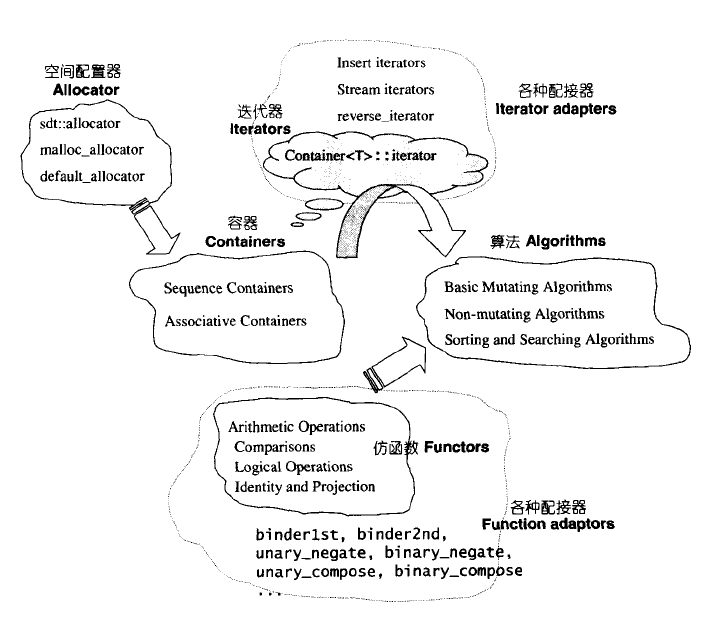

六大部件之间的关系：Container通过Allocator取得数据存储空间，Algorithm通过Iterator存取Container内容，Functor可以协助Algorithm完成不同的策略变化，Adapter可以修饰或套接Functor

使用示例：

```cpp
#include <iostream>
#include <functional>
#include <algorithm>
#include <vector>

using namespace std;

int main()
{
    int a[6] = {1, 45, 3, 44, 50, 6};
    vector<int, allocator<int>> vi(a, a + 6);
    cout << count_if(vi.begin(), vi.end(), not1(bind2nd(less<int>(), 40)));
    return 0;
}
```

上面代码中把六个部件都用上了。

区间：前闭后开

range-based for（c++11）

auto

容器分类：Sequence、Associative、Unordered

泛型编程

操作符重载

#### 二、空间配置器

**空间配置器的标准接口**

```cpp
// 一系列类型定义，在后续会进行介绍
allocator::value_type
allocator::pointer
allocator::const_pointer
allocator::reference
allocator::const_reference
allocator::size_type
allocator::difference_type
allocator::rebind // class rebind<U>拥有唯一成员other；是一个typedef，代表allocator<U>

// 默认构造函数和析构函数，因为没有数据成员，所以不需要初始化，但是必须被定义
allocator::allocator()
allocator::allocator(const allocator&)
template <class U> allocator::allocator(const allocator<U>&)
allocator::~allocator()

// 初始化、地址相关函数
pointer allocator::allocate(size_type n, const void*=0)
size_type allocator::max_size() const
pointer allocator::address(reference x) const
const_pointer allocator::address(const_reference x) const
void deallocate(pointer p, size_type n)

// 构建函数
void allocator::construct(pointer p, const T& x)
void allocator::destory(pointer p)
```

C++中new和delete其实都包含两步操作，new包含了申请内存、调用构造函数，delete包含了调用析构函数、释放内存。而 allocator为了更加精密分工，区分开了两个步骤：allocate和deallocate负责内存申请和释放，construct和destory负责构造和析构。

```cpp
    template <class T1, class T2>  
    inline void construct(T1* p, const T2& value) {  
        // placement new，在已经分配的内存上进行构造
        new (p) T1(value);  
    }  

    // 以下是 destroy() 第一版本，接受一个指针，仅仅调用析构函数 
    template <class T>  
    inline void destroy(T* pointer) {  
        pointer->~T();  
    }  

    // 以下是 destroy() 第二版本，接受两个迭代器。此函数设法找出元素的数值型别，  
    // 进而利用 __type_traits<> 求取最适当措施  
    template <class ForwardIterator>  
    inline void destroy(ForwardIterator first, ForwardIterator last) {  
      __destroy(first, last, value_type(first));  
    }  

   // 判断元素的数值型别(value type)是否有 trivial destructor  
    template <class ForwardIterator, class T>  
    inline void __destroy(ForwardIterator first, ForwardIterator last, T*) {  
      typedef typename __type_traits<T>::has_trivial_destructor trivial_destructor;  
      __destroy_aux(first, last, trivial_destructor());  
    }  

    // 如果元素的数值型别(value type)有 non-trivial destructor  
    template <class ForwardIterator>  
    inline void  
    __destroy_aux(ForwardIterator first, ForwardIterator last, __false_type) {  
      for ( ; first < last; ++first)  
        destroy(&*first);  
    }  

    // 如果元素的数值型别(value type)有 trivial destructor  
    template <class ForwardIterator>   
    inline void __destroy_aux(ForwardIterator, ForwardIterator, __true_type) {}  

    // 以下是 destroy() 第二版本针对迭代器为 char * 和 wchar_t * 的特化版  
    inline void destroy(char*, char*) {}  
    inline void destroy(wchar_t*, wchar_t*) {} 
```

**空间的配置和释放，std::alloc**

SGI STL的空间配置和释放，有以下的考虑：

- 向system heap申请空间。
- 考虑多线程。
- 考虑内存不足的情况。
- 考虑内存碎片的问题。

C++中申请和释放内容分别为new和delete，对应C语言中的malloc和free，SGI STL中使用了malloc和free。为了解决内存碎片的问题，SGI STL设计了双层配置器，第一级直接使用malloc和free，第二级按照不同情况采用不同策略：

  当配置区块超过128bytes时，视之为“足够大”，便调用第一级配置器。

  当配置区块小于128bytes时，视之为“过小”，为了降低额外负担，便采用复杂的memory pool整理方式（后面会介绍），而不再求助于第一级配置器。

**第一级配置器**

```cpp
#if 0   
#   include <new>   
#   define  __THROW_BAD_ALLOC throw bad_alloc   
#elif !defined(__THROW_BAD_ALLOC)   
#   include <iostream.h>   
#   define  __THROW_BAD_ALLOC cerr << "out of memory" << endl; exit(1)   
#endif   

// malloc-based allocator. 通常比稍后介绍的 default alloc 速度慢，   
//一般而言是 thread-safe，并且对于空间的运用比较高效（efficient）。   
//以下是第一级配置器。   
//注意，无「template 型别参数」。至于「非型别参数」inst，完全没派上用场。  
template <int inst>     
class __malloc_alloc_template {   

private:   
//以下都是函式指标，所代表的函式将用来处理内存不足的情况。   
// oom : out of memory.   
static void *oom_malloc(size_t);   
static void *oom_realloc(void *, size_t);   
static void (* __malloc_alloc_oom_handler)();   

public:   

static void * allocate(size_t n)   
{   
    void  *result =malloc(n);//第一级配置器直接使用 malloc()   
    // 以下，无法满足需求时，改用 oom_malloc()   
    if (0 == result) result = oom_malloc(n);   
    return  result;   
}   
static void deallocate(void *p, size_t /* n */)   
{   
free(p); //第一级配置器直接使用 free()   
}   

static void * reallocate(void *p, size_t /* old_sz */, size_t new_sz)   
{   
    void  *  result  =realloc(p, new_sz);//第一级配置器直接使用 rea  
    // 以下，无法满足需求时，改用 oom_realloc()   
    if (0 == result) result = oom_realloc(p, new_sz);   
    return  result;   
}   

//以下模拟 C++的 set_new_handler(). 换句话说，你可以透过它，   
//指定你自己的 out-of-memory handler   
static void (* set_malloc_handler(void (*f)()))()   
{   
    void  (*  old)()  =  __malloc_alloc_oom_handler;   
__malloc_alloc_oom_handler = f;   
    return(old);   
}   
};   

// malloc_alloc out-of-memory handling   
//初值为 0。有待客端设定。   
template <int inst>   
void (* __malloc_alloc_template<inst>::__malloc_alloc_oom_handler)() = 0;   

template <int inst>   
void * __malloc_alloc_template<inst>::oom_malloc(size_t n)   
{   
    void  (* my_malloc_handler)();   
    void  *result;   

    for (;;)  {   

//不断尝试释放、配置、再释放、再配置…   
my_malloc_handler = __malloc_alloc_oom_handler;   
        if  (0  ==  my_malloc_handler)  {  __THROW_BAD_ALLOC; }   
        (*my_malloc_handler)();//呼叫处理例程，企图释放内存。   
        result = malloc(n);  //再次尝试配置内存。   
        if  (result)  return(result);   
    }   
}   

template <int inst>   
void * __malloc_alloc_template<inst>::oom_realloc(void *p, size_t n)   
{   
    void  (* my_malloc_handler)();   
    void  *result;   
       for (;;)  {  //不断尝试释放、配置、再释放、再配置…   
my_malloc_handler = __malloc_alloc_oom_handler;   
        if  (0  ==  my_malloc_handler)  {  __THROW_BAD_ALLOC; }   
        (*my_malloc_handler)();//呼叫处理例程，企图释放内存。   
        result = realloc(p, n);//再次尝试配置内存。   
        if  (result)  return(result);   
    }   
}   

//注意，以下直接将参数 inst指定为 0。   
typedef __malloc_alloc_template<0> malloc_alloc;   
```

**第二级配置器**

第二级配置器比第一级多了一些机制，防止连续小内存空间配置造成的内存碎片问题。SGI STL第二级配器的做法是，当配置的区块大于128bytes时，交给第一级配置器处理；区块小于等于128bytes时，就以内存池的方式进行管理：每次配置一大块内存，以内存链表的方式进行管理。为了方便管理，所有区块的内存都会被调整至8的倍数，并维护16个free-lists，分别为8bytes~128bytes，每个free-lists中都存在相同大小的一些区块。

```cpp
enum {__ALIGN = 8};  //小型区块的上调边界
enum {__MAX_BYTES = 128};   //小型区块的上界
enum {__NFREELISTS = __MAX_BYTES/__ALIGN};   //free-list个数

 // 无template型参数，且第二个参数没有用上
 // 第一个用于多线程，暂不讨论
template <bool threads, int inst>
class __default_alloc_template {

private:
    /*将bytes上调至8的倍数
    用二进制理解,byte整除align时尾部为0，结果仍为byte；否则尾部肯定有1存在，加上
    align - 1之后定会导致第i位(2^i = align)的进位,再进行&操作即可得到8的倍数
    */
    static size_t ROUND_UP(size_t bytes) {
        return (((bytes) + __ALIGN-1) & ~(__ALIGN - 1));
    }
private:
    union obj {   //free-list的节点
        union obj * free_list_link;
        char client_data[1];    /* The client sees this.     */
    };

private:
    //16个free-lists
    static obj * __VOLATILE free_list[__NFREELISTS]; 
    //根据区块大小，找到合适的free-list，返回其下标(从0起算)
    static  size_t FREELIST_INDEX(size_t bytes) {
        return (((bytes) + __ALIGN-1)/__ALIGN - 1);
  }

  //返回一个大小为n的对象，并可能编入大小为n的区块到相应的free-list
  static void *refill(size_t n);
  //配置一大块空间，可容纳nobjs个大小为“size”的区块
  //如果配置nobjs个区块有所不便，nobjs可能会降低
  static char *chunk_alloc(size_t size, int &nobjs);

  //Chunk allocation state
  static char *start_free;
  static char *end_free;
  static size_t heap_size;

public:
    // 下面会介绍
    static void * allocate(size_t n); 
    static void * deallocatr(void *p, size_t n);
    static void * reallocate(void *p, size_t old_sz, size_t new_sz);
};

//以下是static data member的定义与初值设定
template <bool threads, int inst>
char * __default_alloc_template<threads, inst>::start_free = 0;

template <bool threads, int inst>
char * __default__alloc_template<threads, inst>::end_free = 0;

template <bool threads, int inst>
size_t __default_alloc_template<threads, inst>::heap_size = 0;

template <bool threads, int inst>
__default_alloc_template<threads, inst>::obj * volatile
__default_alloc_template<threads, inst>::free_list[__NFREELISTS] = 
{0, 0, 0, 0, 0, 0, 0, 0, 0, 0, 0, 0, 0, 0, 0, 0, };

```

**_default_alloc_template的allocate函数**

```cpp
 static void * allocate(size_t n)
  {
    obj * __VOLATILE * my_free_list;
    obj * __RESTRICT result;

    if (n > (size_t) __MAX_BYTES) {
        return(malloc_alloc::allocate(n));
    }

    //如果所开辟的区块的大小小于128bytes
    my_free_list = free_list + FREELIST_INDEX(n);
    result = *my_free_list;
    if (result == 0) {
        // 没有找到可用的free list，重新配置
        void *r = refill(ROUND_UP(n));     // refill会在后续介绍
        return r;
    }
    //如果此时free_list上有空间，则拨出一块空间给对象使用
    *my_free_list = result -> free_list_link;
    return (result);
  };
```

**__default_alloc_template的deallocate函数**

```cpp
static void deallocate(void *p, size_t n)
{
    obj *q = (obj *)p;
    obj * __VOLATILE * my_free_list;

    if (n > (size_t) __MAX_BYTES) {
        malloc_alloc::deallocate(p, n);
        return;
    }

    //如果是小内存块的释放，则还是先找到所释放内存块在free_list[]中的位置
    my_free_list = free_list + FREELIST_INDEX(n);
    q -> free_list_link = *my_free_list;

    // 调整free_list上的首地址，即返还给free_list中的这个节点
    *my_free_list = q;
}
```

**refill函数重新填充**

对于第二级空间配置器从free-lists中获取空间和释放空间的流程已经做了介绍，其中获取空间的过程中会出现所需大小的区块已经被获取完了，这时候需要重新填充这个区块，也就是调用refill函数。

```cpp
template <bool threads, int inst>
void* __default_alloc_template<threads, inst>::refill(size_t n)
{
    // 默认填充20个（n字节上调至8的整数倍）的内存块
    int nobjs = 20;

    // 这个函数的作用是尝试取得nobjs个（n字节上调至8的整数倍）的内存块作为free_list的新节点
    // 这里需要注意取得的不一定是20个区块，如果内存池的空间不够，它所获得的区块数目可能小于20个
    char * chunk = chunk_alloc(n, nobjs);
    obj * __VOLATILE * my_free_list;
    obj * result;
    obj * current_obj, * next_obj;
    int i;

    // 如果申请到的区块数目为1，则直接返还给对象使用
    if (1 == nobjs) return(chunk);

    // 如果不为1则找到区块在free_list[]中所对应位置
    my_free_list = free_list + FREELIST_INDEX(n);

    //从头拨出1个申请好的区块在下面返还给对象，把剩余的区块全部链在free_list[FREELIST_INDEX]下面
    result = (obj *)chunk;
    *my_free_list = next_obj = (obj *)(chunk + n);
    for (i = 1; ; i++) {
        current_obj = next_obj;

        //chunck_alloc返回的空间类型为char*
        next_obj = (obj *)((char *)next_obj + n);
        //如果已经链上的节点的个数等于从内存池申请的节点的个数-1，终止循环
        if (nobjs - 1 == i) {
            current_obj -> free_list_link = 0;
            break;
        } else {
            current_obj -> free_list_link = next_obj;
        }
    }

    return(result);
}
```

**内存池**

refill函数中使用到的chunk_alloc，就是从内存池中获取空间，以下为具体实现：

```cpp
template <bool threads, int inst>
char*
__default_alloc_template<threads, inst>::chunk_alloc(size_t size, int& nobjs)
{
    char * result;
    size_t total_bytes = size * nobjs;
    size_t bytes_left = end_free - start_free;  // 内存池剩余大小

    if (bytes_left >= total_bytes) {
        // 剩余大小满足申请需求
        result = start_free;
        start_free += total_bytes;
        return(result);
    }
    else if (bytes_left >= size) {
        // 剩余大小不满足申请需求，但是能够供应一个区块以上的大小，也就是refill里说明的获得的区块数目可能小于20个
        nobjs = bytes_left/size;
        total_bytes = size * nobjs;
        result = start_free;
        start_free += total_bytes;
        return(result);
    }
    else {
        // 剩余大小连一个区块都不满足
        size_t bytes_to_get = 2 * total_bytes + ROUND_UP(heap_size >> 4);

        // 尝试内存池中剩余的小空间分配给合适的free-lists
        if (bytes_left > 0) {
            obj * __VOLATILE * my_free_list = free_list + FREELIST_INDEX(bytes_left);
            ((obj *)start_free) -> free_list_link = *my_free_list;
            *my_free_list = (obj *)start_free;
        }

        // 用malloc给内存池分配空间
        start_free = (char *)malloc(bytes_to_get);
        if (0 == start_free) {
            // 分配失败
            int i;
            obj * __VOLATILE * my_free_list, *p;

            // 在free_lists中查找没有使用过的内存块，并且它足够大
            for (i = size; i <= __MAX_BYTES; i += __ALIGN) {
                my_free_list = free_list + FREELIST_INDEX(i);
                p = *my_free_list;

                // 把free-lists中的内存编入内存池
                if (0 != p) {
                    *my_free_list = p -> free_list_link;
                    start_free = (char *)p;
                    end_free = start_free + i;
                    return(chunk_alloc(size, nobjs));  // 递归调用，剩余的的零头会被重新编入合适的free-lists
                }
            }

        // 如果free_list中也没有内存块了
        end_free = 0;

        // 试着调用一级空间配置器，可能会抛出异常或者申请到内存
        start_free = (char *)malloc_alloc::allocate(bytes_to_get);
        }

        heap_size += bytes_to_get;
        end_free = start_free + bytes_to_get;
        return (chunk_alloc(size, nobjs));
    }
}
```

内存池的处理主要有一下一些情况：

1.内存池空间足够，直接分配空间。
2.内存池空间不满足所有需求，但是能够分配一个区块以上的大小，分配能分配的最大空间。
3.内存池空间连一个区块都无法满足，尝试使用malloc进行申请，扩展内存池大小然后分配。

4.malloc申请失败，则尝试用第一级配置器，因为其中有针对申请空间失败的处理(new-handler机制)，可能能够释放其他的内存来使用，如果失败会抛出异常。

#### 三、迭代器

迭代器简单来说就是提供一种方法，在不需要暴露容器的内部表现形式情况下，使之能依次访问容器中的各个元素。另外，通过迭代器容器和算法可以有机的粘合在一起，只要对算法给予不同的迭代器，就可以对不同容器进行相同的操作。

**迭代器设计思维**

STL中迭代器的中心思想是将容器和算法分开，彼此独立设计，最后通过迭代器结合在一起。

```cpp
template<typename InputIterator, typename T>
InputIterator find(InputIterator first, InputIterator last, const T &value)
{
    while (first != last && *frist != value)
        ++first;
    return first;
}
```

迭代器是一种行为类似指针的对象，最重要的就是对operator*和oprator->进行重载。还有++   +n -- -n  > < >= <= ==


traits编程技巧

traits编程按照字面理解就是特性编程，在迭代器中有很多应用

在算法中运用迭代器时，很可能会用到其相应型别（迭代器所指元素的类型）。假设算法中有必要声明一个变量，以“迭代器所指对象的型别”为型别，该怎么办呢？STL中利用函数模板（function template）的参数推导机制解决。

```cpp
template <class I, class T>
void func_impl(I iter, T t) {
        T tmp; // 这里就是迭代器所指物的类型新建的对象
        // ... 功能实现
}

template <class I>
inline void func(I iter) {
        func_impl(iter, *iter); // 传入iter和iter所指的值，class自动推导
}

int main() {
    int i;
    func(&i);
}
```

迭代器相应型别不只是“迭代器所指对象的型别”一种而已。根据经验，最常用的相应型别有五种，而函数模板参数推导机制推导的只是参数，无法推导函数的返回值类型。这种情况，可以通过声明内嵌型别来完成。

```cpp
template <class T>
struct MyIter {
    typedef T value_type; // 内嵌型别声明
    T *m_ptr;
    MyIter (T *p = 0) : m_ptr(p) {}
    T& operator*() const { return *m_ptr;}
    // ...
};

template <class I>
typename I::value_type           // 函数func()的返回类型前面必须加上关键词typename,告知编译器这是一个型别
func(I ite) {
    return *ite;
}

// ...
MyIter<int> ite(new int(8));
cout << func(ite);
```

以上的实现方式看起来的确解决了返回值类型的问题，但是实际上不是所有的迭代器都是类类型。比如原生指针就不是，因此无法定义内嵌类型，但是STL需要接受原生指针作为迭代器（例如数组作为STL算法的参数）。这种情况可以通过模板偏特化来解决，模板偏特化是指：如果模板拥有一个以上的模板参数，那么可以针对其中数个参数进行特殊化，也就是说我们可以在泛型中特化出一个模板版本

```cpp
template <class I>
struct iterator_traits {
    typedef typename I::value_type value_type;
};

// 偏特化版本
template <class T>
struct iterator_traits<T*> {
    typedef T value_type;
};

template <class I>
typename iterator_traits<I>::value_type
func(I ite) {
    return *ite;
}

int main()
{
    int a = 1;
    std::cout << func(&a) << std::endl;

    return 0;
}
```

以上的代码中，iterator_traits有两个版本，一个是将模板参数 I 中的成员value_type定义成value_type，另一个偏特化版本是将模板参数T*的类型T定义成value_type。另外，func函数的返回值定义成了iterator_traits::value_type，这样就能接收偏特化版本的value_type。当func的参数类型是int*时，会优先匹配偏特化版本，这样value_type类型就被推导为int，因此能够支持原生指针。还需要注意的是如果传入类型为const int*，那么类型会被推导为const int，这样会导致在模板内部无法对它进行赋值，因此还需要特化一个const版本：

```cpp
template <class T>
struct iterator_traits<const T*> {
    typedef T value_type;                   // const int*类型会被推导为int
};
```

**迭代器的相应型别**

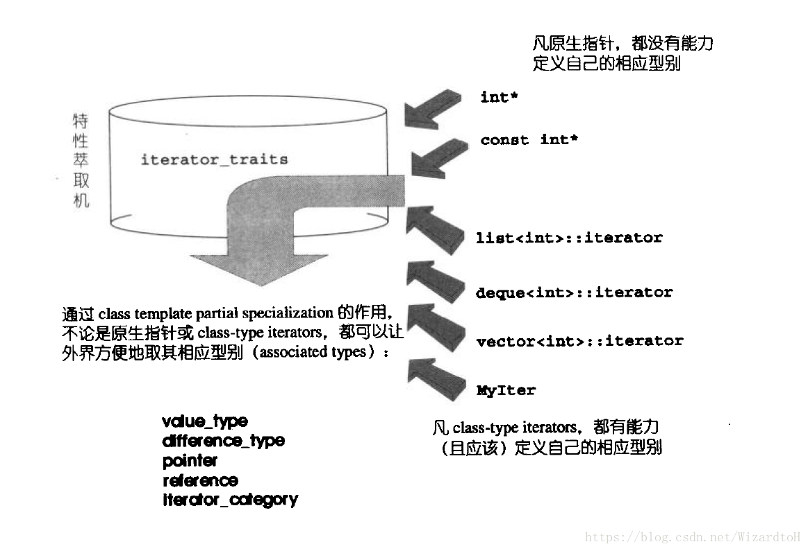

上图是迭代器traits获取相应型别的示意图，最常用到的相应型别有：

- value_type
- difference_type
- reference_type
- pointer_type
- iterator_category

**std::iterator的保证**

任何迭代器都应该提供五个内嵌相应型别，否则可能无法与其它STL组件顺利搭配，但是总会容易遗漏。为了简化编写过程，STL提供了一个iterators class，只要新开发的迭代器继承自他，就能保证符合STL规范。

```cpp
template <class Category, class T, class Distance = ptrdiff_t,
          class Pointer = T*, class Reference = T&>
struct iterator {
  typedef Category  iterator_category;
  typedef T         value_type;
  typedef Distance  difference_type;
  typedef Pointer   pointer;
  typedef Reference reference;
};
```

C++11提供的相关特性

实际上在C++11中已经有了相关的一些新特性，可以代替这种自定义的特性。

迭代器的value_type型别，可以使用decltype进行推算，那么pointer和refrence都能够得到。
_type_traits中的has_trivial_default_constructor，可以用std::is_trivially_default_constructible代替。
_type_traits中的has_trivial_copy_constructor，可以用std::is_trivially_copy_constructible实现。
_type_traits中的has_trivial_assignment_operator，可以用std::is_trivially_copy_assignable实现。
__type_traits中的has_trivial_destructor，可以用std::is_trivially_destructible实现。

__type_traits中的is_POD_type，可以用std::is_pod实现。

#### 四、vector

vector的元素排列和操作方式与array很相似，不同的是vector是动态空间，能够随着元素的添加自动扩展空间。它的实现关键在于对大小的控制以及重新配置空间时移动元素的效率。

vector是很常用的一个容器，就不说那么详细了

当使用push_back()将元素插入尾部时，会先检查是否有备用空间，如果有就直接在备用空间中构造，并调整迭代器finish。否则，就需要进行扩展空间：

```cpp
template <class T, class Alloc = alloc>
void vector::push_back(const T& x)
{
    if (finish != end_of_storage) {  
        // 还有备用空间，直接构造
        construct(finish, x);
        ++finish;
    }
    else
        insert_aux(finish, x);  // 见后续代码
}

// 在某个位置插入元素
template <class T, class Alloc = alloc>
void  vector::insert_aux(iterator position, const T& x)
{
    if (finish != end_of_storage) {
        // 还有备用空间
        // 将最后一位元素构造给备用空间中的第一位
        construct(finish, *(finish - 1));
        ++finish;

        // 把[position,finish - 2]的元素后移一位
        T x_copy = x;
        copy_backward(position, finish - 2, finish - 1);  // 见后续代码
        *position = x_copy;
    }
    else {
        // 没有备用空间，需要扩展，扩展方式为抛原有空间重新分配
        // 原则为：原大小为0，则配置1个；否则，配置原有的两倍。为什么是两倍，详见https://blog.csdn.net/yangshiziping/article/details/52550291
        const size_type old_size = size();
        const size_type new_size = old_size == 0 ? 1 : 2 * old_size;

        iterator new_start = data_allocator::allocate(new_size);
        iterator new_finish = new_start;

        try
        {
            // 将原有的position前的内容拷贝到新的空间
            // 赋值position位置为x
            // 将position后的内容拷贝到新的空间
            new_finish = uninitialized_copy(start, position, new_start);
            construct(new_finish, x);
            ++new_finish;
            new_finish = uninitialized_copy(position, finish, new_finish);  // 此处原作者有所误解，并不是将备用空间拷贝
        }
        catch (...)
        {
            destroy(new_start, new_finish);
            data_allocator::deallocate(new_start, new_size);
            throw;
        }

        // 析构并释放原有空间
        destroy(begin(), end());
        deallocate();

        // 调整迭代器位置指向新的空间
        start = new_start;
        finish = new_finish;
        end_of_storage = new_start + new_size;
    }
}

// 将[first,last]按倒序赋值给[first - (result-last), last - (result-last)]
// (result-last)大于0时，相当于将元素[first,last]后移(result-last)位
// (result-last)小于0时，相当于将元素[first,last]前移(result-last)位
template<class BidirectionalIterator1, class BidirectionalIterator2>
BidirectionalIterator2 copy_backward ( BidirectionalIterator1 first,
                                       BidirectionalIterator1 last,
                                       BidirectionalIterator2 result )
{
  　　while (last != first) *(--result) = *(--last);
  　　return result;
}
```

以上代码可以看到，vector扩展空间的方式是申请新的空间，然后把原有的内容复制过来，然后释放原有空间，这是为了保证空间的连续性。因此，一旦发生了空间的扩展，原有的迭代器全都会失效。

```cpp
// 移除最后一个元素
void pop_back()
{
    --finish;
    destroy(finish);
}

// 移除指定迭代器的元素
iterator erase(iterator position)
{
    if (position + 1 != end())
        copy(position + 1, finish, position);

    --finish;
    destroy(finish);
    return position;
}

// 移除[first，last)之间的元素
iterator erase(iterator first, iterator last)
{
    iterator i = copy(last, finish, first);
    // 析构掉需要析构的元素
    destroy(i, finish);
    finish = finish - (last - first);
    return first;
}

// 清空
void clear()
{
    erase(begin(), end());
}

// 在指定位置插入n个x
template <class T, class Alloc>
void insert(iterator position, size_type n, const T& x)
{
    if (n != 0)
    {
        if (size_type(end_of_storage - finish) >= n)
        {      
            // 备用空间大于等于“新增元素个数”
            T x_copy = x;
            // 以下计算插入点后面的现有元素个数
            const size_type elems_after = finish - position;
            iterator old_finish = finish;
            if (elems_after > n)
            {
                // 插入点后面的现有元素个数大于新增元素个数的情况
                uninitialized_copy(finish - n, finish, finish);
                finish += n;    
                // 从position开始向后移n位
                copy_backward(position, old_finish - n, old_finish);
                fill(position, position + n, x_copy); // 从插入点开始填入新值
            }
            else
            {
                // 插入点后面的现有元素个数小于等于新增元素个数的情况
                // 无法和大于的情况一样使用copy_backward(position, old_finish - n, old_finish)，position会大于old_finish - n
                uninitialized_fill_n(finish, n - elems_after, x_copy);
                finish += n - elems_after;
                uninitialized_copy(position, old_finish, finish);
                finish += elems_after;
                fill(position, old_finish, x_copy);
            }
        }
        else
        {
            // 备用空间小于“新增元素个数”（那就必须配置额外的内存）
            // 首先决定新长度：旧长度的两倍，或旧长度+新增元素个数
            const size_type old_size = size();
            const size_type len = old_size + max(old_size, n);
            // 以下配置新的vector空间
            iterator new_start = data_allocator::allocate(len);
            iterator new_finish = new_start;
            __STL_TRY
            {
                // 以下首先将旧的vector的插入点之前的元素复制到新空间
                new_finish = uninitialized_copy(start, position, new_start);
                // 以下再将新增元素（初值皆为n）填入新空间
                new_finish = uninitialized_fill_n(new_finish, n, x);
                // 以下再将旧vector的插入点之后的元素复制到新空间
                new_finish = uninitialized_copy(position, finish, new_finish);
            }
#ifdef  __STL_USE_EXCEPTIONS
            catch(...)
            {
                destroy(new_start, new_finish);
                data_allocator::deallocate(new_start, len);
                throw;
            }
#endif /* __STL_USE_EXCEPTIONS */

            destroy(start, finish);
            deallocate();
            start = new_start;
            finish = new_finish;
            end_of_storage = new_start + len;
        }
    }
}
```

#### 五、list

相较于vector的连续线性空间，list就复杂许多，它的好处是每次插入或删除一个元素，就配置或释放一个元素空间。因此，list对于空间的运用有绝对的精准，一点也不浪费。而且，对于任何位置的元素插入或元素移除，list永远是常数时间。

```cpp
template <class T>
struct __list_node
{
    typedef void* void_pointer;
    void_pointer next;                // 前后指针都是void*类型
    void_pointer prev;
    T data;
};
```

list的迭代器

list和vector不同，不能使用原始指针作为迭代器的value_type，因为list不能保证元素是线性连续的。list的迭代器需要具备前移、后移的能力，因此是Bidirectional Iterators。list的插入操作不会造成迭代器失效，删除操作只导致被删除的迭代器失效。

```cpp
template<class T, class Ref, class Ptr>
struct __list_iterator
{
    typedef __list_iterator<T, T&, T*>      iterator;
    typedef __list_iterator<T, Ref, Ptr>    self;

    typedef bidirectional_iterator_tag iterator_category;
    typedef T value_type;
    typedef Ptr pointer;
    typedef Ref reference;
    typedef __list_node<T>* link_type;
    typedef size_t size_type;
    typedef ptrdiff_t difference_type;

    link_type node;   // 迭代器内部当然要有一个普通指针，指向list的节点

    __list_iterator(link_type x) : node(x) {}
    __list_iterator() {}
    __list_iterator(const iterator& x) : node(x.node) {}

    bool operator==(const self& x) const { return node == x.node; }
    bool operator!=(const self& x) const { return node != x.node; }

    // 以下对迭代器取值（dereference）,取的是节点的数据值
    reference operator*() const { return (*node).data; }

    // 以下是迭代器的成员存取运算子的标准做法
    pointer operator->() const { return &(operator*()); }

    // 前缀自加，对迭代器累加1，就是前进一个节点
    self& operator++()
    {
        node = (link_type)((*node).next);
        return *this;
    }

    // 后缀自加, 需要先产生自身的一个副本, 然会再对自身操作, 最后返回副本
    self operator++(int)
    {
        self tmp = *this;
        ++*this;
        return tmp;
    }

    // 前缀自减
    self& operator--()
    {
        node = (link_type)((*node).prev);
        return *this;
    }

    self operator--(int)
    {
        self tmp = *this;
        --*this;
        return tmp;
    }
};
```

```cpp
// 默认allocator为alloc
template <class T, class Alloc = alloc>
class list
{
...
public:
    list() { empty_initialize(); }
protected: 
    // 专属空间配置器，配置单位为一个节点大小
    typedef simple_alloc<list_node, Alloc> list_node_allocator;

    // 建立空链表
    void empty_initialize()
    {
        node = get_node();
        node->next = node;
        node->prev = node;
    }

    // 配置一个节点，不进行构造
    link_type get_node() { return list_node_allocator::allocate(); }

    // 释放一个节点, 不进行析构
    void put_node(link_type p) { list_node_allocator::deallocate(p); }

    // 配置并构造一个节点
    link_type create_node(const T& x)
    {
        link_type p = get_node();
        construct(&p->data, x);
        return p;
    }

    // 析构并释放节点
    void destroy_node(link_type p)
    {
        destroy(&p->data);
        put_node(p);
    }
...
}
```

```cpp
void push_front(const T& x) { insert(begin(), x); }
void push_back(const T& x) { insert(end(), x); }

// 在position之前插入节点
iterator insert(iterator position, const T& x)
{
    link_type tmp = create_node(x);   // 产生一个节点
    // 调整双向指针，使tmp插入
    tmp->next = position.node;
    tmp->prev = position.node->prev;
    (link_type(position.node->prev))->next = tmp;
    position.node->prev = tmp;
    return tmp;
}
```

```cpp
// 在链表前端插入结点
void push_front(const T& x) { insert(begin(), x); }
// 在链表最后插入结点
void push_back(const T& x) { insert(end(), x); }

// 移除迭代器position所指节点
iterator erase(iterator position){
    link_type next_node = link_type(position.node->next);
    link_type prev_node = link_type(position.node->prev);
    prev_node->next = next_node;
    next_node->prev = prev_node;
    destroy_node(position.node);
    return iterator(next_node);
}

// 删除链表第一个结点
void pop_front() { erase(begin()); }
// 删除链表最后一个结点
void pop_back(){
    iterator tmp = end();
    erase(--tmp);
}

// 销毁所有结点, 将链表置空
template <class T, class Alloc>
void list<T, Alloc>::clear()
{
    link_type cur = (link_type)node->next;
    while (cur != node)
    {
        link_type tmp = cur;
        cur = (link_type)cur->next;
        destroy_node(tmp);
    }
    // 恢复node原始状态
    node->next = node;
    node->prev = node;
}

// 移除容器内所有的相邻的重复结点
template <class T, class Alloc>
void list<T, Alloc>::unique()
{
    iterator first = begin();
    iterator last = end();
    if (first == last) return;
    iterator next = first;
    while (++next != last)
    {
        if (*first == *next)
            erase(next);
        else
            first = next;
        next = first;
    }
}

```

```cpp
// 将 [first,last) 内的所有元素搬移到 position 之前
void transfer(iterator position, iterator first, iterator last)  
{  
    if (position != last)   // 如果last == position, 则相当于链表不变化, 不进行操作  
    {  
        (*(link_type((*last.node).prev))).next = position.node;  //（1）
        (*(link_type((*first.node).prev))).next = last.node;  //（2）
        (*(link_type((*position.node).prev))).next = first.node;  //（3）
        link_type tmp = link_type((*position.node).prev);  //（4）
        (*position.node).prev = (*last.node).prev;  //（5）
        (*last.node).prev = (*first.node).prev;  //（6）
        (*first.node).prev = tmp;  //（7）
    }  
}

// 将 x 接合于 position 所指位置之前。x 必须不同于 *this。 
void splice(iterator position, list& x)  
{  
    if (!x.empty())  
        transfer(position, x.begin(), x.end());  
}  

//将 i 所指元素接合于 position 所指位置之前。position 和 i 可指向同一个 list。
void splice(iterator position, list&, iterator i)  
{  
    iterator j = i;  
    ++j;  
    if (position == i || position == j) return;  
    transfer(position, i, j);  
}  

// 将 [first,last) 内的所有元素接合于 position 所指位置之前。
// position 和[first,last)可指向同一个 list，
// 但 position 不能位于[first,last)之内。
void splice(iterator position, list&, iterator first, iterator last)  
{  
    if (first != last)  
        transfer(position, first, last);  
}  

// merge() 将 x 合并到 *this 身上。两个 lists 的内容都必须先经过递增排序。
template <class T, class Alloc>  
void list<T, Alloc>::merge(list<T, Alloc>& x)  
{  
  iterator first1 = begin();  
  iterator last1 = end();  
  iterator first2 = x.begin();  
  iterator last2 = x.end();  

  // 注意：前提是，两个lists都已经递增排序  
  while (first1 != last1 && first2 != last2)  
    if (*first2 < *first1)  
    {  
      iterator next = first2;  
      transfer(first1, first2, ++next);  
      first2 = next;  
    }  
    else  
      ++first1;  
  if (first2 != last2)  
      transfer(last1, first2, last2);  
}  

// reverse() 将 *this 的内容逆向重置
template<class T, class Alloc>  
void list<T,Alloc>::reverse()  
{  
    // 以下判断，如果是空白串行，或仅有㆒个元素，就不做任何动作。
    // 使用 size() == 0 || size() == 1 来判断，虽然也可以，但是比较慢。
    if (node->next == node || link_type(node->next->next == node))  
    {  
        return;  
    }  
    iterator first = begin();  
    ++first;  
    while (first != end())  
    {  
      iterator old = first;  
      ++first;  
      transfer(begin(),old,first);  
    }  
}  

// list 不能使用 STL 算法 sort()，必须使用自己的 sort() member function，
// 因为 STL 算法 sort() 只接受 RamdonAccessIterator.
// 本函式采用 quick sort
template <class T, class Alloc>
void list<T, Alloc> :: sort(){
    // 判断链表是否为空或者只有一个元素，就不做任何动作。
    // 使用 size() == 0 || size() == 1 来判断，虽然也可以，但是比较慢。
    if(node->next == node || link_type(node->next)->next == node){
        return;
    }

    list<T, Alloc> carry;
    list<T, alloc> counter[64];
    int fill = 0;
    while(!empty()){
        carry.splice(carry.begin(), *this, begin());
        int i = 0;
        while(i < fill && !counter[i].empty()){
            counter[i].merge(carry);
            carry.swap(counter[i++]);
        }
        carry.swap(counter[i]);
        if(i == fill){
            ++fill;
        } 
    }

    for(int i = 1; i < fill; ++i){
        counter[i].merge(counter[i-1]);
    }
    swap(counter[fill-1]);
}
```

#### 六、deque

deque是一种双向开口的分段连续线性空间，可以在头部/尾部进行元素的插入和删除。它与vector最大的差异，一是deque允许于常数时间内对头端进行插入或删除元素，二是deque是由分段连续线性空间组合而成，随时可以增加一段新的空间，不像vector那样，vector当内存不够时，需要重新分配空间。 

deque也提供Ramdom Access Iterator，但是不是原始指针，相比起来要复杂得多，因此也影响了运算效率，所以尽量使用vector少用deque。

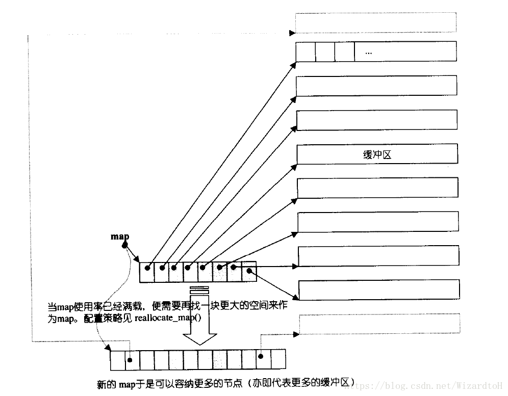

**deque的迭代器**

deque分段连续空间的实现，主要有迭代器的operator++和operator–来负责。deque迭代器必须能够判断目前的缓冲区，以及是否在当前缓冲区的边界，这样才能决定是否要跳转到另一个缓冲区。而为了找到其他缓冲区，必须要能够控制中控器map。

```cpp
template <class T, class Ref, class Ptr, size_t BufSiz>
struct __deque_iterator {
    typedef __deque_iterator<T, T&, T*, BufSiz>             iterator;
    typedef __deque_iterator<T, const T&, const T*, BufSiz> const_iterator;
    static size_t buffer_size() {return __deque_buf_size(BufSiz, sizeof(T)); }

    typedef random_access_iterator_tag iterator_category;
    typedef T value_type;
    typedef Ptr pointer;
    typedef Ref reference;
    typedef size_t size_type;
    typedef ptrdiff_t difference_type;
    typedef T** map_pointer;

    typedef __deque_iterator self;

    // 保持与容器的联结
    T* cur;           // 缓冲区中的当前元素
    T* first;         // 缓冲区中的头
    T* last;          // 缓冲区中的尾
    map_pointer node; // 指向中控器
...
}
```

deque的迭代器对各种指针运算都进行了重载，其中最关键的就是当遇到缓冲区边缘时需要特殊处理：

```cpp
// 跳转缓冲区
void set_node(map_pointer new_node)
{
      node = new_node;      
      first = *new_node;    // 更新跳转后缓冲区first信息
      last = first + difference_type(buffer_size());  // 更新跳转后缓冲区last的信息
}

reference operator*() const { return *cur; }
pointer operator->() const { return &(operator*()); }

// -操作符，计算两个迭代器之间的距离。单个缓冲区元素的数量 * 缓冲区间隔 + 迭代器在缓冲区中的间隔
difference_type operator-(const self& x) const
{
      return difference_type(buffer_size()) * (node - x.node - 1) + (cur - first) + (x.last - x.cur);
}

// 前缀自增
self& operator++()
{
    ++cur;
    if (cur == last) {
        set_node(node + 1); // 如果为当前缓冲区最后一个，则跳转到下一个缓冲区
        cur = first;        // 更新为下一缓冲区的起始点
    }
    return *this;
}

// 后缀自增
self operator++(int)
{
    self tmp = *this;
    ++*this;
    return tmp;
}

//前缀自减
self& operator--()
{
    if (cur == first) {
        set_node(node - 1);
        cur = last;
    }
    --cur;
    return *this;
}

// 后缀自减
self operator--(int)
{
    self tmp = *this;
    --*this;
    return tmp;
}

// 实现迭代器跳跃功能
self& operator+=(difference_type n)
{
    difference_type offset = n + (cur - first);
    if (offset >= 0 && offset < difference_type(buffer_size()))
        // 目标在同一缓冲区
        cur += n;
    else {
        // 目标在其他缓冲区
        difference_type node_offset =
            offset > 0 ? offset / difference_type(buffer_size())
            : -difference_type((-offset - 1) / buffer_size()) - 1;
        set_node(node + node_offset);
        cur = first + (offset - node_offset * difference_type(buffer_size()));
    }
    return *this;
}

self operator+(difference_type n) const
{
    self tmp = *this;
    return tmp += n;
}

self& operator-=(difference_type n) { return *this += -n; }

self operator-(difference_type n) const {
    self tmp = *this;
    return tmp -= n;
}

reference operator[](difference_type n) const { return *(*this + n); }

bool operator==(const self& x) const { return cur == x.cur; }
bool operator!=(const self& x) const { return !(*this == x); }
bool operator<(const self& x) const {
    return (node == x.node) ? (cur < x.cur) : (node < x.node);
}
```

**deque的数据结构**

deque处理维护指向map的指针外，还需要维护start和finish两个迭代器，分别是第一个缓冲区的第一个元素和最后一个缓冲区的最后一个元素后一个位置。还需要记录当前map的大小，如果空间不足就需要重新配置：

```cpp
template <class T, class Alloc = alloc, size_t BufSiz = 0>
class deque {
public:
    typedef T value_type;
    typedef value_type* pointer;
    typedef size_t size_type;
...
public:
    typedef __deque_iterator<T, T&, T*, BufSiz>  iterator;    // deque的迭代器
protected:
    typedef pointer* map_pointer;
protected:
    iterator start;               // 指向第一个的迭代器
    iterator finish;              // 指向最后一个节点的迭代器

    map_pointer map;      // map指针
    size_type map_size;   // map容量 

public:
  iterator begin() { return start; }    // 返回第一个节点的迭代器
  iterator end() { return finish; }     // 返回最后一个节点的迭代器
  const_iterator begin() const { return start; }    // const版本
  const_iterator end() const { return finish; }     // const版本
public:
    iterator begin() { return start; }    // 返回第一个节点的迭代器
    iterator end() { return finish; }     // 返回最后一个节点的迭代器
    const_iterator begin() const { return start; }    // const版本
    const_iterator end() const { return finish; }     // const版本

    // 使用deque迭代器的[]操作符
    reference operator[](size_type n) { return start[difference_type(n)]; }

    reference front() { return *start; }
    reference back() {
        iterator tmp = finish;
        --tmp;
        return *tmp;
    }

    // 返回deque的大小，使用迭代器的-运算符 
    size_type size() const { return finish - start; }
    // 返回deque最大容量
    size_type max_size() const { return size_type(-1); }

    bool empty() const { return finish == start; }
}
```

**deque的构造与内存管理**

以下举例deque中的一个构造函数：

```cpp
template <class T, class Alloc = alloc, size_t BufSiz = 0>
class deque {
public:
    deque(size_type n, const value_type& value)
        : start(), finish(), map(0), map_size(0)
    {
        fill_initialize(n, value);    // 调用fill_initialize函数
    }

protected:
    // 专属配置器，一个元素大小
    typedef simple_alloc<value_type, Alloc> data_allocator;
    // 专属配置器，一个指针大小
    typedef simple_alloc<pointer, Alloc> map_allocator;

    pointer allocate_node() { return data_allocator::allocate(buffer_size()); }
    void deallocate_node(pointer n) {
        data_allocator::deallocate(n, buffer_size());
    }
}

// 分配n个结点, 并以value为元素值初始化
template <class T, class Alloc, size_t BufSize>
void deque<T, Alloc, BufSize>::fill_initialize(size_type n,
    const value_type& value)
{
    create_map_and_nodes(n);  // 配置map和缓冲区
    map_pointer cur;
    __STL_TRY{
        // 为每一个缓冲区设定初值
        for (cur = start.node; cur < finish.node; ++cur)
        uninitialized_fill(*cur, *cur + buffer_size(), value);
    // 最后一个缓冲区特殊处理，因为尾端可能留有备用空间，不必设初值
    uninitialized_fill(finish.first, finish.cur, value);
    }
        catch (...) {
        for (map_pointer n = start.node; n < cur; ++n)
            destroy(*n, *n + buffer_size());
        destroy_map_and_nodes();
        throw;
    }
}

// 配置并安排好
template <class T, class Alloc, size_t BufSize>
void deque<T, Alloc, BufSize>::create_map_and_nodes(size_type num_elements) {
    // 计算需要的缓冲区节点数，刚好对缓冲器元素个数整除则多配置一个节点
    size_type num_nodes = num_elements / buffer_size() + 1;

    // map需要管理几个节点, = 所需节点前后+2(最少8个)
    map_size = max(initial_map_size(), num_nodes + 2);
    map = map_allocator::allocate(map_size);

    // nstart和nfinish指向实际需要节点的头和尾
    map_pointer nstart = map + (map_size - num_nodes) / 2;
    map_pointer nfinish = nstart + num_nodes - 1;

    map_pointer cur;
    __STL_TRY{
        // 为所有节点配置缓冲区
        for (cur = nstart; cur <= nfinish; ++cur)
        *cur = allocate_node();
    }
#ifdef  __STL_USE_EXCEPTIONS 
        catch (...) {
        for (map_pointer n = nstart; n < cur; ++n)
            deallocate_node(*n);
        map_allocator::deallocate(map, map_size);
        throw;
    }
#endif /* __STL_USE_EXCEPTIONS */

    // 为deque中的两个迭代器设置内容
    start.set_node(nstart);
    finish.set_node(nfinish);
    start.cur = start.first;
    finish.cur = finish.first + num_elements % buffer_size();
}
```

push_back/push_front的实现如下：

```cpp
void push_back(const value_type& t) {
    // 当前缓冲区备用空间需要大于等于2个，否则调用push_back_aux，其中进行了空间配置
    if (finish.cur != finish.last - 1) {
        construct(finish.cur, t);
        ++finish.cur;
    }
    else
        push_back_aux(t);
}

template <class T, class Alloc, size_t BufSize>
void deque<T, Alloc, BufSize>::push_back_aux(const value_type& t) {
    value_type t_copy = t;
    reserve_map_at_back();                 // 检查map中的节点是否需要扩展，下文会解释如何使用
    *(finish.node + 1) = allocate_node();  // 配置一个新的缓冲区
    __STL_TRY{
        construct(finish.cur, t_copy);
        finish.set_node(finish.node + 1);
        finish.cur = finish.first;
    }
    __STL_UNWIND(deallocate_node(*(finish.node + 1)));
}

void push_front(const value_type& t) {
    if (start.cur != start.first) {
        construct(start.cur - 1, t);
        --start.cur;
    }
    else
        push_front_aux(t);
}

template <class T, class Alloc, size_t BufSize>
void deque<T, Alloc, BufSize>::push_front_aux(const value_type& t) {
    value_type t_copy = t;
    reserve_map_at_front();
    *(start.node - 1) = allocate_node();
    __STL_TRY{
        start.set_node( sart.node - 1);
        start.cur = start.last - 1;
        construct(start.cur, t_copy);
    }
#ifdef __STL_USE_EXCEPTIONS
    catch (...) {
        start.set_node(start.node + 1);
        start.cur = start.first;
        deallocate_node(*(start.node - 1));
        throw;
    }
#endif /* __STL_USE_EXEONS */

void reserve_map_at_back(size_type nodes_to_add = 1)
    if (nodes_to_add + 1 > map_size - (finish.node - map))
        // map尾部的节点备用空间不足，重新配置
        reallocate_map(nodes_to_add, false);
}

void reserve_map_at_front(size_type nodes_to_add = 1) {
    if (nodes_to_add > start.node - map)
        // map头部的节点备用空间不足，重新配置
        reallocate_map(nodes_to_add, rue);
}

template <class T, class Alloc, size_t BufSize>
void deque<T, Alloc, BufSize>::reallocate_map(size_type nodes_to_add, bool add_at_front) {
    // 计算新map需要的节点数量
    size_type old_num_nodes = finish.node - start.node + 1;
    size_type new_num_nodes = old_num_nodes + nodes_to_add;

    map_pointer new_nstart;
    if (map_size > 2 * new_num_nodes) {   
        // 当前map节点数量是需要的节点数量2倍以上，说明map中还有剩余备用空节点可用
        // 移动map起点，并拷贝原有节点中的缓冲区地址到新的位置
        new_nstart = map + (map_size - new_num_nodes) / 2 + (add_at_front ? nodes_to_add : 0);
        if (new_nstart < start.node)
            copy(start.node, finish.node + 1, new_nstart);
        else
            copy_backward(start.node, finish.node + 1, new_nstart + old_num_nodes);
    }
    else {
        // 当前map节点数量不到需要的节点数量2倍，那么需要重新配置map节点空间
        size_type new_map_size = map_size + max(map_size, nodes_to_add) + 2;

        // 申请新空间，释放原来的map空间
        map_pointer new_map = map_allocator::allocate(new_map_size);
        new_nstart = new_map + (new_map_size - new_num_nodes) / 2 + (add_at_front ? nodes_to_add : 0);
        copy(start.node, finish.node + 1, new_nstart);
        map_allocator::deallocate(map, map_size);

        map = new_map;
        map_size = new_map_size;
    }

    // 重新设置迭代器的位置
    start.set_node(new_nstart);
    finish.set_node(new_nstart + old_num_nodes - 1);
}
```

**deque的元素操作**

deque提供的元素操作函数很多，下面只举例常用的几个。

```cpp
void pop_front() {
    if (start.cur != start.last - 1) { 
        destroy(start.cur);
        ++start.cur;
    }
    else 
        pop_front_aux();
}

// 当前缓冲区只剩一个元素
template <class T, class Alloc, size_t BufSize>
void deque<T, Alloc, BufSize>::pop_front_aux() {
    destroy(start.cur);
    deallocate_node(start.first);
    start.set_node(start.node + 1);
    start.cur = start.first;
}

void pop_back()
{

  if (finish.cur != finish.first)
  {
    destroy(finish.cur);
    --finish.cur;
  }
  else
    pop_back_aux();         
}

// 被删的节点刚好是最后一个缓冲区的第一个节点
template<class T, class Alloc, size_t BufSize>
void deque<T,Alloc,BufSize> ::pop_back_aux()
{
   deallocate_node(finish.first) ;
   destroy(finish.cur) ;
   finish.setNode( finish.node-1 ) ;
   finish.cur = finish.last-1 ;
}

// 删除某个位置的元素
iterator erase(iterator pos) {
    iterator next = pos;
    ++next;
    difference_type index = pos - start;
    if (index < (size() >> 1)) {
        // 如果清除点之前的元素比较少
        // 将清除点之前的所有元素后移一位 ，然后删除第一个元素
        copy_backward(start, pos, next);  // 利用了迭代器的operator--
        pop_front();
    }
    else { 
        // 如果清除点之后的元素比较少
        // 将清除点之后的所有元素前移一位  然后删除最后一个元素
        copy(next, finish, pos);  // 利用了迭代器的operator++
        pop_back();
    }
    return start + index;
}

// 根据插入位置的不同进行处理
iterator insert(iterator position, const value_type& x) {
    if (position.cur == start.cur) {
        push_front(x);
        return start;
    }
    else if (position.cur == finish.cur) {
        push_back(x);
        iterator tmp = finish;
        --tmp;
        return tmp;
    }
    else {
        return insert_aux(position, x);
    }
}

template <class T, class Alloc, size_t BufSize>
typename deque<T, Alloc, BufSize>::iterator
deque<T, Alloc, BufSize>::insert_aux(iterator pos, const value_type& x) {
    difference_type index = pos - start;
    value_type x_copy = x;
    if (index < size() / 2) {
        // 插入点之前的元素较少
        // 先在前端插入一个元素，然后把开始到pos的元素向前移动一位
        push_front(front());
        iterator front1 = start;
        ++front1;
        iterator front2 = front1;
        ++front2;
        pos = start + index;
        iterator pos1 = pos;
        ++pos1;
        copy(front2, pos1, front1);
    }
    else {
        // 插入点之后的元素较少
        // 先在尾端插入一个元素，然后把pos到尾部的元素向后移动一位
        push_back(back());
        iterator back1 = finish;
        --back1;
        iterator back2 = back1;
        --back2;
        pos = start + index;
        copy_backward(pos, back2, back1);
    }

    // 给pos位置的元素赋值
    *pos = x_copy;
    return pos;
}
```

#### 七、stack、queue

由deque实现

#### 八、priority_queue、heap算法

会用就行了吧。。。

还挺方便的

https://blog.csdn.net/qq_23905237/article/details/90905635

#### 九、关联式容器

##### 1.树

##### 2.二叉搜索树

节点删除操作：

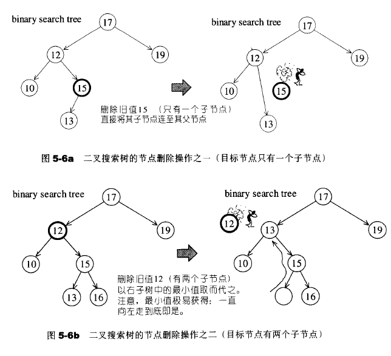

##### 3.平衡二叉搜索树

避免深度过大

##### 4.AVLtree(Adelson-Velskii-Landis tree)

要求任何节点的左右子树高度相差最多为1

当插入一个值后，可能会导致失去平衡状态

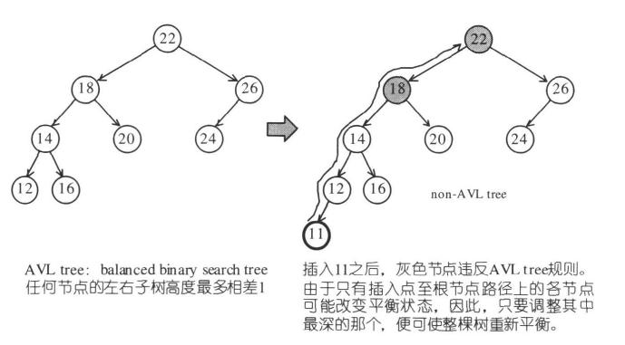

可以分为四种情况：

1.插入点位于X的左子节点的左子树---左左

2.插入点位于X的左子节点的右子树---左右

3.插入点位于X的右子节点的左子树---右左

4.插入点位于X的右子节点的左子树---右右

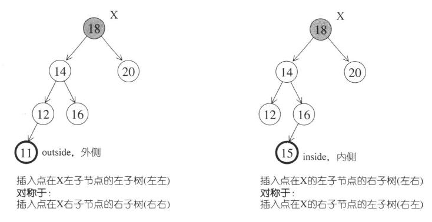

外侧：单旋

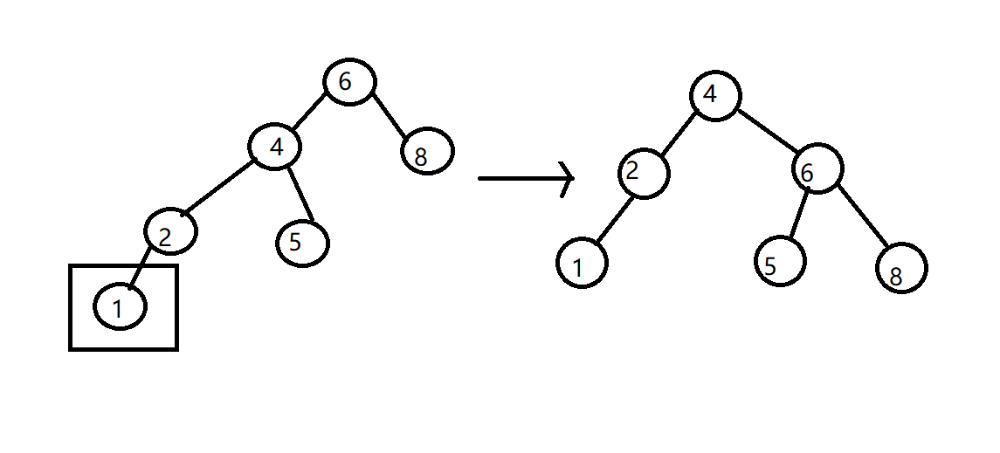

6向右旋转成为4的右结点，同时，5放到6的左孩子上。这样即可得到一颗新的AVL树，

右右左旋的原理同上

内侧：双旋

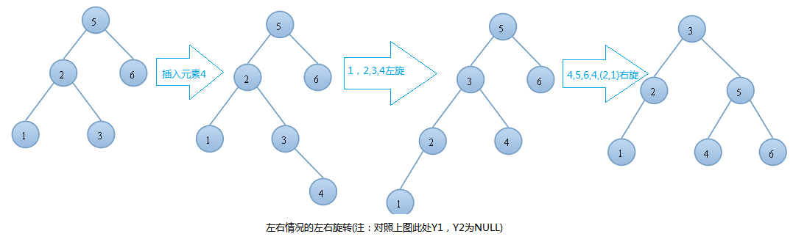


别人的简单实现：

```cpp
#include <iostream>

using namespace std;

#define DataType int

/*
    定义AVL树的结构体，链式
*/
typedef struct AvlNode{
    DataType    data;
    AvlNode    * m_pLeft;
    AvlNode    * m_pRight;
    int height;
}*AvlTree,*Position,AvlNode;

//求两个数的最大值
int Max(int a,int b)
{
    return a>b?a:b;
}
//求树的高度
int Height( AvlTree T)
{
    if(NULL == T)
        return -1;
    else
        return T->height;
}

//单旋转右旋
AvlTree singleRotateWithRight(AvlTree T)
{
    AvlTree L = T->m_pLeft;
    T->m_pLeft = L->m_pRight;
    L->m_pRight = T;
    T->height = Max( Height(T->m_pLeft),Height(T->m_pRight) ) + 1;
    L->height = Max( Height(L->m_pLeft),Height(L->m_pRight) ) + 1;
    return L;    //此时L成为根节点了（可参考AVL的插入的左左情况的右旋图）
}
//单旋转左旋
AvlTree singleRotateWithLeft(AvlTree T)
{
    AvlTree R = T->m_pRight;
    T->m_pRight = R->m_pLeft;
    R->m_pLeft = T;
    T->height = Max( Height(T->m_pLeft),Height(T->m_pRight) ) + 1;
    R->height = Max( Height(R->m_pLeft),Height(R->m_pRight) ) + 1;
    return R;    //此时R成为根节点了（可参考AVL的插入的左左情况的左旋图）
}
//双旋转，先左后右
AvlTree doubleRotateWithLeft(AvlTree T)        //先左后右
{
    T->m_pLeft = singleRotateWithLeft(T->m_pLeft);
    return singleRotateWithRight(T);
}
//双旋转，先右后左
AvlTree doubleRotateWithRight(AvlTree T)    //先右后左
{
    T->m_pRight = singleRotateWithRight(T->m_pRight);
    return singleRotateWithLeft(T);
}
AvlTree AvlTreeInsert(AvlTree T, DataType x)
{
    if(T == NULL)    //如果树为空
    {
        T = (AvlNode *)malloc(sizeof(struct AvlNode));
        if(T)
        {
            T->data = x;
            T->m_pLeft    = NULL;
            T->m_pRight = NULL;
            T->height = 0;
        }
        else
        {
            cout << "空间不够" << endl;
            exit(0);
        }
    }
    else if( x < T->data)        //如果插入到T结点的左子树上
    {
        T->m_pLeft = AvlTreeInsert(T->m_pLeft,x);    //先插入，后旋转
        if(Height(T->m_pLeft) - Height(T->m_pRight) == 2) //只有可能是这个
        {
            if(x < T->m_pLeft->data)        //左左情况，只需要右旋转
            {
                T = singleRotateWithRight( T );
            }
            else                            //左右情况，双旋转,先左
            {            
                T = doubleRotateWithLeft( T );
            }
        }
    }
    else if( x > T->data )
    {
        T->m_pRight = AvlTreeInsert(T->m_pRight,x);
        if(Height(T->m_pRight) - Height(T->m_pLeft) == 2)
        {
            if(x > T->m_pRight->data)        //右右情况，进行左旋
            {
                T = singleRotateWithLeft( T );
            }
            else                            //左右情况，双旋转,先右
            {
                T = doubleRotateWithRight( T );
            }
        }
    }
    //如果这个数已经存在，那么不进行插入
    T->height = Max(Height(T->m_pLeft),Height(T->m_pRight)) + 1;
    return T;
}
//递归实现中序遍历
void inOrderVisitUseRecur(const AvlTree pCurrent)
{
    if(pCurrent)
    {
        inOrderVisitUseRecur(pCurrent->m_pLeft);
        cout << pCurrent->data << " ";
        if(pCurrent->m_pLeft)
            cout << " leftChild: "<<pCurrent->m_pLeft->data;
        else
            cout << " leftChild: "<<"NULL" ;
        if(pCurrent->m_pRight)
            cout << " rightChild: "<<pCurrent->m_pRight->data;
        else
            cout << " rightChild: "<< "NULL";
        cout << endl;
        inOrderVisitUseRecur(pCurrent->m_pRight);
    }
}
int main()
{
    AvlTree root = NULL;
    root = AvlTreeInsert(root,1);
    root = AvlTreeInsert(root,2);
    root = AvlTreeInsert(root,3);
    root = AvlTreeInsert(root,4);
    root = AvlTreeInsert(root,5);
    root = AvlTreeInsert(root,6);
    root = AvlTreeInsert(root,7);
    root = AvlTreeInsert(root,8);
    root = AvlTreeInsert(root,9);
    root = AvlTreeInsert(root,10);
    root = AvlTreeInsert(root,11);
    root = AvlTreeInsert(root,12);
    root = AvlTreeInsert(root,13);
    root = AvlTreeInsert(root,14);
    root = AvlTreeInsert(root,15);
    inOrderVisitUseRecur(root);
    return 0;
}
```

##### 5.RB-tree

必须满足以下规则

1.每个结点或是红色的，或是黑色的

2.根节点是黑色的

3.每个叶结点(NULL)是黑色的

4.如果一个结点是红色的，那么他的两个子结点都是黑色的

5.对于每个结点，从该结点到其所有后代叶结点的简单路径上，包含相同数目的黑色结点

3与我们常说的(大部分数据结构书上说的)叶结点有一点点区别，如下图：

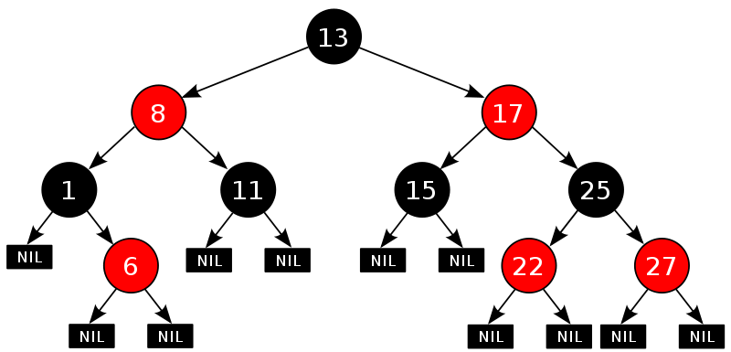

那性质5又是什么意思呢？我们再来看一个图：

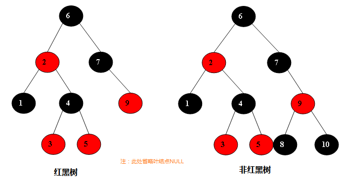

插入节点：

将一个节点插入到红黑树中，需要执行哪些步骤呢？首先，将红黑树当作一颗二叉查找树，将节点插入；然后，将节点着色为红色；最后，通过旋转和重新着色等方法来修正该树，使之重新成为一颗红黑树。详细描述如下：

**第一步: 将红黑树当作一颗二叉查找树，将节点插入。**
红黑树本身就是一颗二叉查找树，将节点插入后，该树仍然是一颗二叉查找树。也就意味着，树的键值仍然是有序的。此外，无论是左旋还是右旋，若旋转之前这棵树是二叉查找树，旋转之后它一定还是二叉查找树。这也就意味着，任何的旋转和重新着色操作，都不会改变它仍然是一颗二叉查找树的事实。
好吧？那接下来，我们就来想方设法的旋转以及重新着色，使这颗树重新成为红黑树！

**第二步：将插入的节点着色为"红色"。**

由于性质的约束：插入点不能为黑节点，应插入红节点。因为你插入黑节点将破坏性质5，所以每次插入的点都是红结点，但是若他的父节点也为红，那岂不是破坏了性质4？对啊，所以要做一些“旋转”和一些节点的变色。

**第三步: 通过一系列的旋转或着色等操作，使之重新成为一颗红黑树。**

 第二步中，将插入节点着色为"红色"之后，不会违背"特性(5)"。那它到底会违背哪些特性呢？ 

​       对于"特性(1)"，显然不会违背了。因为我们已经将它涂成红色了。 

​       对于"特性(2)"，显然也不会违背。在第一步中，我们是将红黑树当作二叉查找树，然后执行的插入操作。而根据二叉查找数的特点，插入操作不会改变根节点。所以，根节点仍然是黑色。 

​       对于"特性(3)"，显然不会违背了。这里的叶子节点是指的空叶子节点，插入非空节点并不会对它们造成影响。 

​       对于"特性(4)"，是有可能违背的！ 

​       那接下来，想办法使之"满足特性(4)"，就可以将树重新构造成红黑树了。

首先来看下伪代码描述：

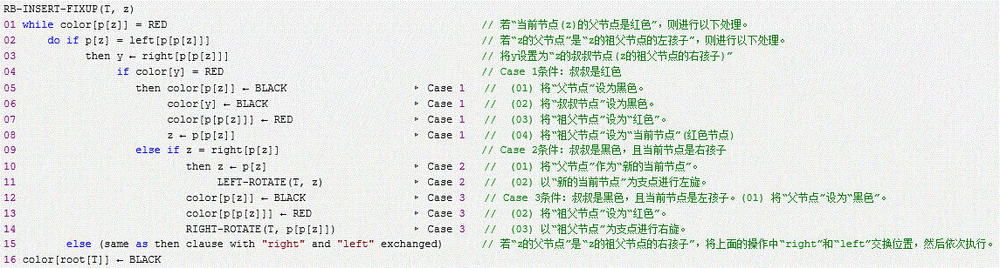

根据被插入节点的父节点的情况，可以将"当节点z被着色为红色节点，并插入二叉树"划分为三种情况来处理。

① 情况说明：被插入的节点是根节点。
    处理方法：直接把此节点涂为黑色。
② 情况说明：被插入的节点的父节点是黑色。
    处理方法：什么也不需要做。节点被插入后，仍然是红黑树。
③ 情况说明：被插入的节点的父节点是红色。
    处理方法：那么，该情况与红黑树的“特性(5)”相冲突。这种情况下，被插入节点是一定存在非空祖父节点的；进一步的讲，被插入节点也一定存在叔叔节点(即使叔叔节点为空，我们也视之为存在，空节点本身就是黑色节点)。理解这点之后，我们依据"叔叔节点的情况"，将这种情况进一步划分为3种情况(Case)。

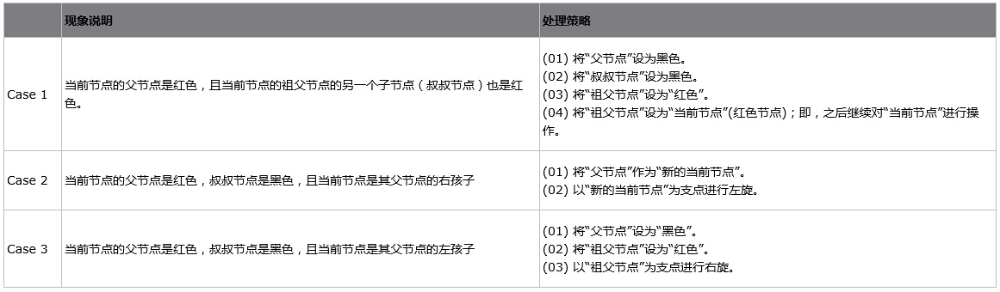
上面三种情况(Case)处理问题的核心思路都是：将红色的节点移到根节点；然后，将根节点设为黑色。下面对它们详细进行介绍。

**1. (Case 1)叔叔是红色**

****

插入的节点标为N（红色），父节点为P，祖父节点为G，叔节点为U，下同

N、P都为红，违反性质4；若把P改为黑，符合性质4，显然左边少了一个黑节点，违反性质5；所以我们把G，U都改为相反色，这样一来通过G的路径的黑节点数目没变，即符合4、5，但是G变红了，若G的父节点又是红的不就有违反了4，是这样，所以经过上边操作后未结束，需把G作为起始点，即把G看做一个插入的红节点继续向上检索----属于哪种情况，按那种情况操作~要么中间就结束，要么知道根结点（此时根结点变红，一根结点向上检索，那木有了，那就把他变为黑色吧）。

注意核心思路就是将红色的节点移到根节点。

**2. (Case 2)叔叔是黑色，且当前节点是右孩子**

case1中我们不考虑当前节点是左孩子还是右孩子，因为情况都相同。但是当叔叔节点为黑色时，则要考虑节点是左孩子还是右孩子。


case2很简单，通过旋转生成右边的图，而右边的情况就是case3。

总之case2就是通过一次旋转，然后进行case3的判断

**3. (Case 3)叔叔是黑色，且当前节点是左孩子**

****

操作：先旋转再变色

经过P、G变换（旋转），变换后P的位置就是当年G的位置，所以红P变为黑，而黑G变为红都是为了不违反性质5，而维持到达叶节点所包含的黑节点的数目不变！还可以理解为：也就是相当于（只是相当于，并不是实事，只是为了更好理解；）把红N头上的红节点移到对面黑

RB-tree数据结构

```cpp
template <class Key, class Value, class KeyOfValue, class Compare, class Alloc = alloc>
class rb_tree {
protected:
    typedef void* void_pointer;
    typedef __rb_tree_node_base* base_ptr;
    typedef __rb_tree_node<Value> rb_tree_node;
    typedef simple_alloc<rb_tree_node, Alloc> rb_tree_node_allocator;  // 专属配置器，配置单位为一个节点的空间
    typedef __rb_tree_color_type color_type;
public:
    typedef Key key_type;
    typedef Value value_type;
    typedef value_type* pointer;
    typedef const value_type* const_pointer;
    typedef value_type& reference;
    typedef const value_type& const_reference;
    typedef rb_tree_node* link_type;
    typedef size_t size_type;
    typedef ptrdiff_t difference_type;
protected:
    link_type get_node() { return rb_tree_node_allocator::allocate(); }
    void put_node(link_type p) { rb_tree_node_allocator::deallocate(p); }

    // 配置空间并且构造
    link_type create_node(const value_type& x) {
        link_type tmp = get_node();
        __STL_TRY{
            construct(&tmp->value_field, x);
        }
        __STL_UNWIND(put_node(tmp));
        return tmp;
    }

    // 复制节点的值和颜色
    link_type clone_node(link_type x) {
        link_type tmp = create_node(x->value_field);
        tmp->color = x->color;
        tmp->left = 0;
        tmp->right = 0;
        return tmp;
    }

    void destroy_node(link_type p) {
        destroy(&p->value_field);
        put_node(p);
    }
public:
    // 迭代器定义
    typedef __rb_tree_iterator<value_type, reference, pointer> iterator;
    typedef __rb_tree_iterator<value_type, const_reference, const_pointer> const_iterator;
private:
    iterator __insert(base_ptr x, base_ptr y, const value_type& v);
    link_type __copy(link_type x, link_type p);
    void __erase(link_type x);

    // 初始化时，生成一个头结点
    void init() {
        header = get_node();
        color(header) = __rb_tree_red;   // 头结点颜色为红色，区分于根节点
        root() = 0;
        leftmost() = header;
        rightmost() = header;
    }
...
}

```

RB-tree的元素操作

一、元素插入insert_equal
insert_equal允许插入键值一致的节点，返回值是指向新增节点的迭代器。

```cpp
template <class Key, class Value, class KeyOfValue, class Compare, class Alloc>
typename rb_tree<Key, Value, KeyOfValue, Compare, Alloc>::iterator
rb_tree<Key, Value, KeyOfValue, Compare, Alloc>::insert_equal(const Value& v)
{
    link_type y = header;
    link_type x = root();

    // 比较key值大小，小向左，大向右
    while (x != 0) {
        y = x;
        x = key_compare(KeyOfValue()(v), key(x)) ? left(x) : right(x);
    }
    // x为新值插入点，y为父节点，v是插入值
    return __insert(x, y, v);
}

```

二、元素插入insert_unique
insert_unique不允许插入键值重复的节点，返回值是pair值，包括是否插入成功以及插入成功后的新增节点迭代器。

```cpp
template <class Key, class Value, class KeyOfValue, class Compare, class Alloc>
pair<typename rb_tree<Key, Value, KeyOfValue, Compare, Alloc>::iterator, bool>
rb_tree<Key, Value, KeyOfValue, Compare, Alloc>::insert_unique(const Value& v)
{
    link_type y = header;
    link_type x = root();
    bool comp = true;
    // 比较key值大小，小向左，大向右
    while (x != 0) {
        y = x;
        comp = key_compare(KeyOfValue()(v), key(x));
        x = comp ? left(x) : right(x);
    }
    
    iterator j = iterator(y);   // 父节点迭代器
    if (comp)                     // comp为true，表示插入节点较小，插入左侧
        if (j == begin())       // 如果父节点是最左节点，x为新值插入点，y为父节点，v是插入值
            return pair<iterator,bool>(__insert(x, y, v), true);
        else  // 如果父节点不是最左节点，将迭代器向前移动
            --j;
            
     // 比较向前移动后的节点和插入节点的键值大小，新值较大则插入右侧
    if (key_compare(key(j.node), KeyOfValue()(v)))
        return pair<iterator,bool>(__insert(x, y, v), true);
        
    //  否则，不大不小就是重复，那么返回重复的节点并告知失败
    return pair<iterator,bool>(j, false);
}

```

三、插入操作__insert
以下为真正的执行插入节点操作

```cpp
template <class Key, class Value, class KeyOfValue, class Compare, class Alloc>
typename rb_tree<Key, Value, KeyOfValue, Compare, Alloc>::iterator
rb_tree<Key, Value, KeyOfValue, Compare, Alloc>::
__insert(base_ptr x_, base_ptr y_, const Value& v) {
    link_type x = (link_type) x_;
    link_type y = (link_type) y_;
    link_type z;
    
    // 当插入节点为头结点或插入键值小于父节点时
    // x!=0，插入点不为NULL为特殊情况在insert_unique的另一个版本中使用
    if (y == header || x != 0 || key_compare(KeyOfValue()(v), key(y))) {
        z = create_node(v);
        left(y) = z;        // 插入父节点的左侧，当父节点为header时等价于leftmost() = z; 
        if (y == header) {
            root() = z;
            rightmost() = z;
        }
        else if (y == leftmost())
            leftmost() = z;           // 父节点为最小值，直接插入左侧
    }
    else {  // 插入键值大于父节点的情况
        z = create_node(v);
        right(y) = z;
        if (y == rightmost())
            rightmost() = z;            // 父节点为最大值，直接插入右侧
    }

    // 为插入节点设置父节点等
    parent(z) = y;
    left(z) = 0;
    right(z) = 0;

	// 进行平衡(改变颜色，进行旋转)
    __rb_tree_rebalance(z, header->parent);
    ++node_count;
    return iterator(z);
}

```

三、调整树 __rb_tree_rebalance

```cpp
inline void
__rb_tree_rebalance(__rb_tree_node_base* x, __rb_tree_node_base*& root)
{
    // 因为规则：任意一个节点到到NULL（树尾端）的任何路径，所含之黑色节点数必须相同
    // 所以插入节点默认为红色，保证这条规则必然符合
    x->color = __rb_tree_red;  

    // 父节点颜色为红，且当前节点不为根节点(违反规则：如果节点为红色，其子节点必须为黑色)
    while (x != root && x->parent->color == __rb_tree_red) {
        if (x->parent == x->parent->parent->left) {
            // 父节点是祖父节点的左子节点
            __rb_tree_node_base* y = x->parent->parent->right;
            if (y && y->color == __rb_tree_red) {   
                // 伯父节点存在且为红色(伯父节点必然和父节点同色)
                // 因为规则：如果节点为红色，其子节点必须为黑色，插入点位红色不符合要求
                // 所以此时需要改变父节点和伯父节点的颜色为黑，祖父节点为红
                x->parent->color = __rb_tree_black;
                y->color = __rb_tree_black;
                x->parent->parent->color = __rb_tree_red;
                
                // 同时以祖父节点为调整起点继续调整
                // 如果祖父节点的父节点为黑色按照循环条件就调整结束
                // 否则继续调整
                x = x->parent->parent;
                // 注意：上文中介绍插入情况时，有伯父节点还需要进行一次旋转，实际代码中并没有
            }
            else {
                // 伯父节点不存在，需要进行旋转保持平衡
                if (x == x->parent->right) {
                   // 插入节点为右节点，内侧插入，需要先左旋再右旋
                   // 以父节点为旋转点进行左旋
                    x = x->parent;
                    __rb_tree_rotate_left(x, root);
                }
                
                // 使父节点颜色为黑，祖父节点颜色为红，这样旋转之后颜色和深度都能保证平衡
                x->parent->color = __rb_tree_black;
                x->parent->parent->color = __rb_tree_red;
                
               // 以祖父节点为旋转点进行右旋
                __rb_tree_rotate_right(x->parent->parent, root);
            }
        }
        else {
           // 父节点是祖父节点的右节点，和以上的情况对称
            __rb_tree_node_base* y = x->parent->parent->left;
            if (y && y->color == __rb_tree_red) {
                x->parent->color = __rb_tree_black;
                y->color = __rb_tree_black;
                x->parent->parent->color = __rb_tree_red;
                x = x->parent->parent;
            }
            else {
                if (x == x->parent->left) {
                    x = x->parent;
                    __rb_tree_rotate_right(x, root);
                }
                x->parent->color = __rb_tree_black;
                x->parent->parent->color = __rb_tree_red;
                __rb_tree_rotate_left(x->parent->parent, root);
            }
        }
    }

    // 按照规则根节点始终为黑
    root->color = __rb_tree_black;
}

// 左旋转
inline void
__rb_tree_rotate_left(__rb_tree_node_base* x, __rb_tree_node_base*& root)
{
    __rb_tree_node_base* y = x->right;  // 旋转点的右子节点
    // 1、将y的左子节点设置成x的右子节点
    x->right = y->left; 
    if (y->left != 0)
        y->left->parent = x;
    // 2、将y的父节点设置成x的父节点
    y->parent = x->parent;

    // 3、将y替换到x的位置
    if (x == root)
        root = y;
    else if (x == x->parent->left)
        x->parent->left = y;
    else
        x->parent->right = y;
  
    // 4、将x设置成y的左子节点
    y->left = x;
    x->parent = y;
}

// 右旋转
inline void
__rb_tree_rotate_right(__rb_tree_node_base* x, __rb_tree_node_base*& root)
{
    __rb_tree_node_base* y = x->left;  // 选装点的左子节点
    // 1、将y的右子节点设置成x的左子节点
    x->left = y->right;
    if (y->right != 0)
        y->right->parent = x;
    // 2、将y的父节点设置成x的父节点
    y->parent = x->parent;

    // 3、将y替换到x的位置
    if (x == root)
        root = y;
    else if (x == x->parent->right)
        x->parent->right = y;
    else
        x->parent->left = y;

    // 4、将x设置成y的右子节点
    y->right = x;
    x->parent = y;
}
```

**元素查找**

查找函数提供两个版本，其中一个返回const迭代器。

```cpp
template <class Key, class Value, class KeyOfValue, class Compare, class Alloc>
typename rb_tree<Key, Value, KeyOfValue, Compare, Alloc>::iterator
rb_tree<Key, Value, KeyOfValue, Compare, Alloc>::find(const Key& k) {
    link_type y = header; 
    link_type x = root(); 

    // 节点不为空
    while (x != 0)
        // 比较查找值和当前值的大小，大向右，小或等于向左
        // y用来保存x节点，最后返回结果，因为小于是向左移动，找到之后会一直向右直到叶子节点为空
        if (!key_compare(key(x), k))
            y = x, x = left(x);                    
        else
            x = right(x); 
            
    // 获取查找结果y的迭代器
    // 判断y是否为end()也就是header节点，此时返回end()
    // 判断k是否大于j的值，如果是说明没有找到，返回end()
    iterator j = iterator(y);
    return (j == end() || key_compare(k, key(j.node))) ? end() : j;
}

template <class Key, class Value, class KeyOfValue, class Compare, class Alloc>
typename rb_tree<Key, Value, KeyOfValue, Compare, Alloc>::const_iterator
rb_tree<Key, Value, KeyOfValue, Compare, Alloc>::find(const Key& k) const {
    link_type y = header; 
    link_type x = root();

    while (x != 0) {
        if (!key_compare(key(x), k))
            y = x, x = left(x);
        else
            x = right(x);
    }
    const_iterator j = const_iterator(y);
    return (j == end() || key_compare(k, key(j.node))) ? end() : j;
}

```

##### 6.set

```cpp
// 默认使用递增排序
template <class Key, class Compare = less<Key>, class Alloc = alloc>
class set {
public:    
    typedef Key key_type;
    typedef Key value_type;
    typedef Compare key_compare;
    typedef Compare value_compare;
private:
    // 底层为rb-tree
    typedef rb_tree<key_type, value_type,
    identity<value_type>, key_compare, Alloc> rep_type;
    rep_type t; 
public:
    // 指针、迭代器、引用都是const类型，限制了不能修改键值
    typedef typename rep_type::const_pointer pointer;
    typedef typename rep_type::const_pointer const_pointer;
    typedef typename rep_type::const_reference reference;
    typedef typename rep_type::const_reference const_reference;
    typedef typename rep_type::const_iterator iterator;
    typedef typename rep_type::const_iterator const_iterator;
    typedef typename rep_type::const_reverse_iterator reverse_iterator;
    typedef typename rep_type::const_reverse_iterator const_reverse_iterator;
    typedef typename rep_type::size_type size_type;
    typedef typename rep_type::difference_type difference_type;
    
    // 构造函数
    set() : t(Compare()) {}
    explicit set(const Compare& comp) : t(comp) {}
    
    // 区间赋值构造，使用insert_unique函数保证插入键值唯一
    template <class InputIterator>
    set(InputIterator first, InputIterator last)
    : t(Compare()) { t.insert_unique(first, last); }
    
    template <class InputIterator>
    set(InputIterator first, InputIterator last, const Compare& comp)
    : t(comp) { t.insert_unique(first, last); }
    
    // 拷贝/赋值构造
    set(const set<Key, Compare, Alloc>& x) : t(x.t) {}
    set<Key, Compare, Alloc>& operator=(const set<Key, Compare, Alloc>& x) {
        t = x.t;
        return *this;
    }
    
    // set操作，使用rb-tree接口
    key_compare key_comp() const { return t.key_comp(); }
    value_compare value_comp() const { return t.key_comp(); }
    iterator begin() const { return t.begin(); }
    iterator end() const { return t.end(); }
    reverse_iterator rbegin() const { return t.rbegin(); }
    reverse_iterator rend() const { return t.rend(); }
    bool empty() const { return t.empty(); }
    size_type size() const { return t.size(); }
    size_type max_size() const { return t.max_size(); }
    void swap(set<Key, Compare, Alloc>& x) { t.swap(x.t); }
    
    // 插入、删除
    typedef  pair<iterator, bool> pair_iterator_bool;
    pair<iterator,bool> insert(const value_type& x) {
        pair<typename rep_type::iterator, bool> p = t.insert_unique(x);
        return pair<iterator, bool>(p.first, p.second);
    }
    iterator insert(iterator position, const value_type& x) {
        typedef typename rep_type::iterator rep_iterator;
        return t.insert_unique((rep_iterator&)position, x);
    }

    template <class InputIterator>
    void insert(InputIterator first, InputIterator last) {
        t.insert_unique(first, last);
    }

    void erase(iterator position) {
        typedef typename rep_type::iterator rep_iterator;
        t.erase((rep_iterator&)position);
    }
    size_type erase(const key_type& x) {
        return t.erase(x);
    }
    void erase(iterator first, iterator last) {
        typedef typename rep_type::iterator rep_iterator;
        t.erase((rep_iterator&)first, (rep_iterator&)last);
    }
    void clear() { t.clear(); }
    
    iterator find(const key_type& x) const { return t.find(x); }
    size_type count(const key_type& x) const { return t.count(x); }
    iterator lower_bound(const key_type& x) const {
        return t.lower_bound(x);
    }
    iterator upper_bound(const key_type& x) const {
        return t.upper_bound(x);
    }
    pair<iterator,iterator> equal_range(const key_type& x) const {
        return t.equal_range(x);
    }
    friend bool operator== __STL_NULL_TMPL_ARGS (const set&, const set&);
    friend bool operator< __STL_NULL_TMPL_ARGS (const set&, const set&);
};

template <class Key, class Compare, class Alloc>
inline bool operator==(const set<Key, Compare, Alloc>& x,
                       const set<Key, Compare, Alloc>& y) {
    return x.t == y.t;
}

template <class Key, class Compare, class Alloc>
inline bool operator<(const set<Key, Compare, Alloc>& x,
                      const set<Key, Compare, Alloc>& y) {
    return x.t < y.t;
}
```

使用：

```cpp
#include <set>

int main(int argc, char* argv[])
{
    std::set<int> st = {0, 1, 3, 5};
    for (auto i : st){
        std::cout << i;
    }
    std::cout << std::endl;
    
    st.insert(4);
    for (auto i : st){
        std::cout << i;
    }
    std::cout << std::endl;

    st.insert(1);       // 已经存在插入无效
    for (auto i : st){
        std::cout << i;
    }
    std::cout << std::endl;
    
    auto result = st.find(1);
    if (result  != st.end())
    {
         st.erase(result);
    }
    for (auto i : st){
        std::cout << i;
    }
    std::cout << std::endl;
    
    return 0;
}

// 输出结果：
0135
01345
01345
0345
```

##### 7.map

map容器的特性是所有元素都会根据键值自动排序，并且所有元素都是pair，拥有键值和实值。pair的第一个元素为键值，第二个元素为实值。map当中不允许存在两个键值相同的元素。

pair的定义

pair定义了两个模板参数，并且访问权限为public。

```cpp
template <class T1, class T2>
struct pair {
  typedef T1 first_type;
  typedef T2 second_type;

  T1 first;
  T2 second;
  pair() : first(T1()), second(T2()) {}
  pair(const T1& a, const T2& b) : first(a), second(b) {}
};
```

map实现

和set一样，map底层也使用了rb-tree，同样map的迭代器不能改变键值，但是能够改变实值。所以，不同于set的迭代器是constant iterators，map的迭代器既不是constant iterators也不是mutable iterators。

```cpp
// 默认递增排序
template <class Key, class T, class Compare = less<Key>, class Alloc = alloc>
class map {
public: 
    typedef Key key_type;
    typedef T data_type;
    typedef T mapped_type;
    typedef pair<const Key, T> value_type;  // 元素类型为<key，value>
    typedef Compare key_compare;
    
    // 定义了一个仿函数（后续文章会对仿函数进行介绍），调用元素比较函数进行比较
    class value_compare
    : public binary_function<value_type, value_type, bool> {
        friend class map<Key, T, Compare, Alloc>;
    protected :
        Compare comp;
        value_compare(Compare c) : comp(c) {}
    public:
        bool operator()(const value_type& x, const value_type& y) const {
            return comp(x.first, y.first);
        }
    };
    
private:
    // 底层为rb-tree
    typedef rb_tree<key_type, value_type,
    select1st<value_type>, key_compare, Alloc> rep_type;
    rep_type t;
public:
    typedef typename rep_type::pointer pointer;
    typedef typename rep_type::const_pointer const_pointer;
    typedef typename rep_type::reference reference;
    typedef typename rep_type::const_reference const_reference;
    typedef typename rep_type::iterator iterator;
    typedef typename rep_type::const_iterator const_iterator;
    typedef typename rep_type::reverse_iterator reverse_iterator;
    typedef typename rep_type::const_reverse_iterator const_reverse_iterator;
    typedef typename rep_type::size_type size_type;
    typedef typename rep_type::difference_type difference_type;
    
    // 构造和析构函数  
    map() : t(Compare()) {}
    explicit map(const Compare& comp) : t(comp) {}
    
    // 区间赋值构造，使用insert_unique函数保证插入键值唯一
    template <class InputIterator>
    map(InputIterator first, InputIterator last)
    : t(Compare()) { t.insert_unique(first, last); }
    
    template <class InputIterator>
    map(InputIterator first, InputIterator last, const Compare& comp)
    : t(comp) { t.insert_unique(first, last); }

    // 复制、赋值构造函数
    map(const map<Key, T, Compare, Alloc>& x) : t(x.t) {}
    map<Key, T, Compare, Alloc>& operator=(const map<Key, T, Compare, Alloc>& x)
    {
        t = x.t;
        return *this;
    }
    
    // map操作
    key_compare key_comp() const { return t.key_comp(); }
    value_compare value_comp() const { return value_compare(t.key_comp()); }
    iterator begin() { return t.begin(); }
    const_iterator begin() const { return t.begin(); }
    iterator end() { return t.end(); }
    const_iterator end() const { return t.end(); }
    reverse_iterator rbegin() { return t.rbegin(); }
    const_reverse_iterator rbegin() const { return t.rbegin(); }
    reverse_iterator rend() { return t.rend(); }
    const_reverse_iterator rend() const { return t.rend(); }
    bool empty() const { return t.empty(); }
    size_type size() const { return t.size(); }
    size_type max_size() const { return t.max_size(); }
    T& operator[](const key_type& k) {
        return (*((insert(value_type(k, T()))).first)).second;
    }
    void swap(map<Key, T, Compare, Alloc>& x) { t.swap(x.t); }
    
    pair<iterator,bool> insert(const value_type& x) { return t.insert_unique(x); }
    iterator insert(iterator position, const value_type& x) {
        return t.insert_unique(position, x);
    }
    
    template <class InputIterator>
    void insert(InputIterator first, InputIterator last) {
        t.insert_unique(first, last);
    }
    
    void erase(iterator position) { t.erase(position); }
    size_type erase(const key_type& x) { return t.erase(x); }
    void erase(iterator first, iterator last) { t.erase(first, last); }
    void clear() { t.clear(); }
    
    iterator find(const key_type& x) { return t.find(x); }
    const_iterator find(const key_type& x) const { return t.find(x); }
    size_type count(const key_type& x) const { return t.count(x); }
    iterator lower_bound(const key_type& x) {return t.lower_bound(x); }
    const_iterator lower_bound(const key_type& x) const {
        return t.lower_bound(x);
    }
    iterator upper_bound(const key_type& x) {return t.upper_bound(x); }
    const_iterator upper_bound(const key_type& x) const {
        return t.upper_bound(x);
    }
    
    pair<iterator,iterator> equal_range(const key_type& x) {
        return t.equal_range(x);
    }
    pair<const_iterator,const_iterator> equal_range(const key_type& x) const {
        return t.equal_range(x);
    }
    friend bool operator== __STL_NULL_TMPL_ARGS (const map&, const map&);
    friend bool operator< __STL_NULL_TMPL_ARGS (const map&, const map&);
};

template <class Key, class T, class Compare, class Alloc>
inline bool operator==(const map<Key, T, Compare, Alloc>& x,
                       const map<Key, T, Compare, Alloc>& y) {
    return x.t == y.t;
}

template <class Key, class T, class Compare, class Alloc>
inline bool operator<(const map<Key, T, Compare, Alloc>& x,
                      const map<Key, T, Compare, Alloc>& y) {
    return x.t < y.t;
}

```

使用：

```cpp
#include <map>
#include <set>
int main()
{
    std::map<int, int> mp = { {1,1},{2,2},{3,3} };
    
    // 插入
    mp.insert(std::pair<int, int>(4, 4)); 
    mp[5] = 5;

    // 查找
    auto result = mp.find(4);
    if (result != mp.end())
    {
        std::cout << result->second << std::endl;
    }

    // 改变实值
    mp[1] = 10;

    return 0;
}
```

##### 8.multiset/multimap

multiset/multimap与set/map特性一致，区别在于multiset/multimap的键值能够重复。也就是说，他们使用了rb-tree的insert_equal而非insert_unique。

##### 9.hashtable

哈希表就是哈希表，没啥好介绍的

几种解决hash冲突的方法：

一、线性探测

取余

例如对64取余

二、二次探测

二次探测和线性探测的区别是，线性探测在发现计算位置被使用时是按照X+1、X+2…的方式进行尝试，而二次探测则是X+12、X+22…。二次探测能解决线性探测的主集团的问题，但是也有一定可能会导致次集团

三、开链

前面的两种方法都属于开放寻址法，因为都是在一个数组中存放数据，能够直接寻址。开链法的思路是将同一个hash值的元素都存放到一个list中，hash table中存放的是list的开始地址，每当元素计算的hash值重复时，就在list中加入一个元素。SGI STL采用的就是这种方法，此时SGI STL称hash table中的元素为bucket，意思是它们不是单纯的元素，而是存储了一堆的元素。

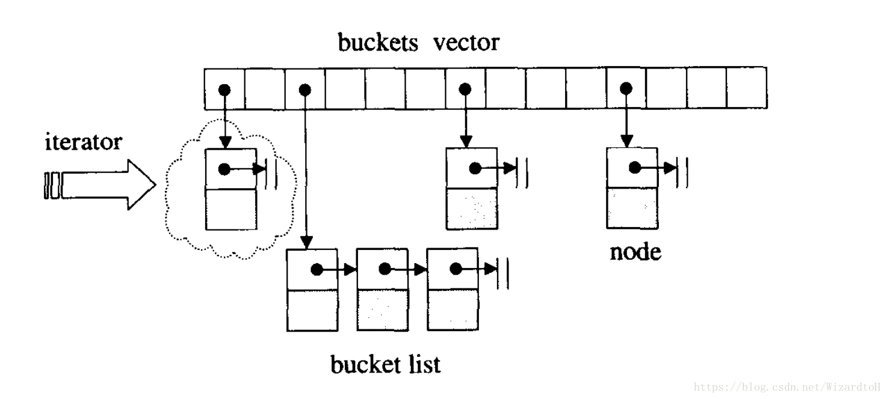

**hashtable的节点定义**

bucket中存放的节点定义如下：

```cpp
template <class Value>
struct __hashtable_node
{
    __hashtable_node* next;
    Value val;
};
```

而bucket存放在hashtable定义的vector中，以便于扩充hashtable的容量。

**hashtable的迭代器**

```cpp
template <class Value, class Key, class HashFcn,
class ExtractKey, class EqualKey, class Alloc>
struct __hashtable_iterator {
    typedef hashtable<Value, Key, HashFcn, ExtractKey, EqualKey, Alloc>
    hashtable;
    typedef __hashtable_iterator<Value, Key, HashFcn,
    ExtractKey, EqualKey, Alloc>
    iterator;
    typedef __hashtable_const_iterator<Value, Key, HashFcn,
    ExtractKey, EqualKey, Alloc>
    const_iterator;
    typedef __hashtable_node<Value> node;
    
    typedef forward_iterator_tag iterator_category;
    typedef Value value_type;
    typedef ptrdiff_t difference_type;
    typedef size_t size_type;
    typedef Value& reference;
    typedef Value* pointer;
    
    node* cur;             // 当前节点
    hashtable* ht;       // 指向真个hashtable，用于在bucket之间跳转
    
    __hashtable_iterator(node* n, hashtable* tab) : cur(n), ht(tab) {}
    __hashtable_iterator() {}
    reference operator*() const { return cur->val; }
    pointer operator->() const { return &(operator*()); }
    iterator& operator++();
    iterator operator++(int);
    bool operator==(const iterator& it) const { return cur == it.cur; }
    bool operator!=(const iterator& it) const { return cur != it.cur; }
};

// 前缀自增
template <class V, class K, class HF, class ExK, class EqK, class A>
__hashtable_iterator<V, K, HF, ExK, EqK, A>&
__hashtable_iterator<V, K, HF, ExK, EqK, A>::operator++()
{
    const node* old = cur;
    cur = cur->next;

    // bucket中的下一个节点为空，也就是说已经是尾部，需要跳转到下一个有节点的bucket，如果接下来的bucket都为空，那么就放回空
    if (!cur) {         
        size_type bucket = ht->bkt_num(old->val);
        while (!cur && ++bucket < ht->buckets.size())
            cur = ht->buckets[bucket];
    }
    
    return *this;
}

// 后缀自增
template <class V, class K, class HF, class ExK, class EqK, class A>
inline __hashtable_iterator<V, K, HF, ExK, EqK, A>
__hashtable_iterator<V, K, HF, ExK, EqK, A>::operator++(int)
{
    iterator tmp = *this;
    ++*this;
    return tmp;
}
```

可以看到hashtable中以vector作为bucket的容器，另外hashtable需要很多的模板参数：

Value，节点实值的型别。
Key，节点键值的型别。
HashFcn，散列函数的型别。
ExtractKey，从节点中取出键值的方法。
EqualKey，判断键值是否相等的方法。

Alloc，空间配置器。

**插入操作和表格重整**

插入操作首先需要判断是否需要重整（resize），之后再进行插入：

```cpp
pair<iterator, bool> insert_unique(const value_type& obj)
{
    resize(num_elements + 1);
    return insert_unique_noresize(obj);
}

template <class V, class K, class HF, class Ex, class Eq, class A>
void hashtable<V, K, HF, Ex, Eq, A>::resize(size_type num_elements_hint)
{
    const size_type old_n = buckets.size();
    
    // 用插入后元素的总数和buckets的大小进行比较，大于时需要resize
    // 可以推论：buckets大小应该和hashtable中存放元素的最大数量一致
    if (num_elements_hint > old_n) {
        // 获得下一个预定义的质数，如果已经最大就不进行resize
        const size_type n = next_size(num_elements_hint);  
        if (n > old_n) {
            vector<node*, A> tmp(n, (node*) 0);   // 重新分配一个vector
            __STL_TRY {
                for (size_type bucket = 0; bucket < old_n; ++bucket) {
                    node* first = buckets[bucket];   // 指向bucket的第一个节点
                    while (first) {
                        size_type new_bucket = bkt_num(first->val, n);  // 计算当前bucket中的节点在新的vector中的位置
                        buckets[bucket] = first->next;      // 记录下一节点
                        first->next = tmp[new_bucket];   // 将first的下一节点指向新bucket的第一个节点
                        tmp[new_bucket] = first;             // 将旧bucket的节点放到了新bucket的头部
                        first = buckets[bucket];               // first指向了下一节点，循环将旧bucket中的节点移到新的bucket
                    }
                }

				// 最后将旧vector用新的vector替换掉
                buckets.swap(tmp);
            }
        }
    }
}

// 插入不重复的值
template <class V, class K, class HF, class Ex, class Eq, class A>
pair<typename hashtable<V, K, HF, Ex, Eq, A>::iterator, bool>
hashtable<V, K, HF, Ex, Eq, A>::insert_unique_noresize(const value_type& obj)
{
    const size_type n = bkt_num(obj);    // 计算元素所属bucket的位置
    node* first = buckets[n];
    
    // bucket中有相等键值的元素，返回失败
    // 此处发现一个问题：先resize可能导致无效的扩容，因为有可能插入键值重复，实际上是不需要扩容的
    for (node* cur = first; cur; cur = cur->next)
        if (equals(get_key(cur->val), get_key(obj)))
            return pair<iterator, bool>(iterator(cur, this), false);
    
    // 分配新节点，并插入到bucket头部
    node* tmp = new_node(obj);
    tmp->next = first;
    buckets[n] = tmp;
    ++num_elements;
    return pair<iterator, bool>(iterator(tmp, this), true);
}
```

**hash functions**

在介绍计算元素所属位置函数时说到，对于char、int等整形，hash functions是能够直接得出散列值的，但是对于字符串类型需要进行转换。stl_hash_fun.h中提供了一个转换的方法：

```cpp

// stl_hash_fun.h
template <class Key> struct hash { };

// 字符串转换成size_t
inline size_t __stl_hash_string(const char* s)
{
    unsigned long h = 0;
    for ( ; *s; ++s)
        h = 5*h + *s;
    
    return size_t(h);
}

__STL_TEMPLATE_NULL struct hash<char*>
{
    size_t operator()(const char* s) const { return __stl_hash_string(s); }
};

__STL_TEMPLATE_NULL struct hash<const char*>
{
    size_t operator()(const char* s) const { return __stl_hash_string(s); }
};

__STL_TEMPLATE_NULL struct hash<char> {
    size_t operator()(char x) const { return x; }
};
__STL_TEMPLATE_NULL struct hash<unsigned char> {
    size_t operator()(unsigned char x) const { return x; }
};
__STL_TEMPLATE_NULL struct hash<signed char> {
    size_t operator()(unsigned char x) const { return x; }
};
__STL_TEMPLATE_NULL struct hash<short> {
    size_t operator()(short x) const { return x; }
};
__STL_TEMPLATE_NULL struct hash<unsigned short> {
    size_t operator()(unsigned short x) const { return x; }
};
__STL_TEMPLATE_NULL struct hash<int> {
    size_t operator()(int x) const { return x; }
};
__STL_TEMPLATE_NULL struct hash<unsigned int> {
    size_t operator()(unsigned int x) const { return x; }
};
__STL_TEMPLATE_NULL struct hash<long> {
    size_t operator()(long x) const { return x; }
};
__STL_TEMPLATE_NULL struct hash<unsigned long> {
    size_t operator()(unsigned long x) const { return x; }
};
```

##### 10.unordered_set和unordered_map

底层就是hash_table

hash_multiset/hash_multimap与hash_set/hash_map特性一致，区别在于multiset/multimap的键值能够重复。也就是说，他们使用了hashtable的insert_equal而非insert_unique。


