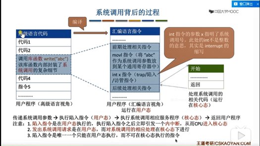
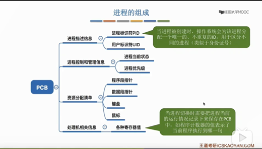
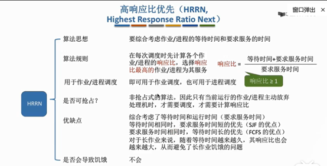
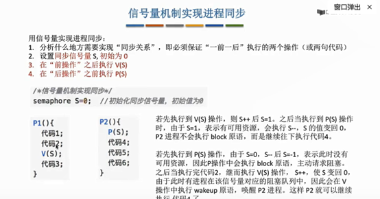
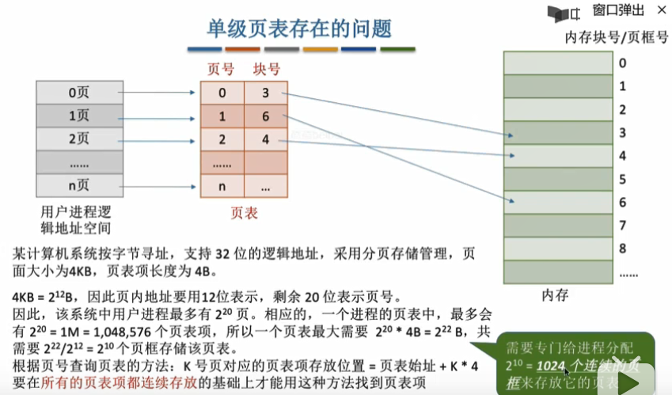

### 一、操作系统概述


##### 1.1操作系统的概念

操作系统（Operating System）：是指控制和管理整个计算机系统的硬件和软件资源，并合理地组织调度计算机的工作和资源的分配，以提供给用户和其他软件方便的接口和环境，它是计算机系统中最基本的系统软件。

##### 1.2操作系统的特征

1.并发：

并发是指两个或多个时间在同一时间间隔内发生。操作系统的并发性是指计算机系统中同时存在多个运行着的程序，因此它具有处理和调度多个程序同时执行的能力。虽然宏观上有多道程序在同时执行，但实际上单处理机环境下。同一时刻只能一道程序运行，故微观上这些程序还是在分时地交替执行。只是cpu的处理速度很快，我们感受就像在同时运行。

2.共享：

就是资源共享，是指系统中的资源可供内存中多个并发执行的进程共同使用。共享可以分为互斥共享和同时共享

(1).系统中的某些资源，如打印机，应该规定在一段时间内只允许一个进程访问该资源。因此当进程A访问某资源时，必须先提出请求，如果此时该资源空闲，系统将资源分配给A，仅当A访问完并释放该资源后，才允许另一进程对该资源进行访问。这种就是互斥共享，而把在一段时间内只允许一个进程访问的资源称为临界资源或独占资源。计算机系统中的大多数物理设备，以及某些软件中所用的栈、变量和表格，都属于临界资源。

(2).同时访问

3.虚拟：

虚拟技术把一个物理实体转换为多个逻辑实体。

主要有两种虚拟技术：时分复用技术和空分复用技术。

多个进程能在同一个处理器上并发执行使用了时分复用技术，让每个进程轮流占有处理器，每次只执行一小个时间片并快速切换。

虚拟内存使用了空分复用技术，它将物理内存抽象为地址空间，每个进程都有各自的地址空间。地址空间的页被映射到物理内存，地址空间的页并不需要全部在物理内存中，当使用到一个没有在物理内存的页时，执行页面置换算法，将该页置换到内存中。

4.异步：

异步指进程不是一次性执行完毕，而是走走停停，以不可知的速度向前推进。

##### 1.3操作系统的功能

进程管理：进程控制、进程同步、进程通信、死锁处理、处理机调度等。

内存管理：内存分配、地址映射、内存保护与共享、虚拟内存等。

文件管理：文件存储空间的管理、目录管理、文件读写管理和保护等。

设备管理：完成用户的 I/O 请求，方便用户使用各种设备，并提高设备的利用率。主要包括缓冲管理、设备分配、设备处理、虛拟设备等。

##### 1.4系统调用



##### 1.5内核


1.大内核：

大内核是将操作系统功能作为一个紧密结合的整体放到内核。

由于各模块共享信息，因此有很高的性能。

2.微内核：

由于操作系统不断复杂，因此将一部分操作系统功能移出内核，从而降低内核的复杂性。移出的部分根据分层的原则划分成若干服务，相互独立。

在微内核结构下，操作系统被划分成小的、定义良好的模块，只有微内核这一个模块运行在内核态，其余模块运行在用户态。

因为需要频繁地在用户态和核心态之间进行切换，所以会有一定的性能损失。

3.大多数内核主要包括以下四个方面的内容

(1).时钟管理

时钟的第一功能是计时。另外，通过时钟中断的管理，可以实现进程的切换。例如，在分时操作系统中，采用时间片轮转调度的实现，在实时系统中，按截止时间控制运行的实现，在批处理系统中，通过时钟管理来衡量一个作业的运行成都等。

(2).中断机制


中断就是：计算机处于执行期间，系统内发生了非寻常或非预期的急需处理事件，CPU暂时中断当前正在执行的程序而转去执行相应的事件处理程序，处理完毕后返回原来被中断处继续执行。

通俗来讲，比如说你在电脑上看视频，突然来了条qq消息，你暂停下来去回复qq消息，回复完了继续回来看视频。

中断是通过硬件实现的(例如设置一个寄存器保存状态)

中断，也称为外中断，外设请求或者人工干预，还有时钟中断

异常，也称为内中断，陷入指令，或者硬件故障，软件故障。

系统调用，进入核心态就是通过中断实现的。

(3).原语

操作系统的底层必然是一些可被调用的公用小程序，它们各自完成一个规定的操作。其特点是：

处于最底层，具有原子性（处于系统安全性和便于管理考虑），运行时间段且调用频繁。

方法是关闭中断，执行完再打开中断。

系统中的设备驱动、cpu切换、进程通信等功能的部分操作可能会被定义为原语

(4).系统控制的数据结构及处理


### 二、进程管理

#### 2.1进程与线程

##### 2.1.1进程定义


PCB是进程存在的唯一标志。进程是进程实体的运行过程，是系统进程资源分配和调度的一个独立单位。



##### 2.1.2进程的状态


##### 2.1.3进程控制


##### 2.1.4进程通信


##### 2.1.5线程概念

线程最直接的理解就是轻量级线程，是一个基本的CPU执行单元，由线程ID、程序计数器、寄存器集合和堆栈组成。线程是进程中的一个实体，是被系统独立调度和分派的基本单位，线程自己不拥有系统资源，只拥有一点在运行中必不可少的资源，但它可与同属一个进程的其他线程共享进程所拥有的的全部资源。一个线程可以创建和撤销另外一个线程。

引入线程之后，进程的内涵就发生了改变，进程只作为系统资源分配的基本单元，线程则作为处理机调度的基本单元。由于一个进程内部有多个线程，如果线程的切换发生在同一个进程内部，则只需要很少的时空开销。

##### 2.1.6线程属性

1）线程是一个轻型实体，不拥有系统资源，但每个线程都有一个唯一的额标识符和一个线程控制块，线程控制块记录了线程执行的寄存器和栈等现场状态

2）不同的线程可以执行相同的程序

3）同一个进程中的各个线程共享该进程所拥有的的资源

等等

##### 2.1.7线程的实现方式


##### 2.1.8多线程模型


##### 2.1.9一些问题


#### 2.2处理机调度

##### 2.2.1调度的概念

在多道程序系统中，进程的数量往往多余处理机的个数，进程争用处理机的情况在所难免，为了使所有运行的程序都得到及时处理，需要对程序进程调度。处理机调度是对处理机进行分配，就是从就绪队列中，按照一定的算法选择一个执行实体将处理机分配给他，以实现并发执行。

2.2.2调度的三个层次

1）高级调度，也称为作业调度


2)中级调度，也称为内存调度


3）低级调度，也称为进程调度

其主要任务是按照某种方法和策略从就绪队列中选取一个进程，将处理机分配给它。


##### 2.2.3进程调度的时机


##### 2.2.4进程调度的方式


##### 2.2.5调度的基本准则


##### 2.2.6典型调度算法





多级反馈队列集中了前几种的优势，其优势主要有以下几点

1.终端型作业用户：短作业优先  2.短批处理作业用户：周转时间优先  3.长批处理作业用户：经过前面几个队列得到部分执行，不会长期得不到处理

##### 2.2.7小结


#### 2.3进程同步

##### 2.3.1进程同步的概念

为什么要引入进程同步呢？解决了什么问题呢？例如，计算1+2*3，假设系统产生两个进程：一个是加法进程、一个是乘法进程。为了让计算结果是正确的，那么一定要让加法进程发送在乘法进程之后，但实际上操作系统具有异步性。

1.临界资源：

虽然多个进程可以共享系统中的各种资源，但是其中很多资源一次只能为一个进程所使用，我们把这种资源称为临界资源。对于临界资源的访问，必须互斥地进行。

临界资源的访问：

```
do {
    entry section;	//进入区
    critical section;	//临界区
    exit	section;	//退出区
    remainder	section;	//剩余区
} while(true) //检查可否进入临界区
```

2.同步：

同步是指为完成某种任务而建立的两个或多个进程，这些进程因为需要在某些位置上协调它们的工作次序而等待、传递信息所产生的制约关系。

例如：


3.互斥

当一个进程进入临界区使用临界资源时，另一个进程必须等待，当占用临界资源的进程退出临界区吼，另一进程才允许去访问此临界资源。


##### 2.3.2实现临界区互斥的方法

软件方法：


硬件方法：


##### 2.3.3信号量机制




信号量实现进程同步的机制就是，将信号量初始为0，后操作执行前需要执行p，前操作执行后执行v，这样在前操作执行之前，后操作是不满足执行条件的，前操作执行完后，后操作才能满足执行条件。


##### 2.3.4经典同步问题

1.生产者-消费者问题

问题描述：一组生产者进程和一组消费者进程共享一个初始为空、大小为n的缓冲区，只有缓冲区没满时，生产者才能把消息放入到缓冲区，否则必须等待；而只有缓冲区不为空时，消费者才能从中取出消息，否则必须等待。由于缓冲区是临界资源，它只允许一个生产者放入消息，或者一个消费者从中取出消息。

```
semaphore mutex = 1;	//临界区初始化为1
semaphore empty = n;	//空闲缓冲区初始化为n
semaphore full = 0;		//缓冲区初始化为空
producer(){
    while(1)
    {
        produce an item in nextp;
        P(empty);		//获取缓冲区单元
        p(mutex);		//进入临界区
        add nextp to buffer;
        V(mutex);		//离开临界区
        V(full);		//满缓冲区加1
    }
}
consumer(){
    while(1){
        P(full);		//获取满缓冲区单元
        p(mutex);
        take an item from buffer;
        V(mutex);
        V(empty);		//空缓冲区+1
        consum the item;
    }
}
```

等等

##### 2.3.5总结


#### 2.4死锁

##### 2.4.1死锁的概念

比如说，三角恋，A喜欢B，B喜欢C，C喜欢A。那么，A想得到B的心，但是B的心在C那，B想得到C的心在A那，C想得到A的心在B那，这就形成了死锁。

##### 2.4.2死锁产生的原因

1.系统资源的竞争

只有对不可剥夺资源的竞争才可能产生死锁，对可剥夺资源的竞争是不会引起死锁的。

2.进程推进顺序非法

进程在运行过程中，请求和释放资源的顺序不当，也同样会导致死锁。例如，并发进程P1、P2分别保持了资源R1，R2，而进程P1申请R2，进程P2申请R1，两者都会因为所需资源被占用而阻塞，进而形成死锁。

信号量使用不当也会造成死锁。进程间彼此相互等待对方发来的消息，结果也会使得这些进程间无法继续向前推进。

3.死锁产生的必要条件


##### 2.4.3死锁的处理策略

为使系统不思索，必须设法破坏四个必要条件之一，或者允许死锁产生，但当死锁发生时能检测出死锁，并有能力实现恢复。

1.预防死锁

2.避免死锁

3.死锁的检测及解除


##### 2.4.4死锁预防

死锁预防只需要破坏死锁的四个必要条件之一就可以了。

1.破坏互斥条件

2.破坏不剥夺条件

3.破坏请求和保持条件

4.破坏循环等待条件


##### 2.4.5死锁避免


安全序列！


##### 2.4.6死锁检测和解除


##### 2.4.7小结


### 三、内存管理

#### 3.1内存管理的概念

##### 3.1.1内存管理的概念

内存管理是操作系统中最重要和最复杂的内容之一。虽然计算机技术在飞速发展，但是仍然不可能将所有用户进程和系统所需要的全部程序和数据放入内存中，所以操作系统必须将内存空间进行合理地划分和有效地动态分配。操作系统对内存的划分和动态分配，就是内存管理。

1.内存管理的功能有：

1）.内存空间的分配与回收

由操作系统完成主存储器空间的分配和管理，使程序员摆脱存储分配的麻烦，提高开发效率

2）.地址转换

在多道程序环境下，程序中的逻辑地址与物理地址不可能一致，因此存储管理必须提供地址变换功能，将逻辑地址转换成相应的物理地址

3）.内存空间的扩充

利用虚拟存储技术或自动覆盖技术，从逻辑上扩充内存

4）.存储保护

保护各道作业在各自的存储空间进行，互不干扰

2.进程运行的基本原理和要求

1）.程序的装入和链接

创建进程首先需要将程序和数据装入内存，通常需要经过，编译、链接、装入三个阶段

2）.程序的链接方式：静态链接、装入时动态链接、运行时动态链接

3）.装入方式：绝对装入、可重定位装入、动态运行时装入

3.逻辑地址和物理地址


4.内存保护

方法一：设置上下线寄存器  方法二：重定位寄存器

##### 3.1.2覆盖和交换


##### 3.1.3连续分配管理

连续分配方式，是指为一个用户程序分配一个连续的内存空间。

1.单一连续分配


2.固定分区分配


内部碎片：

外部碎片：

外部碎片可以通过紧凑技术解决

动态分配算法：

1）.首次适应：空闲分区以地址递增的次序连接。分配时顺序查找，找到大小能满足要求的第一个空闲分区

2）.最佳适应：空闲分区按容量递增形成分区链，找到第一个能满足要求的空闲分区

3）.最坏适应：空闲分区以容量递减次序连接，找到第一个能满足要求的空闲分区

4）.邻近适应：由首次适应算法演变而成。不同之处是分配内存时从上次查找结束的位置开始继续查找。

##### 3.1.4非连续分配管理

非连续分配允许程序分散地装入到不相邻的内存分区中。在连续内存分配管理方式中我们发现，即使内存有超过1GB的空闲空间，但如果没有连续的1GB空间，仍然无法分配到这1GB空间。

非连续分配管理根据分区的大小是否固定分为分页存储管理和分段存储管理

1.基本分页存储管理

固定分区会产生内部碎片，动态分区会产生外部碎片，这两种技术对内存的利用率都比较低。分页的思想是：把主存空间划分为大小相等且固定的块，块相对较小，作为主存的基本单位。每个进程也以块为单位进行划分，进程在执行时，以块为单位逐个申请内存中的块空间。





2.基本分段存储管理


3.段页式管理方式


#### 3.2虚拟内存管理

##### 3.2.1虚拟内存的基本概念


##### 3.2.2请求分页管理方式


##### 3.2.3页面置换算法

1.最佳置换算法

最佳置换算法所选择是被淘汰页面将是以后永不使用的，或者是在最长事件内不再被访问的页面。但是由于人们无法预知进程在内存下的若干页面中哪个是未来最长事件内不再被访问的，因而该算法无法实现。

2.先进先出页面置换算法

有限淘汰最早进入内存的页面。

3.最近最久未使用(LRU)置换算法

选择最近最长世间未被访问过的页面予以淘汰，它认为过去一段时间内未被访问过的页面，在最近的将来也不会被访问。

4.时钟置换算法


5.改进型的时钟置换算法 


##### 3.2.4页面分配策略

....

### 四、文件系统

真的累了 不想搞了
