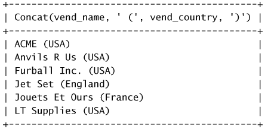
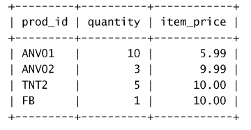
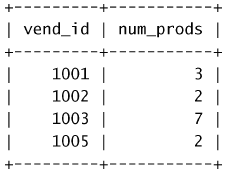
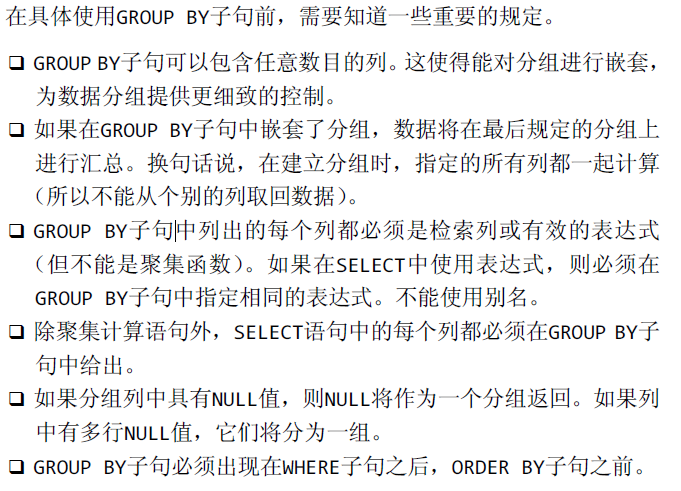
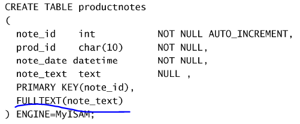

#### hhh

#### 1.MySQL 中 InnoDB 和 MyISAM 的联系与区别

 InnoDB 和 MyISAM 是 MySQL 的两个「存储引擎」。

数据库存储引擎 

> 数据库存储引擎是数据库底层软件组织，数据库管理系统（DBMS）使用数据引擎进行创建、查询、更新和删除数据。不同的存储引擎提供不同的存储机制、索引技巧、锁定水平等功能，使用不同的存储引擎，还可以获得特定的功能。

- InnoDB 支持事务，MyISAM 不支持，对于 InnoDB 每一条 SQL 语句都默认封装成事务进行提交，这样就会影响速度，优化速度的方式是将多条 SQL 语句放在 begin 和 commit 之间，组成一个事务；

- InnoDB 支持外键，而 MyISAM 不支持。

  存储引擎原理

  首先针对可能面试会问到的问题「MyISAM 和 InnoDB 两种引擎所使用的索引的数据结构是什么」做一个回答：

  都是 B+ 树，不过区别在于：

  - MyISAM 中 B+ 树的数据结构存储的内容是实际数据的地址值，它的索引和实际数据是分开的，只不过使用索引指向了实际数据。这种索引的模式被称为非聚集索引。
  - InnoDB 中 B+ 树的数据结构中存储的都是实际的数据，这种索引有被称为聚集索引。

#### 2.数据库事务四个特性

```
事务（Transaction）是由一系列对系统中数据进行访问与更新的操作所组成的一个程序执行逻辑单元。事务是DBMS中最基础的单位，事务不可分割。
事务具有4个基本特征，分别是：原子性（Atomicity）、一致性（Consistency）、隔离性（Isolation）、持久性（Duration），简称ACID。
1. 原子性（Atomicity）
原子性是指事务包含的所有操作要么全部成功，要么全部失败回滚，[删删删]因此事务的操作如果成功就必须要完全应用到数据库，如果操作失败则不能对数据库有任何影响。
2. 一致性（Consistency）
一致性是指事务必须使数据库从一个一致性状态变换到另一个一致性状态，也就是说一个事务执行之前和执行之后都必须处于一致性状态。
拿转账来说，假设用户A和用户B两者的钱加起来一共是5000，那么不管A和B之间如何转账，转几次账，事务结束后两个用户的钱相加起来应该还得是5000，这就是事务的一致性。
3. 隔离性（Isolation）
隔离性是当多个用户并发访问数据库时，比如操作同一张表时，数据库为每一个用户开启的事务，不能被其他事务的操作所干扰，多个并发事务之间要相互隔离。
即要达到这么一种效果：对于任意两个并发的事务T1和T2，在事务T1看来，T2要么在T1开始之前就已经结束，要么在T1结束之后才开始，这样每个事务都感觉不到有其他事务在并发地执行。
多个事务并发访问时，事务之间是隔离的，一个事务不应该影响其它事务运行效果。
这指的是在并发环境中，当不同的事务同时操纵相同的数据时，每个事务都有各自的完整数据空间。由并发事务所做的修改必须与任何其他并发事务所做的修改隔离。
不同的隔离级别：
Read Uncommitted（读取未提交[添加中文释义]内容）：最低的隔离级别，什么都不需要做，一个事务可以读到另一个事务未提交的结果。所有的并发事务问题都会发生。
Read Committed（读取提交内容）：只有在事务提交后，其更新结果才会被其他事务看见。可以解决脏读问题。
Repeated Read（可重复读）：在一个事务中，对于同一份数据的读取结果总是相同的，无论是否有其他事务对这份数据进行操作，以及这个事务是否提交。可以解决脏读、不可重复读。
Serialization（可串行化）：事务串行化执行，隔离级别最高，牺牲了系统的并发性。可以解决并发事务的所有问题。
4. 持久性（Durability）
持久性是指一个事务一旦被提交了，那么对数据库中的数据的改变就是永久性的，即便是在数据库系统遇到故障的情况下也不会丢失提交事务的操作。
例如我们在使用JDBC操作数据库时，在提交事务方法后，提示用户事务操作完成，当我们程序执行完成直到看到提示后，就可以认定事务以及正确提交，即使这时候数据库出现了问题，也必须要将我们的事务完全执行完成，否则就会造成我们看到提示事务处理完毕，但是数据库因为故障而没有执行事务的重大错误。
```

#### 3.数据库的三大范式

```
第一范式：当关系模式R的所有属性都不能再分解为更基本的数据单位时，称R是满足第一范式，即属性不可分
第二范式：如果关系模式R满足第一范式，并且R得所有非主属性都完全依赖于R的每一个候选关键属性，称R满足第二范式
第三范式：设R是一个满足第一范式条件的关系模式，X是R的任意属性集，如果X非传递依赖于R的任意一个候选关键字，称R满足第三范式，即非主属性不传递依赖于键码
```

#### 4.mysql的四种隔离状态

Mysql主要包含四种隔离状态：

| 事务隔离级别                 | 脏读 | 不可重复读 | 幻读 |
| ---------------------------- | ---- | ---------- | ---- |
| 读未提交（read-uncommitted） | 是   | 是         | 是   |
| 不可重复读（read-committed） | 否   | 是         | 是   |
| 可重复读（repeatable-read）  | 否   | 否         | 是   |
| 串行化（serializable）       | 否   | 否         | 否   |

#### 5.mysql的MVCC机制

MVCC是一种多版本并发控制机制，是MySQL的InnoDB存储引擎实现隔离级别的一种具体方式，用于实现提交读和可重复读这两种隔离级别。MVCC是通过保存数据在某个时间点的快照来实现该机制，其在每行记录后面保存两个隐藏的列，分别保存这个行的创建版本号和删除版本号，然后Innodb的MVCC使用到的快照存储在Undo日志中，该日志通过回滚指针把一个数据行所有快照连接起来。

#### 6.请你说说索引是什么，多加索引一定会好吗

```
1、索引
数据库索引是为了增加查询速度而对表字段附加的一种标识，是对数据库表中一列或多列的值进行排序的一种结构。
DB在执行一条Sql语句的时候，默认的方式是根据搜索条件进行全表扫描，遇到匹配条件的就加入搜索结果集合。如果我们对某一字段增加索引，查询时就会先去索引列表中一次定位到特定值的行数，大大减少遍历匹配的行数，所以能明显增加查询的速度。
优点：
通过创建唯一性索引，可以保证数据库表中每一行数据的唯一性。
可以大大加快数据的检索速度，这也是创建索引的最主要的原因。
可以加速表和表之间的连接，特别是在实现数据的参考完整性方面特别有意义。
在使用分组和排序子句进行数据检索时，同样可以显著减少查询中分组和排序的时间。
通过使用索引，可以在查询的过程中，使用优化隐藏器，提高系统的性能。
缺点：
创建索引和维护索引要耗费时间，这种时间随着数据量的增加而增加。
索引需要占物理空间，除了数据表占数据空间之外，每一个索引还要占一定的物理空间，如果要建立聚簇索引，那么需要的空间就会更大。
当对表中的数据进行增加、删除和修改的时候，索引也要动态的维护，这样就降低了数据的维护速度。
2、添加索引原则
在查询中很少使用或者参考的列不应该创建索引。这是因为，既然这些列很少使用到，因此有索引或者无索引，并不能提高查询速度。相反，由于增加了索引，反而降低了系统的维护速度和增大了空间需求。
只有很少数据值的列也不应该增加索引。这是因为，由于这些列的取值很少，例如人事表的性别列，在查询的结果中，结果集的数据行占了表中数据行的很大比例，即需要在表中搜索的数据行的比例很大。增加索引，并不能明显加快检索速度。
定义为text、image和bit数据类型的列不应该增加索引。这是因为，这些列的数据量要么相当大，要么取值很少。
当修改性能远远大于检索性能时，不应该创建索引。这是因为，修改性能和检索性能是互相矛盾的。当增加索引时，会提高检索性能，但是会降低修改性能。当减少索引时，会提高修改性能，降低检索性能。因此，当修改性能远远大于检索性能时，不应该创建索引。
```


#### 01 MySQL简介

数据库(database)：保存有组织的数据的容器

数据库系统软件

表：某种特点类型数据的结构化清单

列：表中的一个字段。所有表都是由一个或多个列组成的

行：

主键：一列，其值能够唯一区分表中的每个行

主键的几个好习惯：不更新主键列中的值；不重用主键列的值；不在主键列中使用可能会更改的值。

SQL(结构化查询语言)

#### 02 使用MySQL

选择使用数据库

```sql
USE mydb;
```

显示所有可用数据库的列表

```sql
SHOW DATABASES;
```

返回当前选择的数据库内可用表的列表

```sql
SHOW TABLES;
```

```sql
SHOW COLUMNS FROM customs;
```

#### 03 检索数据

##### SELECT语句

从products表中检索出一个名为prod_name的列

```sql
SELECT prod_name FROM products;
```

检索多行

```sql
SELECT prod_name, prod_name, prod_price FROM products;
```

```sql
SELECT * FROM products;
```

检索不同的行，意思就是说不允许重复的

```sql
SELECT DISTINCT vend_id FROM products;
```

限制结果

```sql
SELECT prod_name FROM products LIMIT 5; #限制返回不多于5行
SELECT prod_name FROM products LIMIT 5,5; #返回从行5开始的5行
```

使用完全限定的表名

```sql
SELECT products.prod_name FROM mydb.products;
```

#### 04 排序检索数据

##### ORDER

```sql
SELECT prod_name FROM products ORDER BY prod_name;	#以prod_name排序返回
SELECT prod_name, prod_id FROM products ORDER BY prod_price, prod_name; #多行排序检索
SELECT prod_name, prod_id FROM products ORDER BY prod_price DESC; #降序
SELECT prod_name, prod_id FROM products ORDER BY prod_price DESC, prod_name; #prod_price降序,prod_name升序
```

#### 05 过滤数据

##### WHERE BETWEEN AND

```sql
SELECT prod_name, prod_price FROM products WHERE prod_price = 2.50;
SELECT prod_name, prod_price FROM products WHERE prod_price < 2.50;
SELECT prod_name, prod_price FROM products WHERE prod_price <= 2.50;
```

不匹配检查

```sql
SELECT prod_name, prod_price FROM products WHERE prod_price <> 2.50;	#不等于2.50的
SELECT prod_name, prod_price FROM products WHERE prod_price != 2.50;	#不等于2.50的
```

范围检查

```sql
SELECT prod_name, prod_price FROM products WHERE prod_price BETWEEN 3 AND 10;
```

空值检查

```sql
SELECT prod_name, prod_price FROM products WHERE prod_price IS NULL;
```

#### 06 数据过滤

##### AND OR IN NOT

```sql
SELECT prod_name, prod_price FROM products WHERE prod_price IS NULL AND vend_id = 1003;
SELECT prod_name, prod_price FROM products WHERE vend_id = 1002 OR vend_id = 1003;
SELECT prod_name, prod_price FROM products WHERE vend_id = 1002 OR vend_id = 1003 AND prod_price <= 10;
#上面这句语句的结合顺序是先AND后OR
SELECT prod_name, prod_price FROM products WHERE （vend_id = 1002 OR vend_id = 1003） AND prod_price <= 10;
#上面加了括号
SELECT prod_name, prod_price FROM products WHERE vend_id IN (1002, 1003) ORDER BY prod_name;
SELECT prod_name, prod_price FROM products WHERE vend_id NOT IN (1002, 1003) ORDER BY prod_name;
```

#### 07 使用通配符进行过滤

##### LIKE

百分号%通配符

```sql
SELECT prod_name, prod_price FROM products WHERE prod_name LIKE 'jet%'; #%表示任何字符出现的任意次数  这里表示jet开头的任意字符
SELECT prod_name, prod_price FROM products WHERE prod_name LIKE '%jet%';	#表示任何位置包含jet的值，而不论它之前或之后出现什么字符
SELECT prod_name, prod_price FROM products WHERE prod_name LIKE 's%e';	#找出s开头e结尾
```

下划线_通配符

_与%作用一样  但是只能匹配单个字符

```sql
SELECT prod_name, prod_price FROM products WHERE prod_name LIKE '_ ton anvil'; 
#在这里比如有'.5 ton anvil' '1 ton anvil' '2 ton anvil' 那么其中'.5  ton anvil'不会被匹配，因为.5是两个
```

#### 08 用正则表达式进行搜索

```sql
SELECT prod_name FROM products WHERE prod_name REGEXP '1000' ORDER BY prod_name;	#匹配'1000'
SELECT prod_name FROM products WHERE prod_name REGEXP '.000' ORDER BY prod_name;	#匹配任意一个字符
SELECT prod_name FROM products WHERE prod_name REGEXP '1000|2000' ORDER BY prod_name;	#相当于OR
SELECT prod_name FROM products WHERE prod_name REGEXP '[123] ton' ORDER BY prod_name;	#[123]定义了一组字符，它的意思是匹配1或2或3 
SELECT prod_name FROM products WHERE prod_name REGEXP '[1-5] ton' ORDER BY prod_name;	#范围
SELECT prod_name FROM products WHERE prod_name REGEXP '.' ORDER BY prod_name;	#检索任意字符
SELECT prod_name FROM products WHERE prod_name REGEXP '\\.' ORDER BY prod_name;	#匹配‘.’
```

匹配字符类

```
[:alnum:] 	任意字母和数字（同[a-zA-Z0-9]）
[:alpha:] 	任意字符（同[a-zA-Z]）
[:blank:] 	空格和制表（同[\\t]）
[:cntrl:] 	ASCII控制字符（ASCII 0到31和127）
[:digit:] 	任意数字（同[0-9]）
[:graph:] 	与[:print:]相同，但不包括空格
[:lower:] 	任意小写字母（同[a-z]）
[:print:] 	任意可打印字符
[:punct:] 	既不在[:alnum:]又不在[:cntrl:]中的任意字符
[:space:] 	包括空格在内的任意空白字符（同[\\f\\n\\r\\t\\v]）
[:upper:] 	任意大写字母（同[A-Z]）
[:xdigit:] 	任意十六进制数字（同[a-fA-F0-9]）
```

重复元字符

```
*	 	0个或多个匹配
+	 	1个或多个匹配（等于{1,}）
?	 	0个或1个匹配（等于{0,1}）
{n}	 	指定数目的匹配
{n,}	不少于指定数目的匹配
{n,m}	匹配数目的范围（m不超过255）
```

```sql
SELECT prod_name FROM products WHERE prod_name REGEXP '\\([0-9] sticks?\\)' ORDER BY prod_name;	#\\(匹配) sticks? 是的s可选
SELECT prod_name FROM products WHERE prod_name REGEXP '[[:digit:]]{4}' ORDER BY prod_name;	#[digit]匹配任意数字 {4}要求它前面的字符出现4次，所以这句语句是在匹配连在一起的任意4位数字
```

定位符

```
^ 		文本的开始
$ 		文本的结尾
[[:<:]] 词的开始
[[:>:]] 词的结尾
```

```
SELECT prod_name FROM products WHERE prod_name REGEXP '^[0-9\\.]' ORDER BY prod_name;	#文本开始的[0-9\\.]0-9和.
```

#### 09 创建计算字段

##### 字段：

基本上与列的意思相同，经常互换使用，不过数据库列一般称为列，而术语字段通常在计算字段的连接上

##### 拼接字段:

vendors表包含供应商名和位置信息。假如要生成一个供应商报表，需要在供应商的名字中按照name(location)这样的格式列出供应商的位置。此报表需要单个值，而表中数据存储在两个列vend_name和vend_country中。此外，需要用括号将vend_country括起来，这些东西都没有明确存储在数据库表中。

```sql
SELECT Concat(vend_name, '(', vend_country, ')') FROM vendors ORDER BY vend_name;	#感觉跟matlab拼字符串的方式差不多
```



```sql
SELECT Concat(RTrim(vend_name), '(', RTrim(vend_country), ')') FROM vendors;	#RTrim()函数去掉值右边的所有空格
```

##### 使用别名：

从前面的输出可以看到，SELECT语句拼接字段做的很好，然后它还没有名字

```sql
SELECT Concat(RTrim(vend_name), '(', RTrim(vend_country), ')') AS vend_title FROM vendors;
```

##### 执行算术计算

对检索出来的数据进行算术计算

```sql
SELECT prod_id, quantity, item_price FROM orderitems WHERE order_num = 20005;
```



现在将item_price汇总

```sql
SELECT prod_id, quantity, item_price, quantity*item_price AS expanded_price FROM orderitems WHERE order_num = 20005;
```

#### 10 使用数据处理函数

##### 文本处理函数

```sql
SELECT vend_name, Upper(vend_name) AS vend_name_upcase FROM vendors DRDER BY vend_name;
```

```
Left() 		返回串左边的字符
Length() 	返回串的长度
Locate() 	找出串的一个子串
Lower() 	将串转换为小写
LTrim() 	去掉串左边的空格
Right() 	返回串右边的字符
RTrim() 	去掉串右边的空格
Soundex() 	返回串的SOUNDEX值
SubString() 返回子串的字符
Upper() 	将串转换为大写
```

##### 日期和时间处理函数

```
AddDate() 		增加一个日期（天、周等）
AddTime() 		增加一个时间（时、分等）
CurDate() 		返回当前日期
CurTime() 		返回当前时间
Date() 			返回日期时间的日期部分
DateDiff() 		计算两个日期之差
Date_Add() 		高度灵活的日期运算函数
Date_Format() 	返回一个格式化的日期或时间串
Day() 			返回一个日期的天数部分
DayOfWeek() 	对于一个日期，返回对应的星期几
Hour() 			返回一个时间的小时部分
Minute() 		返回一个时间的分钟部分
Month() 		返回一个日期的月份部分
Now() 			返回当前日期和时间
Second() 		返回一个时间的秒部分
Time() 			返回一个日期时间的时间部分
Year() 			返回一个日期的年份部分
```

##### 数值处理函数

```
Abs() 	返回一个数的绝对值
Cos() 	返回一个角度的余弦
Exp() 	返回一个数的指数值
Mod() 	返回除操作的余数
Pi() 	返回圆周率
Rand() 	返回一个随机数
Sin() 	返回一个角度的正弦
Sqrt() 	返回一个数的平方根
Tan() 	返回一个角度的正切
```

#### 11 汇总数据

我们经常需要汇总数据而不用把它们实际检索出来

1.确定表中行数（或者满足条件的行数）

2.获得表中行组的和

3.找出表列的最大值、最小值和平均值

上述例子都需要对表中数据汇总。因此返回实际表数据是对时间和处理资源的一种浪费。

```
AVG() 	返回某列的平均值
COUNT() 返回某列的行数
MAX() 	返回某列的最大值
MIN() 	返回某列的最小值
SUM() 	返回某列值之和
```

```sql
SELECT AVG(prod_price) AS avg_price FROM products;
SELECT COUNT(*) AS num_cust FROM customers; #顾客总数
SELECT COUNT(cust_email) AS num_cust_mail FROM customers; #具有电子邮地址的客户计数
SELECT MAX(prod_price) AS max_price FROM products;
#etc..
```

聚集不同值DISTINCT

```sql
SELECT AVG(DISTINCT prod_price) AS avg_price FROM products;
#这样就能得到全品类品类角度的一个平均价格
```

#### 12 分组数据

##### 创建分组 GROUP BY

```sql
SELECT vend_id, COUNT(*) AS num_prods FROM products GROUP BY vend_id;	#按vend_id排序并分组
```






##### 过滤分组

```sql
SELECT cust_id, COUNT(*) AS orders FROM orders GROUP BY cust_id HAVING COUNT(*) >= 2; #
SELECT cust_id, COUNT(*) AS orders FROM orders WHERE prod_price >= 10 GROUP BY cust_id HAVING COUNT(*) >= 2; #
```

##### 分组和排序

```sql
SELECT order_num, SUM(quantity*item_price) AS ordertotal FROM orderitems GROUP BY order_num HAVING SUM(quantity*item_price) >= 50 ORDER BY ordertotal;
```

#### 13 使用子查询

```sql
SELECT cust_id FROM orders WHERE order_num IN (SELECT order_num FROM orderitems WHERE prod_id = 'TNT2');
```

#### 14 联结表

外键:外键为某个表中的一行，它包含另一个表的主键值，定义了两个表之间的关系

创建联结：

```sql
SELECT vend_name, prod_name, prod_price FROM vendors, products WHERE vendors.vend_id = products.vend_id ORDER BY vend_name, prod_name;	
SELECT vend_name, prod_name, prod_price FROM vendors, products WHERE vendors INNER JOIN products ON vendors.vend_id = products.vend_id;	
```

#### 15 高级联结

如果面试被问到了再回来看...

#### 16 组合查询

将多个SELECT查询结果并返回

```sql
SELECT vend_id, prod_id, prod_price FROM products WHERE prod_price <= 5 UNION SELECT vend_id, prod_id, prod_price FROM products WHERE vend_id IN (1001,1002);
SELECT vend_id, prod_id, prod_price FROM products WHERE prod_price <= 5 UNION ALL SELECT vend_id, prod_id, prod_price FROM products WHERE vend_id IN (1001,1002); #重复的行不会被删除
#关于排序：略
```

#### 17 全文本搜索

启用全文本搜索支持：

CREATE时



进行全文本搜索：

```sql
SELECT note_text FROM productnotes WHERE Match(note_text) Against('rabbit');	#Match指定列进行搜索  Against指定搜索文本
```

布尔文本搜索：

```
+ 	包含，词必须存在
- 	排除，词必须不出现
> 	包含，而且增加等级值
< 	包含，且减少等级值
() 	把词组成子表达式（允许这些子表达式作为一个组被包含、排除、排列等）
~ 	取消一个词的排序值
* 	词尾的通配符
"" 	定义一个短语（与单个词的列表不一样，它匹配整个短语以便包含或排除这个短语）
```

#### 18 插入数据

终于不是查询了。。。

INSERT是用来插入行到数据库表中的。可以有：

插入完整的行；插入行的一部分；插入多行；插入某些查询的结果；

插入完整的行：

```sql
INSERT INTO Customers VALUES(NULL, ''.....);
#下面是一个更安全的做法
INSERT INTO Customers(cust_name, cust_address,....) VALUES('TOM', 'USA'...);
#插入多个行：略
```

插入检索出的数据：

```sql
INSERT INTO customers(cust_id, cust_contact,....) SELECT cust_id, cust_contact,... FROM custnew;
```

#### 19 更新和删除数据

##### 更新数据

更新特定行

更新所有行

```sql
UPDATE customers SET cust_email = 'elmer@fudd.com' WHERE cust_id = 10005;
UPDATE customers SET cust_name = 'The Fudds', cust_email = 'elmer@fudd.com' WHERE cust_id = 10005;
#IGNORE关键字 如果用UPDATE语句更新多行，并且在更新这些行中的一行或多行时出一个现错误，则整个UPDATE操作被取消（错误发生前更新的所有行被恢复到它们原来的值）。为即使是发
生错误，也继续进行更新，可使用IGNORE关键字，如下所示：UPDATE IGNORE customers…
#为了删除某个列的值，可将其设置为NULL
UPDATE customers SET cust_email = NULL WHERE cust_id = 10005;
```

##### 删除数据

删除特点行

删除所有行

```sql
DELETE FROM customers WHEREcust_id = 10006;
```

使用UPDATE或DELETE时所需要遵循的习惯：

```
除非确实打算更新和删除每一行，否则绝对不要使用不带WHERE子句的UPDATE或DELETE语句。
保证每个表都有主键（如果忘记这个内容，请参阅第15章），尽可能像WHERE子句那样使用它（可以指定各主键、多个值或值的范围）。
在对UPDATE或DELETE语句使用WHERE子句前，应该先用SELECT进行测试，保证它过滤的是正确的记录，以防编写的WHERE子句不正确。
使用强制实施引用完整性的数据库
```

#### 20 创建和操纵表

```sql
CREATE TABLE customers 
(
    cust_id 		int 		NOT NULL AUTO_INCREMENT,
    cust_name 		char(50)	NOT NULL,
    cust_address	char(50)	NULL,
    cust_city		char(50)	NULL,
    ...
    PRIMARY KEY	(cust_id)
) ENGINE = InnoDB;
#NULL值就是没有值或缺值，允许NULL值得列也允许在插入行的时候不给出该列的值。不允许NULL值得列不接受该列没有值的行
#主键必须唯一，如果主键使用单个列，则它的值必须唯一。如果使用多个列，则这些列的组合之必须唯一
#AUTO_INCREMENT 
#指定默认值 DEFAULT
#引擎类型 
#InnoDB是一个可靠的事务处理引擎,它不支持全文本搜索；
#MEMORY在功能等同于MyISAM，但由于数据存储在内存（不是磁盘）中，速度很快（特别适合于临时表）；
#MyISAM是一个性能极高的引擎，它支持全文本搜索，但不支持事务处理。
```

##### 更新表

```sql
ALTER TABLE vendors ADD vend_phone CHAR(20);
ALTER TABLE vendors DROP COLUMN vend_phone;
#....
```

删除表，重命名表

#### 21 视图

视图是虚拟的表。与包含数据的表不一样，视图只包含使用时动态检索数据的查询。

略

#### 22 使用存储过程

存储过程简单来说，就是为以后的使用而保存的一条或多条MySQL语句的集合。可将其视为批文件，虽然它们的作用不仅限于批处理。

使用存储过程的理由：

```
	通过把处理封装在容易使用的单元中，简化复杂的操作（正如前面例子所述）。
	由于不要求反复建立一系列处理步骤，这保证了数据的完整性。如果所有开发人员和应用程序都使用同一（试验和测试）存储过程，则所使用的代码都是相同的。这一点的延伸就是防止错误。需要执行的步骤越多，出错的可能性就越大。防止错误保证了数据的一致性。
	简化对变动的管理。如果表名、列名或业务逻辑（或别的内容）有变化，只需要更改存储过程的代码。使用它的人员甚至不需要知道这些变化。
```

略

#### 23 使用游标

几个步骤：

```
在能够使用游标前，必须声明（定义）它。这个过程实际上没有检索数据，它只是定义要使用的SELECT语句。
一旦声明后，必须打开游标以供使用。这个过程用前面定义的SELECT语句把数据实际检索出来。
对于填有数据的游标，根据需要取出（检索）各行。
在结束游标使用时，必须关闭游标。
```

略：

#### 24 使用触发器

MySQL语句在需要时被执行，存储过程也是如此。但是，如果你想要某条语句（或某些语句）在事件发生时自动执行，怎么办呢？

触发器是MySQL响应以下任意语句而自动执行的一条MySQL语句

略

#### 25 管理事务处理

事务处理：可以用来维护数据库的完整性，它保证成批的MySQL操作要么完全执行，要么完全不执行。

事务（transaction）指一组SQL语句；
回退（rollback）指撤销指定SQL语句的过程；
提交（commit）指将未存储的SQL语句结果写入数据库表；
保留点（savepoint）指事务处理中设置的临时占位符（placeholder），你可以对它发布回退（与回退整个事务处理不同）

```sql
SELECT * FROM ordertotals;
START TRANSACTION;
DELETEFROM ordertotals;
SELECT * FROM ordertotals;
ROLLBACK;	#回退
SELECT * FROM ordertotals;
#事务处理用来管理INSERT、UPDATE和DELETE语句。你不能回退SELECT语句。（这样做也没有什么意义。）你不能回退CREATE或DROP操作。事务处理块中可以使用这两条语句，但如果你执行回退，它们不会被撤销。
```

一般的MySQL语句都是直接针对数据库表执行和编写的。这就是所谓的隐含提交（implicit commit），即提交（写或保存）操作是自动进行的。但是，在事务处理块中，提交不会隐含地进行。为进行明确的提交，使用COMMIT语句.

```sql
START TRANSCTION;
DELETE FROM orderitems WHERE order_num = 20010;
DELETE FROM orders WHERE order_num = 20010;
COMMIT;
#最后的COMMIT语句仅在不出错时写出更改。如果第一条DELETE起作用，但第二条失败，则DELETE不会提交（实际上，它是被自动撤销的）。
```

保留点：

为了支持回退部分事务处理，必须能在事务处理块中合适的位置放置占位符。这样，如果需要回退，可以回退到某个占位符。

```sql
SAVEPOINT delete1;
ROLLBACK TO delete1;
```

#### 26 全球化和本地化

字符集为字母和符号的集合；

编码为某个字符集成员的内部表示；

校对为规定字符如何比较的指令。

略

#### 27 安全管理

MySQL服务器的安全基础是：用户应该对他们需要的数据具有适当的访问权，既不能多也不能少

略

#### 28 数据库维护

略

#### 29 改善性能

```
首先，MySQL（与所有DBMS一样）具有特定的硬件建议。在学习和研究MySQL时，使用任何旧的计算机作为服务器都可以。但对用于生产的服务器来说，应该坚持遵循这些硬件建议。
一般来说，关键的生产DBMS应该运行在自己的专用服务器上。
MySQL是用一系列的默认设置预先配置的，从这些设置开始通常是很好的。但过一段时间后你可能需要调整内存分配、缓冲区大小等。（为查看当前设置，可使用SHOW VARIABLES; 和SHOW STATUS;。）
MySQL一个多用户多线程的DBMS，换言之，它经常同时执行多个任务。如果这些任务中的某一个执行缓慢，则所有请求都会执行缓慢。如果你遇到显著的性能不良，可使用SHOW PROCESSLIST显示所有活动进程（以及它们的线程ID和执行时间）。你还可以用KILL命令终结某个特定的进程（使用这个命令需要作为管理员登录）。
总是有不止一种方法编写同一条SELECT语句。应该试验联结、并、子查询等，找出最佳的方法。
使用EXPLAIN语句让MySQL解释它将如何执行一条SELECT语句。
一般来说，存储过程执行得比一条一条地执行其中的各条MySQL语句快。
应该总是使用正确的数据类型。
决不要检索比需求还要多的数据。换言之，不要用SELECT *（除非你真正需要每个列）。
有的操作（包括INSERT）支持一个可选的DELAYED关键字，如果使用它，将把控制立即返回给调用程序，并且一旦有可能就实际执行该操作。
在导入数据时，应该关闭自动提交。你可能还想删除索引（包括FULLTEXT索引），然后在导入完成后再重建它们。
必须索引数据库表以改善数据检索的性能。确定索引什么不是一件微不足道的任务，需要分析使用的SELECT语句以找出重复的WHERE和ORDER BY子句。如果一个简单的WHERE子句返回结果所花的时间太长，则可以断定其中使用的列（或几个列）就是需要索引的对象。
你的SELECT语句中有一系列复杂的OR条件吗？通过使用多条SELECT语句和连接它们的UNION语句，你能看到极大的性能改进。
索引改善数据检索的性能，但损害数据插入、删除和更新的性能。如果你有一些表，它们收集数据且不经常被搜索，则在有必要之前不要索引它们。（索引可根据需要添加和删除。）
LIKE很慢。一般来说，最好是使用FULLTEXT而不是LIKE。
数据库是不断变化的实体。一组优化良好的表一会儿后可能就面目全非了。由于表的使用和内容的更改，理想的优化和配置也会改变。
最重要的规则就是，每条规则在某些条件下都会被打破。
```

