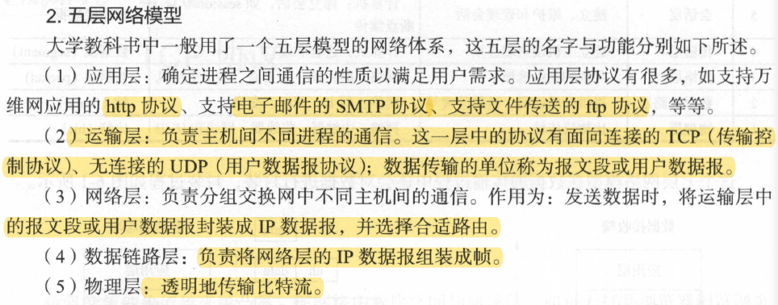
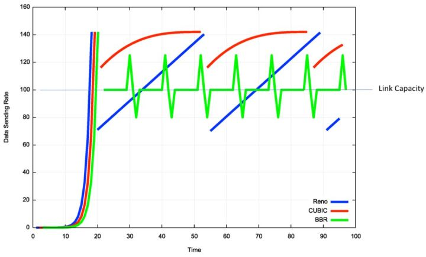

常见面试题：

##### 1.OSI，TCP/IP，五层协议

```
OSI分层 （7层）：物理层、数据链路层、网络层、传输层、会话层、表示层、应用层。
TCP/IP分层（4层）：网络接口层、 网际层、运输层、 应用层。
五层协议 （5层）：物理层、数据链路层、网络层、运输层、 应用层。
每一层的协议如下：
物理层：RJ45、CLOCK、IEEE802.3 （中继器，集线器）
数据链路：PPP、FR、HDLC、VLAN、MAC （网桥，交换机）
网络层：IP、ICMP、ARP、RARP、OSPF、IPX、RIP、IGRP、 （路由器）
传输层：TCP、UDP、SPX
会话层：NFS、SQL、NETBIOS、RPC
表示层：JPEG、MPEG、ASII
应用层：FTP、DNS、Telnet、SMTP、HTTP、WWW、NFS
每一层的作用如下：
物理层：通过媒介传输比特,确定机械及电气规范（比特Bit）
数据链路层：将比特组装成帧和点到点的传递（帧Frame）
网络层：负责数据包从源到宿的传递和网际互连（包PackeT）
传输层：提供端到端的可靠报文传递和错误恢复（段Segment）
会话层：建立、管理和终止会话（会话协议数据单元SPDU）
表示层：对数据进行翻译、加密和压缩（表示协议数据单元PPDU）
应用层：允许访问OSI环境的手段（应用协议数据单元APDU）
```

##### 2.IP地址的分类

```
A类地址：以0开头，   第一个字节范围：1~126（1.0.0.0 - 126.255.255.255）；
B类地址：以10开头，  第一个字节范围：128~191（128.0.0.0 - 191.255.255.255）；
C类地址：以110开头， 第一个字节范围：192~223（192.0.0.0 - 223.255.255.255）；
D类地址：以1110开头，第一个字节范围：224~239（224.0.0.0 - 239.255.255.255）；（作为多播使用）
E类地址：保留
其中A、B、C是基本类，D、E类作为多播和保留使用。
以下是留用的内部私有地址：
A类 10.0.0.0--10.255.255.255
B类 172.16.0.0--172.31.255.255
C类 192.168.0.0--192.168.255.255
IP地址与子网掩码相与得到网络号：
ip       : 192.168.2.110
&
Submask : 255.255.255.0
----------------------------
网络号   ：192.168.2  .0
注:
主机号，全为0的是网络号（例如：192.168.2.0），主机号全为1的为广播地址（192.168.2.255）
```

##### 3.解释一下ARP协议工作原理

```
答:1：首先，每个主机都会在自己的ARP缓冲区中建立一个ARP列表，以表示IP地址和MAC地址之间的对应关系。
2：当源主机要发送数据时，首先检查ARP列表中是否有对应IP地址的目的主机的MAC地址，如果有，则直接发送数据，如果没有，就向本网段的所有主机发送ARP数据包，该数据包包括的内容有：源主机 IP地址，源主机MAC地址，目的主机的IP 地址。
3：当本网络的所有主机收到该ARP数据包时，首先检查数据包中的IP地址是否是自己的IP地址，如果不是，则忽略该数据包，如果是，则首先从数据包中取出源主机的IP和MAC地址写入到ARP列表中，如果已经存在，则覆盖，然后将自己的MAC地址写入ARP响应包中，告诉源主机自己是它想要找的MAC地址。
4：源主机收到ARP响应包后。将目的主机的IP和MAC地址写入ARP列表，并利用此信息发送数据。如果源主机一直没有收到ARP响应数据包，表示ARP查询失败。
广播发送ARP请求，单播发送ARP响应。
```

##### 4.在浏览器中输入www.baidu.com后执行的全部过程

```
1、客户端浏览器通过DNS解析到www.baidu.com 的IP地址220.181.27.48，通过这个IP地址找到客户端到服务器的路径。客户端浏览器发起一个HTTP会话到220.181.27.48，然后通过TCP进行封装数据包，输入到网络层。
2、在客户端的传输层，把HTTP会话请求分成报文段，添加源和目的端口，如服务器使用80端口监听客户端的请求，客户端由系统随机选择一个端口如5000，与服务器进行交换，服务器把相应的请求返回给客户端的5000端口。然后使用IP层的IP地址查找目的端。
3、客户端的网络层不用关心应用层或者传输层的东西，主要做的是通过查找路由表确定如何到达服务器，期间可能经过多个路由器，这些都是由路由器来完成的工作，我不作过多的描述，无非就是通过查找路由表决定通过那个路径到达服务器。
4、客户端的链路层，包通过链路层发送到路由器，通过邻居协议查找给定IP地址的MAC地址，然后发送ARP请求查找目的地址，如果得到回应后就可以使用ARP的请求应答交换的IP数据包现在就可以传输了，然后发送IP数据包到达服务器的地址。
```

##### 5.DNS原理

```
当DNS客户机需要在程序中使用名称时，它会查询DNS服务器来解析该名称。客户机发送的每条查询信息包括三条信息：包括：指定的DNS域名，指定的查询类型，DNS域名的指定类别。基于UDP服务，端口53. 该应用一般不直接为用户使用，而是为其他应用服务，如HTTP，SMTP等在其中需要完成主机名到IP地址的转换。
```

##### 6.了解交换机、路由器、网关的概念，并知道各自的用途

```
1）交换机
在计算机网络系统中，交换机是针对共享工作模式的弱点而推出的。交换机拥有一条高带宽的背部总线和内部交换矩阵。交换机的所有的端口都挂接在这条背 部总线上，当控制电路收到数据包以后，处理端口会查找内存中的地址对照表以确定目的MAC（网卡的硬件地址）的NIC（网卡）挂接在哪个端口上，通过内部 交换矩阵迅速将数据包传送到目的端口。目的MAC若不存在，交换机才广播到所有的端口，接收端口回应后交换机会“学习”新的地址，并把它添加入内部地址表 中。
交换机工作于OSI参考模型的第二层，即数据链路层。交换机内部的CPU会在每个端口成功连接时，通过ARP协议学习它的MAC地址，保存成一张 ARP表。在今后的通讯中，发往该MAC地址的数据包将仅送往其对应的端口，而不是所有的端口。因此，交换机可用于划分数据链路层广播，即冲突域；但它不 能划分网络层广播，即广播域。
交换机被广泛应用于二层网络交换，俗称“二层交换机”。
交换机的种类有：二层交换机、三层交换机、四层交换机、七层交换机分别工作在OSI七层模型中的第二层、第三层、第四层盒第七层，并因此而得名。
2）路由器
路由器（Router）是一种计算机网络设备，提供了路由与转送两种重要机制，可以决定数据包从来源端到目的端所经过 的路由路径（host到host之间的传输路径），这个过程称为路由；将路由器输入端的数据包移送至适当的路由器输出端(在路由器内部进行)，这称为转 送。路由工作在OSI模型的第三层——即网络层，例如网际协议。
路由器的一个作用是连通不同的网络，另一个作用是选择信息传送的线路。 路由器与交换器的差别，路由器是属于OSI第三层的产品，交换器是OSI第二层的产品(这里特指二层交换机)。
3）网关
网关（Gateway），网关顾名思义就是连接两个网络的设备，区别于路由器（由于历史的原因，许多有关TCP/IP 的文献曾经把网络层使用的路由器（Router）称为网关，在今天很多局域网采用都是路由来接入网络，因此现在通常指的网关就是路由器的IP），经常在家 庭中或者小型企业网络中使用，用于连接局域网和Internet。 网关也经常指把一种协议转成另一种协议的设备，比如语音网关。
在传统TCP/IP术语中，网络设备只分成两种，一种为网关（gateway），另一种为主机（host）。网关能在网络间转递数据包，但主机不能 转送数据包。在主机（又称终端系统，end system）中，数据包需经过TCP/IP四层协议处理，但是在网关（又称中介系 统，intermediate system）只需要到达网际层（Internet layer），决定路径之后就可以转送。在当时，网关 （gateway）与路由器（router）还没有区别。
在现代网络术语中，网关（gateway）与路由器（router）的定义不同。网关（gateway）能在不同协议间移动数据，而路由器（router）是在不同网络间移动数据，相当于传统所说的IP网关（IP gateway）。
网关是连接两个网络的设备，对于语音网关来说，他可以连接PSTN网络和以太网，这就相当于VOIP，把不同电话中的模拟信号通过网关而转换成数字信号，而且加入协议再去传输。在到了接收端的时候再通过网关还原成模拟的电话信号，最后才能在电话机上听到。
对于以太网中的网关只能转发三层以上数据包，这一点和路由是一样的。而不同的是网关中并没有路由表，他只能按照预先设定的不同网段来进行转发。网关最重要的一点就是端口映射，子网内用户在外网看来只是外网的IP地址对应着不同的端口，这样看来就会保护子网内的用户。
```

##### 7.http和https区别

```
HTTP协议和HTTPS协议区别如下：
1）HTTP协议是以明文的方式在网络中传输数据，而HTTPS协议传输的数据则是经过TLS加密后的，HTTPS具有更高的安全性
2）HTTPS在TCP三次握手阶段之后，还需要进行SSL 的handshake，协商加密使用的对称加密密钥
3）HTTPS协议需要服务端申请证书，浏览器端安装对应的根证书
4）HTTP协议端口是80，HTTPS协议端口是443
HTTPS优点：
HTTPS传输数据过程中使用密钥进行加密，所以安全性更高
HTTPS协议可以认证用户和服务器，确保数据发送到正确的用户和服务器
HTTPS缺点：
HTTPS握手阶段延时较高：由于在进行HTTP会话之前还需要进行SSL握手，因此HTTPS协议握手阶段延时增加
HTTPS部署成本高：一方面HTTPS协议需要使用证书来验证自身的安全性，所以需要购买CA证书；另一方面由于采用HTTPS协议需要进行加解密的计算，占用CPU资源较多，需要的服务器配置或数目高
```

##### 8.简述http协议

```
1）HTTP协议：
HTTP协议是Hyper Text Transfer Protocol（超文本传输协议）的缩写，是用于从万维网（WWW:World Wide Web）服务器传输超文本到本地浏览器的传送协议。
HTTP是一个基于TCP/IP通信协议来传递数据（HTML 文件，图片文件，查询结果等）。
HTTP是一个属于应用层的面向对象的协议，由于其简捷、快速的方式，适用于分布式超媒体信息系统。它于1990年提出，经过几年的使用与发展，得到不断地完善和扩展。目前在WWW中使用的是HTTP/1.0的第六版，HTTP/1.1的规范化工作正在进行之中，而且HTTP-NG（Next Generation of HTTP）的建议已经提出。
HTTP协议工作于客户端-服务端架构为上。浏览器作为HTTP客户端通过URL向HTTP服务端即WEB服务器发送所有请求。Web服务器根据接收到的请求后，向客户端发送响应信息。
2）HTTP协议特点
1、简单快速：
客户向服务器请求服务时，只需传送请求方法和路径。请求方法常用的有GET、HEAD、POST。每种方法规定了客户与服务器联系的类型不同。由于HTTP协议简单，使得HTTP服务器的程序规模小，因而通信速度很快。
2、灵活：
HTTP允许传输任意类型的数据对象。正在传输的类型由Content-Type加以标记。
3、无连接：
无连接的含义是限制每次连接只处理一个请求。服务器处理完客户的请求，并收到客户的应答后，即断开连接。采用这种方式可以节省传输时间。
4、无状态：
HTTP协议是无状态协议。无状态是指协议对于事务处理没有记忆能力。缺少状态意味着如果后续处理需要前面的信息，则它必须重传，这样可能导致每次连接传送的数据量增大。另一方面，在服务器不需要先前信息时它的应答就较快。
5、支持B/S及C/S模式。
6、默认端口80
7、基于TCP协议
3）HTTP过程概述：
HTTP协议定义Web客户端如何从Web服务器请求Web页面，以及服务器如何把Web页面传送给客户端。HTTP协议采用了请求/响应模型。客户端向服务器发送一个请求报文，请求报文包含请求的方法、URL、协议版本、请求头部和请求数据。服务器以一个状态行作为响应，响应的内容包括协议的版本、成功或者错误代码、服务器信息、响应头部和响应数据。
HTTP 请求/响应的步骤如下：
1、客户端连接到Web服务器
一个HTTP客户端，通常是浏览器，与Web服务器的HTTP端口（默认为80）建立一个TCP套接字连接。例如，http://www.baidu.com。
2、发送HTTP请求
通过TCP套接字，客户端向Web服务器发送一个文本的请求报文，一个请求报文由请求行、请求头部、空行和请求数据4部分组成。
3、服务器接受请求并返回HTTP响应
Web服务器解析请求，定位请求资源。服务器将资源复本写到TCP套接字，由客户端读取。一个响应由状态行、响应头部、空行和响应数据4部分组成。
4、释放连接TCP连接
若connection 模式为close，则服务器主动关闭TCP连接，客户端被动关闭连接，释放TCP连接;若connection 模式为keepalive，则该连接会保持一段时间，在该时间内可以继续接收请求;
5、客户端浏览器解析HTML内容
客户端浏览器首先解析状态行，查看表明请求是否成功的状态代码。然后解析每一个响应头，响应头告知以下为若干字节的HTML文档和文档的字符集。客户端浏览器读取响应数据HTML，根据HTML的语法对其进行格式化，并在浏览器窗口中显示。
4、举例：
在浏览器地址栏键入URL，按下回车之后会经历以下流程：
1、浏览器向 DNS 服务器请求解析该 URL 中的域名所对应的 IP 地址；
2、解析出 IP 地址后，根据该 IP 地址和默认端口80，和服务器建立TCP连接；
3、浏览器发出读取文件（URL中域名后面部分对应的文件）的HTTP 请求，该请求报文作为 TCP 三次握手的第三个报文的数据发送给服务器；
4、服务器对浏览器请求作出响应，并把对应的 html 文本发送给浏览器；
5、释放 TCP连接；
6、浏览器将该 html 文本并显示内容；
```


#### TCP协议

##### 网络模型

###### 七层网络模型


###### 五层网络模型



###### TCP/IP分层模型


​	数据链路层：数据链路层实现了网卡接口的网络驱动程序，不同的物理网络存在不同的电气特征，然而网络驱动程序隐藏了这些细节，为上一层协议提供了一个统一的接口。

​	数据链路层两个常用的协议分别是ARP协议（地址解析协议）和RARP协议（逆地址解析协议）。它们实现了IP地址和机器物理地址之间的转换。网络层通过IP地址寻址一台机器，而数据链路层使用物理地址才能寻址一台机器。

​	网络层：网络层实现数据包的选路与转发。WAN以及LAN，两台相互通信的机器并不是直接相连的，而是通过多个中间节点（路由器）连接的。网络层的任务就是确定这两台机器的通信路径，同时网络层隐藏了两台机器之间的网络拓扑细节，使得这两台机器看起来就像是直接相连的。

​	网络层主要是IP协议（Internet Protocol），通过hop by hop确定通信路径。网络层的另一个协议就是ICMP协议，主要用于检测网络连接。

​	传输层：如下图所示，传输层只关心端对端之间的通信，而不在乎数据包的具体中转过程。下图中，实线的垂直箭头表示TCP/IP协议族各层之间的实体通信，而水平虚线则表示逻辑通信线路。


传输层主要包括三个协议：TCP协议、UDP协议和SCTP协议

​	TCP协议：Transmission Control Protocol ，传输控制协议，为应用层提供可靠的、面向连接的基于流的服务。TCP使用超时重传、数据确认等方式来确保数据包被正确地发生至目的端，因此TCP服务是可靠地。使用TCP协议通信的双方必须先建立起TCP连接，并在内核中为该连接维持一些必要的数据结构，比如连接的状态、读写缓冲区，以及诸多定时器等。当连接结束后，双方必须通过关闭连接以释放这些内核资源。TCP服务是基于流的，所以数据是没有边界（长度）的，它源源不断地从通信的一段流入另一端。当发送端应用程序连续执行多次写操作时，TCP模块先将这些数据放入TCP发送缓冲区中。当TCP模块真正开始发送数据时，发送缓冲区中这些等待发送的数据可能被封装成一个或多个TCP报文段发出。因此，TCP模块发送出的TCP报文段的个数和应用程序的写操作次数之间没有固定的数量关系。当接收端收到一个或者多个TCP报文段后，TCP模块将它们携带的应用程序数据安装TCP报文段的序号一次放入TCP接收缓冲区中，并通知应用程序读取数据，接收端应用程序肯恩一次将数据全部读出，也可能分多次读出，这取决于应用程序读缓冲区的大小。

​	TCP传输是可靠地，是因为TCP采用发送应答机制，即发送端发送的每个TCP报文段都必须得到接收方的应答，才会认为这次传输成功。另外TCP协议采用超时重传机制，发送端在发送出一个TCP报文段之后启动定时器，如果在定时时间内未收到应答，它将重发该报文段。另外，由于TCP报文段最终是通过IP数据包发送的，而IP数据报到接收端可能乱序、重复，所以TCP协议还会对接收到的TCP报文段进行重排、整理，再交给应用层。

​	UDP协议：User Datagram Protocol，用户数据报协议，为应用层提供不可靠、无连接和基于数据报的服务。如果数据在中途丢失，或者目的端通过数据校验发现数据错误而将其丢弃，则UDP协议就只是简单的通知应用程序发送失败。

##### TCP协议

###### TCP头部


​	TCP头部里每一个字段都为管理TCP连接和控制数据流起了重要作用

​	(1)16位端口号：告知主机该报文是来自哪里以及传给那个上层协议或应用程序。进行TCP通信时，客户端通常使用系统向动选择的临时端口号，而服务器则使用知名服务端口号。所有知名服务使用的端口号都定义在／etc/services 文件中。

​	(2)32位序号：一次TCP 通信（从TCP 连接建立到断开）过程中某一个传输方向上的字节流的每个字节的编号。假设主机A 和主机B 进行TCP 通信， A 发送给B 的第一个TCP 报文段中，序号值被系统初始化为某个随机值ISN ( Initial Sequence Number ，初始序号值） 。那么在该传输方向上（从A 到B ），后续的TCP 报文段中序号值将被系统设置成ISN 加上该报文段所携带数据的第一个字节在整个字节流中的偏移。例如，某个TCP 报文段传送的数据是字节流中的第1025 ～ 2048 字节，那么该报文段的序号值就是ISN+l025 。另外一个传输方向（从B 到A ）的TCP 报文段的序号值也具有相同的含义。

​	(3)32位确认号：用作对另一方发送来的TCP 报文段的响应。其值是收到的TCP 报文段的序号值加1 。假设主机A 和主机B 进行TCP 通信，那么A 发送出的TCP 报文段不仅携带自己的序号，而且包含对B 发送来的TCP 报文段的确认号。反之，B 发送出的TCP 报文段也同时携带自己的序号和对A 发送来的报文段的确认号。

​	( 4) 4 位头部长度（ header length ）：标识该TCP 头部有多少个32bit ( 4 Byte ） 。因为4 位最大能表示15 ，所以TCP 头部最长是60 Byte 。

​	( 5) 6 位标志位包含如下几项。
​	1) URG 标志，表示紧急指针（ urgent pointer ）是否有效。
​	2) ACK 标志，表示确认号是否有效，一般称携带ACK 标志的TCP 报文段为“确认报文段” 。
​	3) PSH 标志，提示接收端应用程序应该立即从TCP 接收缓冲区中读走数据，为接收后续数据腾出空间（如果应用程序不将接收到的数据读走，它们就会一直停留在TCP 接收缓冲区中） 。
​	4) RST 标志，表示要求对方重新建立连接，一般称携带RST 标志的TCP 报文段为“复位报文段” 。
​	5) SYN 标志，表示请求建立一个连接，一般称携带SYN 标志的TCP 报文段为“同步报文段” 。
​	6) FIN 标志，表示通知对方本端要关闭连接了，一般称携带FIN 标志的TCP 报文段为“结束报文段” 。
​	( 6) 16 位窗口大小（ window size ）：是TCP 流量控制的一个手段。这里说的窗口，指的是接收通告窗口（ Receiver Window, RWND ） 。它告诉对方本端的TCP 接收缓冲区还能容纳多少字节的数据，这样对方就可以控制发送数据的速度。

​	( 7) 16 位校验和（ TCP checksum ）：由发送端填充，接收端对TCP 报文段执行CRC 算法，以检验TCP 报文段在传输过程中是否损坏。注意，这个校验不仅包括TCP 头部，也包括数据部分。这也是TCP 可靠传输的一个重要保障。

​	( 8) 16 位紧急指针（ urgent pointer ）：是一个正的偏移量。它和序号字段的值相加表示最后一个紧急数据的下一字节的序号。因此，确切地说，这个字段是紧急指针相对当前序号的偏移，不妨称之为“紧急偏移” 。TCP 的紧急指针是发送端向接收端发送紧急数据的方法。

###### TCP状态流转

​	其实，网络上的传输是没有连接的，TCP也一样。而TCP所谓的连接，其实只不过是在通信的双方维护一个连接状态，让它看上去好像有连接一样。


三次握手：

​	第一次握手：建立连接时，客户端发送SYN=J到服务器，并进入到SYN_SEND状态，等待服务器确认

​	第二次握手：服务器收到SYN包，必须确认客户端的SYN(ACK = J + 1),同时自己也发送一个SYN包（SYN = K),即SYN+ACK包，此时服务器进入SYN_RECV状态

​	第三次握手：客户端收到服务器的SYN+ACK包，客户端进入ESTABLISHED状态，向服务器发送确认包ACK(ACK=K+1),服务器收到ACK，进入ESTABLISHED状态。完成3次握手。


四次挥手：


如上动图所示。


​	( 1) CLOSED ：表示初始状态。
​	( 2) LISTEN ：表示服务器端的某个socket 处于监昕状态，可以接受连接。
​	( 3) SYN SENT ：在服务端监昕后，客户端socket 执行CONNECT 连接时，客户端发送SYN 报文，此时客户端就进入SYN SENT 状态，等待服务端的确认。
​	(4) SYN RCVD ：表示服务端接收到了SYl叫报文，在正常情况下，这个状态是服务器端的socket 在建立TCP 连接时的3 次握手会话过程中的一个中间状态，很短暂，基本上用网络查询工具nets tat 是很难看到这种状态的，除非特意写了一个客户端测试程序，故意将3 次TCP 握手过程中最后一个ACK 报文不予发送。因此这种状态时，当收到客户端的ACK 报文后，它会进入到ESTABLISHED 状态。

​	( 5 ) ESTABLISHED ：表示连接已经建立了。
​	( 6 ) FIN WAIT 1 ：这个是已经建立连接之后，其中一方请求终止连接，等待对方的FIN 报文。FIN WAIT l 状态是当socket 在ESTABLISHED 状态时，它想主动关闭连接，向对方发送了FIN 报文，此时该socket 即进入到FIN WAIT l 状态。而当对方回应ACK 报文后，则进入到FIN WAIT 2 状态，当然在实际的正常情况下，无论对方处于何种情况，都应该马上回应ACK 报文所以FIN WAIT l 状态一般是比较难见到的而FIN WAIT 2 状态还可以用netstat 看到。
​	( 7 ) FIN WAIT 2 ：实际上FIN WAIT 2 状态下的socket ，表示半连接，即有一方要求关闭连接，但另外还告诉对方：我暂时广穹点数据需要传送给你，请稍后再关闭连接。
​	( 8) TIME_ WAIT ：表示收到了对方的FIN 报文，并发送出了ACK 报文，就等2MSL .后即可回CLOSED 可用状态了。如果在FIN WAIT l 状态下收到了对方同时带FIN 标志和ACK 标志的报文时，可以直接进入到TIME WAIT 状态，而无需经过FIN WAIT 2 状态。
​	( 9) CLOSING ：这种状态比较特殊实际情况中应该是很少见属于一种比较罕见的例外状态。正常情况下，当发送FIN 报文后，按理来说是应该先收到（或同时收到）对方的ACK 报文，再收到对方的FIN 报文。但是CLOSING 状态表示你发送FIN 报文后，并没有收到对方的ACK 报文，反而收到了对方的FIN 报文。为什么会出现此种情况呢？其实细想一下，也不难得出结论：那就是如果双方几乎在同时关闭一个socket 的话，那么就出现了双方同时发送FIN 报文的情况，就会出现CLOSING 状态，表示双方都正在关闭socket 连接。
​	( 10) CLOSE WAIT ：这种状态的含义其实是表示在等待关闭。怎么理解呢？当对方关闭一个socket 后发送FIN 报文给自己时，系统将毫无疑问地会回应一个ACK 报文给对方，此时则进入到CLOSE WAIT 状态。接下来呢，实际上你真正需要考虑的事情是察看你是否还有数据发送给对方，如果没有，那么你也就可以关闭这个socket 了，发送FIN 报文给对方，即关闭连接。在CLOSE WAIT 状态下，需要完成的事情是等待你去关闭连接。
​	( 11 ) LAST ACK ：这个状态还是比较好理解的，它是被动关闭一方在发送FIN 报文后，最后等待对方的ACK 报文。
​	( 12) CLOSED ： 当收到ACK 报文后，也即可以进入到CLOSED 可用状态了。2MSL 等待状态： 图6-4 里面，有一个TIME WAIT 等待状态，这个状态又叫作2MSL状态，说的是在TIME WAIT2 发送了最后一个ACK 数据报以后，要进入TIME WAIT 状态，这个状态是防止最后一次握手的数据报没有传送到对方那里而准备的（注意这不是4 次握手，这是第4 次握手的保险状态） 。这个状态在很大程度上保证了双方都可以正常结束，但是问题也来了。由于socket 的2MSL 状态（ socket 是IP 和端口对的意思），使得应用程序在2MSL 时间内无法再次使用同一个socket ，对于客户程序还好一些，但是对于服务程序（例如h即d ），它总是要使用同一个端口来进行服务，而在2MSL 时间内，启动httpd 就会出现错误（插口被使用） 。为了避免这个错误，服务器给出了一个平静时间的概念，这是说在2MSL时间内，虽然可以重新启动服务器，但是这个服务器还是要平静地等待2MSL 的时间才能进行下一次连接。
​	FIN_WAIT_2 状态：这就是著名的半关闭状态了，这是在关闭连接时，客户端和服务器两次握手之后的状态。在这个状态下，应用程序还有接收数据的能力，但是已经无法发送数据，但是也有一种可能是，客户端一直处于FIN WAIT 2 状态，而服务器则一直处于WAITCLOSE 状态，直到应用层来决定关闭这个状态。
​	RST ，同时打开和同时关闭： RST 是另一种关闭连接的方式，应用程序应该可以判断RST 包的真实性，即是否为异常中止。而同时打开和同时关闭则是两种特殊的TCP 状态，
发生的概率很小。

###### TCP超时重传

​	假设有这样几种情况：

1）.数据顺利到达对端，对端顺利响应ACK

2）.数据包中途丢失

3）.数据包顺利到达，但是ACK报文被风吹跑了

4）.数据包梳理到达对端，但对端异常未响应ACK或被对端丢弃。


​	当出现这些异常情况时，TCP就会超时重传。TCP每发送一个报文段，就对这个报文段设置一次计时器。只要计时器设置的重传时间到了，但还没有收到确认，就要重传这一报文段，这个就叫作“超时重传”。

​	影响超时重传机制协议效率的一个关键参数是RTO(Retransmission TimeOut, 重传超时时间)。

​	如果底层网络的传输特性是可预知的，那么重传机制的设计相对简单得多，可根据底层网络的传输时延的特性选择一个合适的RTO ，使协议的性能得到优化。但是TCP 的底层网络环境是一个完全异构的互联结构。在实现端到端的通信时，不同端点之间传输通路的性能可能存在着巨大的差异，而且同一个TC P 连接在不同的时间段上，也会由于不同的网络状态具有不同的传输时延。

​	因此，TCP协议必须适应两个方面的时延差异：一个是达到不同目的端的时延的差异；另一个是统一连接上的传输时延随业务量负载的变化而出现的差异。

​	为此，TCP协议使用自适应算法以适应互联网分组传输时延的变化。这种算法的基本要点是TCP监视每个连接的性能（传输时延），由每一个TCP的连接情况推算出合适的RTO值，当连接时延性能变化时，TCP也能够相应地自动xiugaiRTO的设定，以适应这种网络的变化。

​	为了动态地设置，TCP引入了RTT（Round Trip Time），也就是连接往返事件.

​	然后就是采样算法估计啥的吧，，，不重要。

###### TCP滑动窗口

​	TCP的滑动窗口主要有两个作用：一是提供TCP的可靠性；二是提供TCP的流控特性。

​	对于TCP会话的发送方，任何时候在其发生缓存内的数据都可以分为4类：1.已经发生并得到对端ACK；2.已经发生但还未收到对端ACK；3.未接收并未准备接收。

​	滑动窗口实现面向流的可靠性来源于“确认重传”机制。TCP 的滑动窗口的可靠性也是建立在“确认重传”基础上的。发送窗口只有收到对端对于本段发送窗口内字节的ACK 确认，才会移动发送窗口的左边界。接收窗口只有在前面所有的段都确认的情况下才会移动左边界；在前面还有字节未接收但收到后面字节的情况下，窗口不会移动，并不对后续字节确认。以此确保对端会对这些数据重传。


###### TCP拥塞控制

什么是 TCP 拥塞控制

> TCP 拥塞控制的目标是最大化利用网络上瓶颈链路的带宽。

简单来说是将网络链路比喻成一根水管，如果我们希望尽可能地使用网络传输数据，方法就是给水管注水，就有如下公式：

> 水管内的水的数量 = 水管的容积 = 水管粗细 × 水管长度

对应的网络名词就是：

> 网络内尚未被确认收到的数据包数量 = 网络链路上能容纳的数据包数量 = 链路带宽 × 往返延迟


为了保证水管不会爆管，TCP 维护一个拥塞窗口cwnd（congestion window），用来估计在一段时间内这条链路（水管中）可以承载和运输的数据（水）的数量，拥塞窗口的大小取决于网络的拥塞程度，并且动态地在变化，但是为了达到最大的传输效率，我们该如何知道这条水管的运送效率是多少呢？

一个简单的方法就是不断增加传输的水量，直到水管破裂为止（对应到网络上就是发生丢包），用 TCP 的描述就是：

> 只要网络中没有出现拥塞，拥塞窗口的值就可以再增大一些，以便把更多的数据包发送出去，但只要网络出现拥塞，拥塞窗口的值就应该减小一些，以减少注入到网络中的数据包数。

常见的 TCP 拥塞控制算法

本文将例举目前 Linux 内核默认的 Reno 算法和 Google 的 BBR 算法进行说明，其中基于丢包的拥塞控制算法 Reno 由于非常著名，所以常常作为教材的重点说明对象。

Reno

Reno 被许多教材（例如：《计算机网络——自顶向下的方法》）所介绍，适用于低延时、低带宽的网络，它将拥塞控制的过程分为四个阶段：**慢启动、拥塞避免、快重传和快恢复**，对应的状态如下所示：


- 慢启动阶段思路是不要一开始就发送大量的数据，先探测一下网络的拥塞程度，也就是说由小到大逐渐增加拥塞窗口的大小，在没有出现丢包时每收到一个 ACK 就将拥塞窗口大小加一（单位是 MSS，最大单个报文段长度），每轮次发送窗口增加一倍，呈指数增长，若出现丢包，则将拥塞窗口减半，进入拥塞避免阶段；
- 当窗口达到慢启动阈值或出现丢包时，进入拥塞避免阶段，窗口每轮次加一，呈线性增长；当收到对一个报文的三个重复的 ACK 时，认为这个报文的下一个报文丢失了，进入快重传阶段，要求接收方在收到一个失序的报文段后就立即发出重复确认（为的是使发送方及早知道有报文段没有到达对方，可提高网络吞吐量约20%）而不要等到自己发送数据时捎带确认；
- 快重传完成后进入快恢复阶段，将慢启动阈值修改为当前拥塞窗口值的一半，同时拥塞窗口值等于慢启动阈值，然后进入拥塞避免阶段，重复上述过程。

BBR

> BBR 是谷歌在 2016 年提出的一种新的拥塞控制算法，已经在 Youtube 服务器和谷歌跨数据中心广域网上部署，据 Youtube 官方数据称，部署 BBR 后，在全球范围内访问 Youtube 的延迟降低了 53%，在时延较高的发展中国家，延迟降低了 80%。

BBR 算法不将出现丢包或时延增加作为拥塞的信号，而是认为当网络上的数据包总量大于瓶颈链路带宽和时延的乘积时才出现了拥塞，所以 BBR 也称为基于拥塞的拥塞控制算法（Congestion-Based Congestion Control），其适用网络为高带宽、高时延、有一定丢包率的长肥网络，可以有效降低传输时延，并保证较高的吞吐量，与其他两个常见算法发包速率对比如下：



BBR 算法周期性地探测网络的容量，交替测量一段时间内的带宽极大值和时延极小值，将其乘积作为作为拥塞窗口大小，使得拥塞窗口始的值始终与网络的容量保持一致。

所以 BBR 算法解决了两个比较主要的问题：

- 在有一定丢包率的网络链路上充分利用带宽。
  适合高延迟、高带宽的网络链路。
- 降低网络链路上的 buffer 占用率，从而降低延迟。
  适合慢速接入网络的用户。

总结

目前有非常多的 TCP 的拥塞控制协议，例如：

- **基于丢包的拥塞控制**：将丢包视为出现拥塞，采取缓慢探测的方式，逐渐增大拥塞窗口，当出现丢包时，将拥塞窗口减小，如 Reno、Cubic 等。
- **基于时延的拥塞控制**：将时延增加视为出现拥塞，延时增加时增大拥塞窗口，延时减小时减小拥塞窗口，如 Vegas、FastTCP 等。
- **基于链路容量的拥塞控制**：实时测量网络带宽和时延，认为网络上报文总量大于带宽时延乘积时出现了拥塞，如 BBR。
- **基于学习的拥塞控制**：没有特定的拥塞信号，而是借助评价函数，基于训练数据，使用机器学习的方法形成一个控制策略，如 Remy。

从使用的角度来说，我们应该根据自身的实际情况来选择自己机器的拥塞控制协议（而不是跟风 BBR），同时对于拥塞控制原理的掌握（尤其是掌握 Reno 的控制机理和几个重要阶段）可以加强对于网络发包机制的了解，在排查问题或面对面试的时候有更好的表现。